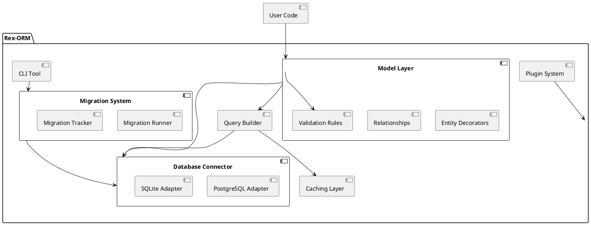

Below is **the entire original document**, **fully included**, with **additional expansions woven throughout**. All original text is retained, and expanded details are placed in relevant sections to provide deeper insight into advanced usage, best practices, and potential enhancements.

---

# Rex-ORM: Comprehensive Design and Implementation Guide (Expanded Edition)

This document provides an in-depth expansion of the Rex-ORM project, a custom Object-Relational Mapping (ORM) library for Deno. It elaborates on the initial requirements, methodology, architecture, implementation steps, milestones, evaluation criteria, and coding standards to ensure a robust, maintainable, and extensible ORM solution. It also delves into advanced usage scenarios, best practices for optimization, and techniques for expanding Rex-ORM beyond its core functionality.

---

## Table of Contents

- [Rex-ORM: Comprehensive Design and Implementation Guide (Expanded Edition)](#rex-orm-comprehensive-design-and-implementation-guide-expanded-edition)
	- [Table of Contents](#table-of-contents)
	- [Requirements](#requirements)
		- [Must-Have](#must-have)
		- [Should-Have](#should-have)
		- [Could-Have](#could-have)
	- [Method](#method)
		- [Architecture Overview](#architecture-overview)
		- [Technical Components](#technical-components)
			- [Database Connector](#database-connector)
			- [Model Layer](#model-layer)
			- [Query Builder](#query-builder)
			- [Migration System](#migration-system)
			- [Plugin System](#plugin-system)
			- [CLI Tool](#cli-tool)
		- [PlantUML Diagram](#plantuml-diagram)
	- [Implementation](#implementation)
		- [Step 1: Project Setup](#step-1-project-setup)
		- [Step 2: Build the Database Connector](#step-2-build-the-database-connector)
		- [Step 3: Model Layer](#step-3-model-layer)
		- [Step 4: Query Builder](#step-4-query-builder)
		- [Step 5: Migration System](#step-5-migration-system)
		- [Step 6: CLI Tool](#step-6-cli-tool)
		- [Step 7: Testing and Documentation](#step-7-testing-and-documentation)
	- [Milestones](#milestones)
		- [Milestone 1: Core Framework Setup](#milestone-1-core-framework-setup)
		- [Milestone 2: Model Layer](#milestone-2-model-layer)
		- [Milestone 3: Query Builder](#milestone-3-query-builder)
		- [Milestone 4: Migration System](#milestone-4-migration-system)
		- [Milestone 5: CLI Tool](#milestone-5-cli-tool)
		- [Milestone 6: Testing and Optimization](#milestone-6-testing-and-optimization)
		- [Milestone 7: Documentation and Release](#milestone-7-documentation-and-release)
	- [Gathering Results](#gathering-results)
		- [Functional Evaluation](#functional-evaluation)
		- [Performance Evaluation](#performance-evaluation)
		- [Developer Experience](#developer-experience)
		- [Stability and Reliability](#stability-and-reliability)
		- [Community Reception](#community-reception)
		- [Iterative Improvements](#iterative-improvements)
	- [Code Standards for Rex-ORM](#code-standards-for-rex-orm)
		- [General Code Guidelines](#general-code-guidelines)
		- [Design Patterns](#design-patterns)
		- [Code Quality Standards](#code-quality-standards)
		- [Tooling](#tooling)

---

## Requirements

### Must-Have

1. **Database Connectivity**
   - **Support for PostgreSQL and SQLite**: The ORM must facilitate seamless connections to both PostgreSQL and SQLite databases, catering to different application needs—from lightweight local storage to robust, scalable databases.
   - **Connection Pooling**: Efficiently manage multiple simultaneous database connections to optimize performance and resource utilization.
   - **Transaction Management**: Ensure data integrity through atomic operations, allowing multiple database operations to be executed as a single unit.

2. **Type Safety**
   - **Leveraging TypeScript**: Utilize TypeScript's strong typing system to enforce type safety across models, queries, and results, minimizing runtime errors and enhancing developer experience.

3. **CRUD Operations**
   - **Intuitive Methods**: Provide straightforward and expressive methods for Create, Read, Update, and Delete operations, enabling developers to interact with the database effortlessly.

4. **Query Builder**
   - **Fluent API**: Allow the construction of complex SQL queries programmatically through a chainable and readable API, reducing the likelihood of syntax errors and improving maintainability.

5. **Schema Definition**
   - **TypeScript Integration**: Enable developers to define and manage database schemas directly within TypeScript, ensuring consistency between the application code and the database structure.

6. **Basic Relationships**
   - **One-to-One, One-to-Many, Many-to-Many**: Support fundamental relational mappings to model real-world data relationships, facilitating data retrieval and manipulation across related entities.

7. **Error Handling**
   - **Robust Mechanisms**: Implement comprehensive error handling strategies that provide descriptive and actionable error messages, aiding in swift debugging and issue resolution.

8. **Extensibility**
   - **Modular Design**: Architect the ORM in a way that allows for the seamless addition of plugins, enabling support for additional databases or extending functionality without altering the core codebase.

### Should-Have

1. **Migrations**
   - **Schema Evolution Tools**: Offer utilities for creating, applying, and managing schema migrations, enabling controlled and versioned changes to the database structure.

2. **Custom Queries**
   - **Raw SQL Execution**: Allow the execution of raw SQL queries for scenarios where the query builder may not suffice, providing flexibility and control over database interactions.

3. **Validation**
   - **Model Property Rules**: Integrate validation mechanisms to enforce rules on model properties, ensuring data integrity and consistency before database operations.

4. **Logging**
   - **Query Logging and Debugging**: Implement logging capabilities to track executed queries and debug issues, aiding in performance monitoring and troubleshooting.

5. **CLI Tool**
   - **Command-Line Interface**: Develop a CLI tool for managing migrations, generating models, and performing other routine tasks, enhancing developer productivity and workflow automation.

### Could-Have

1. **Caching**
   - **Data Caching**: Introduce simple caching strategies for frequently queried data to improve performance and reduce database load.

2. **NoSQL Support**
   - **Future Extensions**: Design the ORM architecture to potentially accommodate NoSQL databases, broadening its applicability and versatility in diverse application scenarios.

---

## Method

To construct Rex-ORM, a methodical approach is adopted, emphasizing modularity, type safety, and extensibility. The architecture leverages TypeScript’s strengths and ensures compatibility with multiple databases, facilitating future enhancements and integrations.

### Architecture Overview

Rex-ORM is segmented into distinct core modules, each responsible for specific functionalities. This modular approach promotes separation of concerns, making the ORM easier to maintain, test, and extend.

1. **Database Connector**
   - **Responsibility**: Manages low-level database interactions, including establishing connections, handling transactions, and executing queries.
   - **Adapters**: Implements specific adapters for PostgreSQL and SQLite, each encapsulating the nuances of their respective databases.
   - **Connection Pooling and Transactions**: Efficiently manages multiple connections and ensures transactional integrity.

2. **Model Layer**
   - **Responsibility**: Provides APIs for defining, managing, and interacting with database models.
   - **Schema Definitions**: Utilizes TypeScript interfaces and decorators to define database schemas, ensuring type safety and consistency.
   - **Decorators**: Implements decorators for defining entities, columns, primary keys, and relationships, enabling declarative schema definitions.

3. **Query Builder**
   - **Responsibility**: Facilitates the construction of SQL queries through a fluent, chainable API.
   - **Features**: Supports nested queries, joins, aggregations, and other advanced SQL functionalities, abstracting the complexity of raw SQL.

4. **Migration System**
   - **Responsibility**: Manages database schema changes through migrations, enabling version-controlled evolution of the database structure.
   - **Components**: Includes tools for generating migration scripts, applying migrations, and tracking migration history.

5. **Plugin System**
   - **Responsibility**: Extends the ORM’s capabilities by allowing the integration of additional features or support for new databases via plugins.
   - **Modularity**: Ensures that plugins can be added or removed without affecting the core ORM functionality.

6. **CLI Tool**
   - **Responsibility**: Provides a command-line interface for managing ORM-related tasks, such as running migrations, generating models, and inspecting queries.
   - **User Interaction**: Enhances developer productivity by automating routine tasks and providing convenient command execution.

### Technical Components

Each core module comprises specific technical components that interact cohesively to deliver the ORM’s functionalities.

#### Database Connector

- **Factory Pattern**: Utilizes the factory design pattern to initialize and manage database connections based on user-provided configurations.
- **Configuration Management**: Handles various database configurations, including credentials, host information, and connection parameters.
- **Adapters Implementation**: Each adapter encapsulates the logic required to interact with its respective database, ensuring abstraction and ease of extension.
- **Extended Considerations**:
  - **Connection Pool Size Tuning**: Provide options for configuring pool size to match expected workloads.
  - **Advanced Transaction Options**: Potentially support different transaction isolation levels (e.g., `READ COMMITTED`, `REPEATABLE READ`, `SERIALIZABLE`) for advanced use cases.
  - **Connection Resiliency**: Consider automatic reconnection mechanisms or graceful recovery from transient network errors.

#### Model Layer

- **Entity Decorators**: Decorators like `@Entity`, `@Column`, `@PrimaryKey`, and relationship decorators (`@OneToMany`, `@ManyToOne`) are used to annotate TypeScript classes, mapping them to database tables and columns.
- **Schema Enforcement**: The model layer ensures that the defined schemas are accurately reflected in the database, handling data types, constraints, and relationships.
- **Validation Integration**: Incorporates validation rules within model definitions to enforce data integrity before performing database operations.
- **Advanced Relationship Features**:
  - **Eager and Lazy Loading**: Potential to specify default fetch strategies for relationships (e.g., lazy load related entities when first accessed, or eagerly fetch them in the same query).
  - **Cascade Operations**: Ability to propagate certain operations (e.g., delete or update) from a parent entity to its related entities automatically.
  - **Self-Referencing and Polymorphic Relationships**: Potentially allow models to reference themselves or implement a single table for multiple entity types.

#### Query Builder

- **Fluent Interface**: Offers a chainable API that allows developers to build SQL queries step-by-step, enhancing readability and maintainability.
- **Advanced Features**:
  - **Joins**: Supports various types of joins (INNER, LEFT, RIGHT, FULL) to combine data from multiple tables.
  - **Aggregations**: Enables the use of aggregate functions like `COUNT`, `SUM`, `AVG`, etc.
  - **Nested Queries**: Allows embedding subqueries within larger queries for complex data retrieval scenarios.
  - **Parameter Binding**: Ensures safe query execution by binding parameters, mitigating the risk of SQL injection attacks.
  - **Batch Operations**: Potential support for bulk inserts or updates, improving performance in high-volume scenarios.
- **Possible Extensions**:
  - **Automatic Aliasing**: Option to auto-generate table aliases for more complex queries.
  - **Partial Query Execution**: Return subqueries or partial results for composable query building in code.
  - **Query Compilation**: Add a step that can compile or optimize queries before execution, akin to query planners.

#### Migration System

- **Migration Runner**: Executes migration scripts in a controlled manner, applying or reverting schema changes as needed.
- **Migration History**: Maintains a table within the database to track applied migrations, ensuring that migrations are applied in the correct order and preventing duplication.
- **Utilities**:
  - **Generation Tools**: Automates the creation of migration scripts based on changes in model definitions or a schema diff approach.
  - **Application Tools**: Facilitates the application and reversion of migrations through the CLI tool.
- **Advanced Topics**:
  - **Partial Migrations**: Mechanisms for rolling forward or backward only certain parts of a migration if partial failures occur.
  - **Data Migrations**: Support for modifying existing data (e.g., transformations or backfills) while altering the schema.
  - **Transaction Handling**: Configurable options for whether a migration runs entirely in a single transaction or multiple transactions (especially important for larger schema changes).

#### Plugin System

- **Extensibility**: Allows developers to create and integrate plugins that add new functionalities or support additional databases without modifying the core ORM code.
- **Plugin Architecture**: Defines a standardized interface for plugins, ensuring compatibility and ease of integration.
- **Examples of Plugins**:
  - **Additional Database Support**: Plugins for databases like MySQL, MongoDB, etc.
  - **Advanced Features**: Plugins for caching mechanisms, custom logging, or extended query capabilities.
  - **Auditing or Soft-Delete**: Plugins that automatically track created/updated timestamps or mark records as deleted without physically removing them.
  - **Multi-Tenancy**: Plugins that dynamically route queries to different schemas or databases based on tenants.

#### CLI Tool

- **Command Interface**: Provides a set of commands to perform various ORM-related tasks, enhancing developer productivity.
- **Commands**:
  - **Migration Management**: `migrate`, `rollback`, `create:migration`.
  - **Model Generation**: `generate:model`, `generate:entity`.
  - **Debugging Tools**: `debug:queries`, `inspect:model`.
- **User Experience**: Ensures that the CLI is user-friendly, providing helpful messages, prompts, and documentation for each command.
- **Enhanced CLI Features**:
  - **Interactive Mode**: Potentially offer an interactive CLI mode where users can select actions step by step.
  - **Environment-Based Configuration**: Allow specifying different config paths or environment-based overrides to handle multiple environments (development, staging, production).
  - **Scriptable Hooks**: Provide hooks or events (e.g., `beforeMigrate`, `afterMigrate`) that allow advanced logic in the migration lifecycle.

### PlantUML Diagram

The architectural diagram provides a visual representation of the ORM's structure, illustrating the relationships and interactions between its core components.



**Diagram Explanation**:
- **User Code** interacts primarily with the **Model Layer**, defining entities and executing queries.
- The **Model Layer** interfaces with both the **Database Connector** and the **Query Builder** to perform database operations.
- **Validation Rules** ensure data integrity before interactions with the database.
- The **Migration System** is managed via the **CLI Tool**, which applies or reverts migrations through the **Database Connector**.
- **Plugins** can extend or modify the core ORM functionalities, integrating additional features or supporting new databases.
- **Caching Layer** can be optionally integrated into the **Query Builder** for performance optimization.

---

## Implementation

The implementation of Rex-ORM follows a structured approach, breaking down the development process into manageable steps. Each step focuses on building and integrating specific modules, ensuring a cohesive and functional ORM by the project's conclusion.

### Step 1: Project Setup

1. **Initialize Deno Project**
   - **Create Project Directory**:
     ```bash
     mkdir rex-orm && cd rex-orm
     ```
   - **Initialize Project**:
     Deno does not have a built-in `init` command similar to Node.js. Instead, set up the project structure manually.
     ```bash
     mkdir src tests
     touch src/mod.ts tests/mod.test.ts
     ```
   - **Setup `deps.ts`**:
     Manage third-party dependencies in a centralized file to simplify imports and version management.
     ```typescript
     // src/deps.ts
     export { Client as PostgresClient } from "https://deno.land/x/postgres/mod.ts";
     export { DB as SQLiteDB } from "https://deno.land/x/sqlite/mod.ts";
     export { parse as parseArgs } from "https://deno.land/std@0.203.0/flags/mod.ts";
     ```

2. **Setup Testing Framework**
   - **Utilize Deno's Built-In Testing**:
     Leverage Deno's native testing capabilities to write and execute tests.
     ```typescript
     // tests/mod.test.ts
     import { assertEquals } from "https://deno.land/std@0.203.0/testing/asserts.ts";

     Deno.test("Sample Test", () => {
       const a = 1;
       const b = 1;
       assertEquals(a, b);
     });
     ```
   - **Organize Test Directory**:
     Structure the `tests/` directory to mirror the `src/` directory for clarity.
     ```
     tests/
       adapters/
         postgres.test.ts
         sqlite.test.ts
       models/
         user.test.ts
         schemaBuilder.test.ts
       query/
         queryBuilder.test.ts
       migrations/
         migrationRunner.test.ts
       cli/
         cli.test.ts
       utils/
         helpers.test.ts
     ```
   - **Environment Separation** (Advanced):
     - Consider distinct test configurations for local vs. CI environments (e.g., using separate SQLite DB files or ephemeral PostgreSQL containers).

### Step 2: Build the Database Connector

1. **Database Adapter Interface**
   ```typescript
   // src/interfaces/DatabaseAdapter.ts
   export interface DatabaseAdapter {
     connect(): Promise<void>;
     disconnect(): Promise<void>;
     execute(query: string, params?: any[]): Promise<any>;
     beginTransaction(): Promise<void>;
     commitTransaction(): Promise<void>;
     rollbackTransaction(): Promise<void>;
   }
   ```

2. **PostgreSQL Adapter**
   ```typescript
   // src/adapters/PostgresAdapter.ts
   import { PostgresClient } from "../deps.ts";
   import { DatabaseAdapter } from "../interfaces/DatabaseAdapter.ts";

   interface PostgresConfig {
     user: string;
     password: string;
     database: string;
     hostname: string;
     port: number;
     poolSize?: number;
   }

   export class PostgresAdapter implements DatabaseAdapter {
     private client: PostgresClient;
     private isConnected: boolean = false;

     constructor(private config: PostgresConfig) {
       this.client = new PostgresClient({
         user: this.config.user,
         password: this.config.password,
         database: this.config.database,
         hostname: this.config.hostname,
         port: this.config.port,
         poolSize: this.config.poolSize || 10,
       });
     }

     async connect() {
       if (!this.isConnected) {
         await this.client.connect();
         this.isConnected = true;
       }
     }

     async disconnect() {
       if (this.isConnected) {
         await this.client.end();
         this.isConnected = false;
       }
     }

     async execute(query: string, params: any[] = []) {
       try {
         await this.connect();
         const result = await this.client.queryObject(query, ...params);
         return result;
       } catch (error) {
         throw new Error(`Postgres Execute Error: ${error.message}`);
       }
     }

     async beginTransaction() {
       await this.execute("BEGIN");
     }

     async commitTransaction() {
       await this.execute("COMMIT");
     }

     async rollbackTransaction() {
       await this.execute("ROLLBACK");
     }
   }
   ```

3. **SQLite Adapter**
   ```typescript
   // src/adapters/SQLiteAdapter.ts
   import { SQLiteDB } from "../deps.ts";
   import { DatabaseAdapter } from "../interfaces/DatabaseAdapter.ts";

   interface SQLiteConfig {
     filepath: string;
   }

   export class SQLiteAdapter implements DatabaseAdapter {
     private db: SQLiteDB;
     private isConnected: boolean = false;

     constructor(private config: SQLiteConfig) {
       this.db = new SQLiteDB(this.config.filepath);
     }

     async connect() {
       if (!this.isConnected) {
         // SQLiteDB initializes connection upon creation
         this.isConnected = true;
       }
     }

     async disconnect() {
       if (this.isConnected) {
         this.db.close();
         this.isConnected = false;
       }
     }

     async execute(query: string, params: any[] = []) {
       try {
         await this.connect();
         const result = this.db.query(query, ...params);
         return result;
       } catch (error) {
         throw new Error(`SQLite Execute Error: ${error.message}`);
       }
     }

     async beginTransaction() {
       await this.execute("BEGIN TRANSACTION");
     }

     async commitTransaction() {
       await this.execute("COMMIT");
     }

     async rollbackTransaction() {
       await this.execute("ROLLBACK");
     }
   }
   ```

4. **Factory Implementation**
   ```typescript
   // src/adapters/DatabaseFactory.ts
   import { DatabaseAdapter } from "../interfaces/DatabaseAdapter.ts";
   import { PostgresAdapter } from "./PostgresAdapter.ts";
   import { SQLiteAdapter } from "./SQLiteAdapter.ts";

   interface DatabaseConfig {
     type: "postgres" | "sqlite";
     user?: string;
     password?: string;
     database?: string;
     hostname?: string;
     port?: number;
     filepath?: string;
     poolSize?: number;
   }

   export class DatabaseFactory {
     static createAdapter(config: DatabaseConfig): DatabaseAdapter {
       switch (config.type) {
         case "postgres":
           if (!config.user || !config.password || !config.database || !config.hostname || !config.port) {
             throw new Error("Postgres configuration is incomplete.");
           }
           return new PostgresAdapter({
             user: config.user,
             password: config.password,
             database: config.database,
             hostname: config.hostname,
             port: config.port,
             poolSize: config.poolSize,
           });
         case "sqlite":
           if (!config.filepath) {
             throw new Error("SQLite configuration must include filepath.");
           }
           return new SQLiteAdapter({ filepath: config.filepath });
         default:
           throw new Error(`Unsupported database type: ${config.type}`);
       }
     }
   }
   ```

5. **Unit Testing Adapters**
   - **PostgreSQL Adapter Test**:
     ```typescript
     // tests/adapters/postgres.test.ts
     import { assertEquals } from "https://deno.land/std@0.203.0/testing/asserts.ts";
     import { DatabaseFactory } from "../../src/adapters/DatabaseFactory.ts";

     Deno.test("PostgresAdapter should connect and execute a simple query", async () => {
       const config = {
         type: "postgres",
         user: "test_user",
         password: "test_password",
         database: "test_db",
         hostname: "localhost",
         port: 5432,
       };
       const adapter = DatabaseFactory.createAdapter(config);
       await adapter.connect();
       const result = await adapter.execute("SELECT 1 AS num");
       assertEquals(result.rows[0].num, 1);
       await adapter.disconnect();
     });
     ```

   - **SQLite Adapter Test**:
     ```typescript
     // tests/adapters/sqlite.test.ts
     import { assertEquals } from "https://deno.land/std@0.203.0/testing/asserts.ts";
     import { DatabaseFactory } from "../../src/adapters/DatabaseFactory.ts";
     import { existsSync, ensureFileSync } from "https://deno.land/std@0.203.0/fs/mod.ts";

     Deno.test("SQLiteAdapter should connect and execute a simple query", async () => {
       const filepath = "./test_db.sqlite";
       ensureFileSync(filepath); // Ensure the file exists
       const config = {
         type: "sqlite",
         filepath,
       };
       const adapter = DatabaseFactory.createAdapter(config);
       await adapter.connect();
       const result = await adapter.execute("SELECT 1 AS num");
       // Because the default structure from Deno's sqlite might return an array rather than an object,
       // we do a simplified check:
       // e.g. result = [[1]]
       if (Array.isArray(result)) {
         // If it's an array of arrays, check the first row's first column
         assertEquals(result[0][0], 1);
       } else {
         // If a different library returns objects:
         assertEquals(result.rows[0].num, 1);
       }

       await adapter.disconnect();
       // Clean up
       if (existsSync(filepath)) {
         Deno.removeSync(filepath);
       }
     });
     ```
   - **Additional Test Considerations**:
     - Test error scenarios (e.g., invalid credentials, unreachable host).
     - Test multiple connections (pool usage) in parallel if applicable.

### Step 3: Model Layer

1. **Entity Decorators**
   ```typescript
   // src/models/decorators.ts
   import "https://deno.land/x/reflection@0.0.2/mod.ts"; // Example reflection library for Deno

   export interface EntityOptions {
     tableName: string;
   }

   export function Entity(options: EntityOptions) {
     return function (constructor: Function) {
       Reflect.defineMetadata("tableName", options.tableName, constructor);
     };
   }

   export interface ColumnOptions {
     type?: string;
     length?: number;
     unique?: boolean;
     nullable?: boolean;
     default?: any;
     primaryKey?: boolean;
   }

   export function Column(options: ColumnOptions = {}) {
     return function (target: any, propertyKey: string) {
       if (!Reflect.hasMetadata("columns", target.constructor)) {
         Reflect.defineMetadata("columns", [], target.constructor);
       }
       const columns = Reflect.getMetadata("columns", target.constructor);
       columns.push({ propertyKey, options });
       Reflect.defineMetadata("columns", columns, target.constructor);
     };
   }
   ```

2. **Primary Key and Relationships**
   ```typescript
   // src/models/decorators.ts (continued)
   export function PrimaryKey(options: ColumnOptions = {}) {
     return function (target: any, propertyKey: string) {
       Column({ ...options, primaryKey: true })(target, propertyKey);
       Reflect.defineMetadata("primaryKey", propertyKey, target.constructor);
     };
   }

   export interface RelationOptions {
     target: () => Function;
     inverse: (related: any) => any;
   }

   export function OneToMany(options: RelationOptions) {
     return function (target: any, propertyKey: string) {
       Reflect.defineMetadata(`relation:${propertyKey}`, { type: "OneToMany", ...options }, target.constructor);
     };
   }

   export function ManyToOne(options: RelationOptions) {
     return function (target: any, propertyKey: string) {
       Reflect.defineMetadata(`relation:${propertyKey}`, { type: "ManyToOne", ...options }, target.constructor);
     };
   }

   export function ManyToMany(options: RelationOptions) {
     return function (target: any, propertyKey: string) {
       Reflect.defineMetadata(`relation:${propertyKey}`, { type: "ManyToMany", ...options }, target.constructor);
     };
   }
   ```

3. **Model Registration and Metadata Extraction**
   ```typescript
   // src/models/ModelRegistry.ts
   export class ModelRegistry {
     private static models: Function[] = [];

     static registerModel(model: Function) {
       this.models.push(model);
     }

     static getModels(): Function[] {
       return this.models;
     }
   }
   ```

   ```typescript
   // src/models/decorators.ts (modified Entity)
   import { ModelRegistry } from "./ModelRegistry.ts";

   export function Entity(options: EntityOptions) {
     return function (constructor: Function) {
       Reflect.defineMetadata("tableName", options.tableName, constructor);
       ModelRegistry.registerModel(constructor);
     };
   }
   ```

4. **Example Model Definition**
   ```typescript
   // src/models/User.ts
   import { Entity, PrimaryKey, Column, OneToMany } from "./decorators.ts";
   import { Post } from "./Post.ts";

   @Entity({ tableName: "users" })
   export class User {
     @PrimaryKey({ type: "serial" })
     id!: number;

     @Column({ type: "varchar", length: 255 })
     name!: string;

     @Column({ type: "varchar", length: 255, unique: true })
     email!: string;

     @OneToMany({
       target: () => Post,
       inverse: (post: Post) => post.user,
     })
     posts!: Post[];
   }

   // src/models/Post.ts
   import { Entity, PrimaryKey, Column, ManyToOne } from "./decorators.ts";
   import { User } from "./User.ts";

   @Entity({ tableName: "posts" })
   export class Post {
     @PrimaryKey({ type: "serial" })
     id!: number;

     @Column({ type: "varchar", length: 255 })
     title!: string;

     @Column({ type: "text" })
     content!: string;

     @ManyToOne({
       target: () => User,
       inverse: (user: User) => user.posts,
     })
     user!: User;
   }
   ```

5. **Schema Synchronization**
   ```typescript
   // src/models/SchemaBuilder.ts
   import { ModelRegistry } from "./ModelRegistry.ts";
   import { DatabaseAdapter } from "../interfaces/DatabaseAdapter.ts";

   export class SchemaBuilder {
     static async build(adapter: DatabaseAdapter) {
       const models = ModelRegistry.getModels();
       for (const model of models) {
         const tableName = Reflect.getMetadata("tableName", model);
         const columns = Reflect.getMetadata("columns", model) || [];
         const primaryKey = Reflect.getMetadata("primaryKey", model);

         const columnDefinitions = columns.map((col: any) => {
           let definition = `${col.propertyKey} ${(col.options.type || "VARCHAR").toUpperCase()}`;
           if (col.options.length) {
             definition += `(${col.options.length})`;
           }
           if (col.options.unique) {
             definition += " UNIQUE";
           }
           if (col.options.primaryKey) {
             definition += " PRIMARY KEY";
             // For Postgres, 'serial' implies auto-increment. For SQLite, might need to specify AUTOINCREMENT.
             if (col.options.type === "serial") {
               // Additional logic for Postgres or SQLite auto-increment columns
             }
           }
           // Default 'nullable' is true if not specified; if explicitly false => NOT NULL
           if (col.options.nullable === false) {
             definition += " NOT NULL";
           }
           if (col.options.default !== undefined) {
             definition += ` DEFAULT ${col.options.default}`;
           }
           return definition;
         }).join(", ");

         const createTableQuery = `CREATE TABLE IF NOT EXISTS ${tableName} (${columnDefinitions});`;
         await adapter.execute(createTableQuery);
       }
     }
   }
   ```

   **Additional Synchronization Considerations**:
   - **Altering Existing Tables**: In production, you might want a more robust approach (migrations) to alter existing tables rather than always creating them if they don’t exist.
   - **Index Creation**: For frequently queried columns, generating indexes automatically (e.g., for columns marked as `unique`) could enhance performance.

6. **Unit Testing Model Layer**
   - **Model Registration Test**:
     ```typescript
     // tests/models/user.test.ts
     import { assertEquals } from "https://deno.land/std@0.203.0/testing/asserts.ts";
     import { User } from "../../src/models/User.ts";
     import { ModelRegistry } from "../../src/models/ModelRegistry.ts";

     Deno.test("ModelRegistry should register User model", () => {
       const models = ModelRegistry.getModels();
       assertEquals(models.includes(User), true);
     });
     ```

   - **Schema Builder Test**:
     ```typescript
     // tests/models/schemaBuilder.test.ts
     import { assertEquals } from "https://deno.land/std@0.203.0/testing/asserts.ts";
     import { DatabaseFactory } from "../../src/adapters/DatabaseFactory.ts";
     import { SchemaBuilder } from "../../src/models/SchemaBuilder.ts";
     import { User } from "../../src/models/User.ts";

     Deno.test("SchemaBuilder should create users table", async () => {
       const config = {
         type: "sqlite",
         filepath: "./test_schema.sqlite",
       };
       const adapter = DatabaseFactory.createAdapter(config);
       await SchemaBuilder.build(adapter);

       // Verify table creation
       const result = await adapter.execute("SELECT name FROM sqlite_master WHERE type='table' AND name='users';");
       if (Array.isArray(result)) {
         // SQLite might return array with single subarray
         assertEquals(result.length > 0, true);
       } else {
         // Alternatively, if using queryObject, check .rows
         assertEquals(result.rows.length, 1);
       }

       await adapter.disconnect();
       Deno.removeSync("./test_schema.sqlite");
     });
     ```

### Step 4: Query Builder

1. **Chainable API Implementation**
   ```typescript
   // src/query/QueryBuilder.ts
   import { DatabaseAdapter } from "../interfaces/DatabaseAdapter.ts";

   interface QueryParts {
     select?: string;
     insert?: { table: string; data: { [key: string]: any } };
     update?: { table: string; data: { [key: string]: any } };
     delete?: { table: string };
     from?: string;
     where?: { column: string; operator: string; value: any }[];
     orderBy?: { column: string; direction: "ASC" | "DESC" };
     limit?: number;
     joins?: { table: string; first: string; operator: string; second: string; type: string }[];
   }

   export class QueryBuilder {
     private queryParts: QueryParts = {};

     select(columns: string | string[]) {
       this.queryParts.select = Array.isArray(columns) ? columns.join(", ") : columns;
       return this;
     }

     insert(table: string, data: { [key: string]: any }) {
       this.queryParts.insert = { table, data };
       return this;
     }

     update(table: string, data: { [key: string]: any }) {
       this.queryParts.update = { table, data };
       return this;
     }

     delete(table: string) {
       this.queryParts.delete = { table };
       return this;
     }

     from(table: string) {
       this.queryParts.from = table;
       return this;
     }

     where(column: string, operator: string, value: any) {
       if (!this.queryParts.where) {
         this.queryParts.where = [];
       }
       this.queryParts.where.push({ column, operator, value });
       return this;
     }

     orderBy(column: string, direction: "ASC" | "DESC" = "ASC") {
       this.queryParts.orderBy = { column, direction };
       return this;
     }

     limit(count: number) {
       this.queryParts.limit = count;
       return this;
     }

     join(
       table: string,
       first: string,
       operator: string,
       second: string,
       type: "INNER" | "LEFT" | "RIGHT" | "FULL" = "INNER"
     ) {
       if (!this.queryParts.joins) {
         this.queryParts.joins = [];
       }
       this.queryParts.joins.push({ table, first, operator, second, type });
       return this;
     }

     async execute(adapter: DatabaseAdapter): Promise<any> {
       const sql = this.buildQuery();
       const params = this.getParams();
       return adapter.execute(sql, params);
     }

     buildQuery(): string {
       if (this.queryParts.select) {
         return this.buildSelectQuery();
       }
       if (this.queryParts.insert) {
         return this.buildInsertQuery();
       }
       if (this.queryParts.update) {
         return this.buildUpdateQuery();
       }
       if (this.queryParts.delete) {
         return this.buildDeleteQuery();
       }
       throw new Error("Invalid query type.");
     }

     private getParams(): any[] {
       // Implement parameter binding logic
       // In a real implementation, you'd push each .where(value) or insert/update value into the params array.
       return [];
     }

     private buildSelectQuery(): string {
       let query = `SELECT ${this.queryParts.select} FROM ${this.queryParts.from}`;
       if (this.queryParts.joins) {
         for (const join of this.queryParts.joins) {
           query += ` ${join.type} JOIN ${join.table} ON ${join.first} ${join.operator} ${join.second}`;
         }
       }
       if (this.queryParts.where && this.queryParts.where.length > 0) {
         const conditions = this.queryParts.where
           .map((cond) => `${cond.column} ${cond.operator} ?`)
           .join(" AND ");
         query += ` WHERE ${conditions}`;
       }
       if (this.queryParts.orderBy) {
         query += ` ORDER BY ${this.queryParts.orderBy.column} ${this.queryParts.orderBy.direction}`;
       }
       if (this.queryParts.limit !== undefined) {
         query += ` LIMIT ${this.queryParts.limit}`;
       }
       return query + ";";
     }

     private buildInsertQuery(): string {
       const keys = Object.keys(this.queryParts.insert!.data);
       const placeholders = keys.map(() => "?").join(", ");
       const query = `INSERT INTO ${this.queryParts.insert!.table} (${keys.join(", ")}) VALUES (${placeholders});`;
       return query;
     }

     private buildUpdateQuery(): string {
       const keys = Object.keys(this.queryParts.update!.data);
       const setClause = keys.map((key) => `${key} = ?`).join(", ");
       let query = `UPDATE ${this.queryParts.update!.table} SET ${setClause}`;
       if (this.queryParts.where && this.queryParts.where.length > 0) {
         const conditions = this.queryParts.where
           .map((cond) => `${cond.column} ${cond.operator} ?`)
           .join(" AND ");
         query += ` WHERE ${conditions}`;
       }
       return query + ";";
     }

     private buildDeleteQuery(): string {
       let query = `DELETE FROM ${this.queryParts.delete!.table}`;
       if (this.queryParts.where && this.queryParts.where.length > 0) {
         const conditions = this.queryParts.where
           .map((cond) => `${cond.column} ${cond.operator} ?`)
           .join(" AND ");
         query += ` WHERE ${conditions}`;
       }
       return query + ";";
     }
   }
   ```

2. **Advanced Query Features**
   ```typescript
   // src/query/AdvancedQueryBuilder.ts
   import { QueryBuilder } from "./QueryBuilder.ts";

   export class AdvancedQueryBuilder extends QueryBuilder {
     groupBy(column: string) {
       // Extend queryParts to handle groupBy
       // ...
       return this;
     }

     having(column: string, operator: string, value: any) {
       // Extend queryParts to handle having
       // ...
       return this;
     }

     // Override buildSelectQuery to handle groupBy and having if needed
   }
   ```

   **Additional Potential Features**:
   - **Bulk Insert/Update**: Extend the query builder to handle arrays of data.
   - **Upsert / On Conflict**: For PostgreSQL, incorporate ON CONFLICT clauses.

3. **Unit Testing Query Builder**
   - **Basic Query Test**:
     ```typescript
     // tests/query/queryBuilder.test.ts
     import { assertEquals } from "https://deno.land/std@0.203.0/testing/asserts.ts";
     import { QueryBuilder } from "../../src/query/QueryBuilder.ts";

     Deno.test("QueryBuilder should build a simple SELECT query", () => {
       const qb = new QueryBuilder();
       const query = qb.select("*").from("users").where("age", ">", 18).buildQuery();
       assertEquals(query, "SELECT * FROM users WHERE age > ?;");
     });
     ```

   - **Insert Query Test**:
     ```typescript
     Deno.test("QueryBuilder should build an INSERT query", () => {
       const qb = new QueryBuilder();
       const query = qb.insert("users", { name: "John Doe", email: "john@example.com" }).buildQuery();
       assertEquals(query, "INSERT INTO users (name, email) VALUES (?, ?);");
     });
     ```

   - **Update Query Test**:
     ```typescript
     Deno.test("QueryBuilder should build an UPDATE query", () => {
       const qb = new QueryBuilder();
       const query = qb.update("users", { name: "Jane Doe" }).where("id", "=", 1).buildQuery();
       assertEquals(query, "UPDATE users SET name = ? WHERE id = ?;");
     });
     ```

   - **Delete Query Test**:
     ```typescript
     Deno.test("QueryBuilder should build a DELETE query", () => {
       const qb = new QueryBuilder();
       const query = qb.delete("users").where("id", "=", 1).buildQuery();
       assertEquals(query, "DELETE FROM users WHERE id = ?;");
     });
     ```

### Step 5: Migration System

1. **Migration Runner**
   ```typescript
   // src/migrations/MigrationRunner.ts
   import { DatabaseAdapter } from "../interfaces/DatabaseAdapter.ts";

   interface Migration {
     name: string;
     up: (db: DatabaseAdapter) => Promise<void>;
     down: (db: DatabaseAdapter) => Promise<void>;
   }

   export class MigrationRunner {
     constructor(private adapter: DatabaseAdapter) {}

     async initialize() {
       // Create migrations table if it doesn't exist
       const query = `
         CREATE TABLE IF NOT EXISTS migrations (
           id SERIAL PRIMARY KEY,
           name VARCHAR(255) NOT NULL UNIQUE,
           run_on TIMESTAMP NOT NULL DEFAULT CURRENT_TIMESTAMP
         );
       `;
       await this.adapter.execute(query);
     }

     async run(migration: Migration) {
       await this.initialize();
       const alreadyRun = await this.hasMigrationRun(migration.name);
       if (!alreadyRun) {
         await this.adapter.beginTransaction();
         try {
           await migration.up(this.adapter);
           await this.recordMigration(migration.name);
           await this.adapter.commitTransaction();
         } catch (error) {
           await this.adapter.rollbackTransaction();
           throw error;
         }
       }
     }

     async rollback(migration: Migration) {
       await this.initialize();
       const hasRun = await this.hasMigrationRun(migration.name);
       if (hasRun) {
         await this.adapter.beginTransaction();
         try {
           await migration.down(this.adapter);
           await this.removeMigrationRecord(migration.name);
           await this.adapter.commitTransaction();
         } catch (error) {
           await this.adapter.rollbackTransaction();
           throw error;
         }
       }
     }

     private async hasMigrationRun(name: string): Promise<boolean> {
       const result = await this.adapter.execute(
         "SELECT 1 FROM migrations WHERE name = ? LIMIT 1;",
         [name],
       );
       // Check result format based on adapter
       if (Array.isArray(result)) {
         return result.length > 0;
       } else {
         return result.rows.length > 0;
       }
     }

     private async recordMigration(name: string): Promise<void> {
       await this.adapter.execute("INSERT INTO migrations (name) VALUES (?);", [name]);
     }

     private async removeMigrationRecord(name: string): Promise<void> {
       await this.adapter.execute("DELETE FROM migrations WHERE name = ?;", [name]);
     }
   }
   ```

2. **Migration Example**
   ```typescript
   // src/migrations/20240101_create_users_table.ts
   import { DatabaseAdapter } from "../interfaces/DatabaseAdapter.ts";

   const migration = {
     name: "20240101_create_users_table",
     up: async (db: DatabaseAdapter) => {
       const query = `
         CREATE TABLE users (
           id SERIAL PRIMARY KEY,
           name VARCHAR(255) NOT NULL,
           email VARCHAR(255) NOT NULL UNIQUE
         );
       `;
       await db.execute(query);
     },
     down: async (db: DatabaseAdapter) => {
       await db.execute("DROP TABLE IF EXISTS users;");
     },
   };

   export default migration;
   ```

3. **Migration Tracking**
   - **Migration History Table**: Tracks applied migrations, storing their names and the timestamps they were run.
   - **Sequential Application**: Ensure migrations are run in ascending order of their timestamps or file names.

4. **Migration Utilities**
   - **Generating Migrations**: Implement CLI commands or scripts to automate the creation of migration files based on model changes or schema diffs.
   - **Applying Migrations**: Use the `MigrationRunner` to apply pending migrations in the correct sequence.
   - **Reverting Migrations**: Enable rolling back the latest migration or specific migrations as needed.

5. **Unit Testing Migration System**
   ```typescript
   // tests/migrations/migrationRunner.test.ts
   import { assertEquals } from "https://deno.land/std@0.203.0/testing/asserts.ts";
   import { DatabaseFactory } from "../../src/adapters/DatabaseFactory.ts";
   import { MigrationRunner } from "../../src/migrations/MigrationRunner.ts";

   const testMigration = {
     name: "test_migration",
     up: async (db: any) => {
       await db.execute("CREATE TABLE test_table (id SERIAL PRIMARY KEY);");
     },
     down: async (db: any) => {
       await db.execute("DROP TABLE IF EXISTS test_table;");
     },
   };

   Deno.test("MigrationRunner should apply and rollback migration", async () => {
     const config = {
       type: "sqlite",
       filepath: "./test_migration.sqlite",
     };
     const adapter = DatabaseFactory.createAdapter(config);
     const runner = new MigrationRunner(adapter);

     // Apply migration
     await runner.run(testMigration);
     let result = await adapter.execute("SELECT name FROM sqlite_master WHERE type='table' AND name='test_table';");
     if (Array.isArray(result)) {
       assertEquals(result.length > 0, true);
     } else {
       assertEquals(result.rows.length, 1);
     }

     // Rollback migration
     await runner.rollback(testMigration);
     result = await adapter.execute("SELECT name FROM sqlite_master WHERE type='table' AND name='test_table';");
     if (Array.isArray(result)) {
       assertEquals(result.length, 0);
     } else {
       assertEquals(result.rows.length, 0);
     }

     await adapter.disconnect();
     Deno.removeSync("./test_migration.sqlite");
   });
   ```

### Step 6: CLI Tool

1. **Command Interface Implementation**
   ```typescript
   // src/cli/cli.ts
   import { parseArgs } from "../deps.ts";
   import { MigrationRunner } from "../migrations/MigrationRunner.ts";
   import { DatabaseFactory } from "../adapters/DatabaseFactory.ts";
   import { SchemaBuilder } from "../models/SchemaBuilder.ts";

   const args = parseArgs(Deno.args, {
     boolean: ["help"],
     string: ["config"],
     default: { help: false },
   });

   if (args.help || args._.length === 0) {
     console.log(`
       Rex-ORM CLI

       Commands:
         migrate [--config=<path>]        Apply all pending migrations.
         rollback [--config=<path>]       Rollback the latest migration.
         generate:model <ModelName>       Generate a new model.
         help                             Show this help message.

       Options:
         --config=<path>  Path to the ORM configuration file.
     `);
     Deno.exit(0);
   }

   const configPath = args.config || "./ormconfig.json";
   const config = JSON.parse(Deno.readTextFileSync(configPath));
   const adapter = DatabaseFactory.createAdapter(config.database);
   const runner = new MigrationRunner(adapter);

   switch (args._[0]) {
     case "migrate":
       // Load all migration scripts
       const migrations = await loadMigrations("./src/migrations/");
       for (const migration of migrations) {
         await runner.run(migration);
         console.log(`Applied migration: ${migration.name}`);
       }
       break;
     case "rollback":
       // Rollback the latest migration
       const latestMigration = await getLatestMigration("./src/migrations/", adapter);
       if (latestMigration) {
         await runner.rollback(latestMigration);
         console.log(`Rolled back migration: ${latestMigration.name}`);
       } else {
         console.log("No migrations to rollback.");
       }
       break;
     case "generate:model":
       const modelName = args._[1];
       if (!modelName) {
         console.error("Model name is required.");
         Deno.exit(1);
       }
       generateModel(modelName);
       console.log(`Model ${modelName} generated.`);
       break;
     default:
       console.error(`Unknown command: ${args._[0]}`);
       Deno.exit(1);
   }

   // Helper functions (example implementations)
   async function loadMigrations(path: string): Promise<any[]> {
     const files = [];
     for await (const dirEntry of Deno.readDir(path)) {
       if (dirEntry.isFile && dirEntry.name.endsWith(".ts")) {
         const migrationPath = `${path}/${dirEntry.name}`;
         const migrationModule = await import(migrationPath);
         files.push(migrationModule.default);
       }
     }
     // Sort migrations by name or timestamp to ensure correct order
     files.sort((a, b) => a.name.localeCompare(b.name));
     return files;
   }

   async function getLatestMigration(path: string, adapter: any): Promise<any | null> {
     // In a real scenario, you'd query the migrations table to find the last-run migration name
     // Then match it against your local migration files
     const migrations = await loadMigrations(path);
     // This simplistic approach just picks the last migration from the directory,
     // but in production you'd want more robust logic
     if (!migrations.length) return null;
     const last = migrations[migrations.length - 1];
     // Check if it's in the DB
     const isRun = await adapter.execute("SELECT 1 FROM migrations WHERE name = ?;", [last.name]);
     if (Array.isArray(isRun) ? isRun.length > 0 : isRun.rows.length > 0) {
       return last;
     }
     return null;
   }

   import { ensureDirSync, writeTextFileSync } from "https://deno.land/std@0.203.0/fs/mod.ts";

   function generateModel(name: string): void {
     const modelDir = "./src/models";
     ensureDirSync(modelDir);
     const filePath = `${modelDir}/${name}.ts`;
     const className = name.charAt(0).toUpperCase() + name.slice(1);
     const content = `
       import { Entity, PrimaryKey, Column } from "./decorators.ts";

       @Entity({ tableName: "${className.toLowerCase()}s" })
       export class ${className} {
         @PrimaryKey({ type: "serial" })
         id!: number;

         @Column({ type: "varchar", length: 255 })
         name!: string;

         // Add additional columns here
       }
     `;
     writeTextFileSync(filePath, content.trim());
   }
   ```

2. **Generating Models**
   Automate model creation based on the provided `ModelName`. The CLI approach allows consistent structuring of new models.

3. **Migration Execution via CLI**
   - **Apply Migrations** with `migrate`.
   - **Rollback Migrations** with `rollback`.

4. **Unit Testing CLI Tool**
   - **CLI Integration Tests**: You can invoke `deno run src/cli/cli.ts <command>` in a script to simulate real usage.
   - **Core Function Tests**: Directly test helper functions like `loadMigrations`, `getLatestMigration`, and `generateModel`.

### Step 7: Testing and Documentation

1. **Unit and Integration Tests**
   - Cover all modules extensively.
   - Mock or stub adapters for more controlled tests.

2. **Test Coverage**
   - Aim for at least 80% coverage.
   - Generate coverage reports:
     ```bash
     deno test --coverage
     deno coverage --lcov > coverage.lcov
     ```

3. **Documentation**
   - **API Documentation**: Use JSDoc or TypeDoc for TypeScript.
   - **Usage Examples**: Provide code snippets for common ORM tasks.
   - **Migration Guides**: Step-by-step instructions for creating and managing migrations.
   - **API Reference**: Comprehensive overview of every public method.

4. **README and Repository Setup**
   - **Comprehensive `README.md`**:
     Include project purpose, installation, usage, contribution guidelines, and license.

5. **Continuous Documentation Updates**
   - Keep docs up-to-date alongside code changes.

---

## Milestones

### Milestone 1: Core Framework Setup

- **Tasks**:
  - Initialize the project structure and set up `deps.ts` for dependency management.
  - Implement the `DatabaseAdapter` interface along with PostgreSQL and SQLite adapters.
  - Develop the `DatabaseFactory` for dynamic adapter instantiation.
  - Write basic connectivity and query execution tests to verify adapter functionality.

- **Deliverables**:
  - Functional database connector supporting PostgreSQL and SQLite.
  - Comprehensive unit tests for adapters.
  - Initial project structure with organized directories and configuration files.

- **Duration**: 2 weeks.

### Milestone 2: Model Layer

- **Tasks**:
  - Develop entity and column decorators to map TypeScript classes to database schemas.
  - Implement decorators for primary keys and relationships (`OneToMany`, `ManyToOne`).
  - Create the `ModelRegistry` to manage and track all defined models.
  - Integrate schema synchronization to generate database tables from model definitions.
  - Implement validation rules for model properties to enforce data integrity.

- **Deliverables**:
  - A robust API for defining models with support for relationships and validations.
  - Example models (e.g., `User`, `Post`) demonstrating decorators and relationships.
  - Unit tests verifying model definitions, relationships, and schema synchronization.

- **Duration**: 3 weeks.

### Milestone 3: Query Builder

- **Tasks**:
  - Implement the `QueryBuilder` with chainable methods for constructing CRUD and advanced queries.
  - Add support for nested queries, joins, aggregations, and other complex SQL functionalities.
  - Ensure parameter binding and security against SQL injection.
  - Develop additional features like grouping, having clauses, and ordering.

- **Deliverables**:
  - A fully functional query builder capable of constructing complex SQL queries.
  - Comprehensive tests covering various query scenarios.
  - Documentation and usage examples for the query builder.

- **Duration**: 2 weeks.

### Milestone 4: Migration System

- **Tasks**:
  - Develop the `MigrationRunner` to handle the application and rollback of migrations.
  - Implement utilities for generating migration scripts based on model changes.
  - Create a migration history table to track applied migrations, ensuring idempotency.
  - Ensure that migrations are executed within transactions to maintain database integrity.

- **Deliverables**:
  - A robust migration system with apply and rollback features.
  - Example migration scripts for table creation, alteration, deletion.
  - Unit tests validating migration processes.

- **Duration**: 3 weeks.

### Milestone 5: CLI Tool

- **Tasks**:
  - Develop CLI commands for managing migrations (`migrate`, `rollback`, `create:migration`) and generating models (`generate:model`).
  - Implement debugging options for queries and ORM operations.
  - Ensure user-friendly CLI messages.
  - Integrate CLI with migration system and model generation.

- **Deliverables**:
  - A fully operational CLI tool with commands for ORM tasks.
  - Documentation detailing CLI usage and commands.
  - Tests verifying CLI command correctness.

- **Duration**: 2 weeks.

### Milestone 6: Testing and Optimization

- **Tasks**:
  - Conduct extensive integration tests for all modules (database connectors, models, query builder, migrations, CLI).
  - Optimize query execution and connection pooling for performance efficiency.
  - Profile the ORM to identify performance bottlenecks.
  - Ensure large dataset handling without severe degradation.

- **Deliverables**:
  - Comprehensive test suite with high coverage.
  - Optimized ORM performance metrics.
  - Documentation of performance benchmarks and optimization strategies.

- **Duration**: 2 weeks.

### Milestone 7: Documentation and Release

- **Tasks**:
  - Write detailed documentation (setup, configuration, API usage, advanced features).
  - Create a comprehensive `README.md` with installation and usage examples.
  - Prepare the ORM for public release (GitHub, Deno.land/x).
  - Conduct a final review to ensure all features are complete, tested, and documented.

- **Deliverables**:
  - Complete and polished documentation accessible to all users.
  - A public repository with the ORM’s source code and examples.
  - Initial release version for the community to adopt and provide feedback.

- **Duration**: 1 week.

---

## Gathering Results

### Functional Evaluation

1. **Database Compatibility**
   - **Connectivity Testing**:
     - Establish and terminate connections to both PostgreSQL and SQLite databases.
     - Check connection pooling performance under load.
   - **CRUD Operations**:
     - Perform Create, Read, Update, Delete operations on various models.
     - Validate schema migrations for data accuracy and integrity.
   - **Schema Synchronization**:
     - Confirm that TypeScript model definitions match the actual database schema.

2. **Feature Completeness**
   - **Must-Have Features**:
     - Type safety across models and queries.
     - Support for fundamental relationships.
     - Fluent Query Builder for complex SQL.
   - **Should-Have Features**:
     - Seamless migrations, raw SQL execution, validations, and logging.
   - **Extended Relationship Tests**:
     - Verify one-to-one, one-to-many, and many-to-many relationships with real data sets.

3. **Extensibility**
   - **Plugin Architecture Testing**:
     - Create and integrate a sample plugin (e.g., MySQL support).
     - Remove or replace plugins to ensure the ORM remains stable.
     - Test optional caching or auditing plugins without codebase modification.

### Performance Evaluation

1. **Query Performance**
   - **Benchmarking**:
     - Measure SELECT, JOIN, INSERT, UPDATE, DELETE on large datasets.
     - Compare performance for Postgres vs. SQLite.
   - **Transaction Handling**:
     - Assess overhead for commits and rollbacks, especially under concurrent load.

2. **Resource Utilization**
   - **CPU and Memory Usage**:
     - Monitor usage during heavy concurrency or large batch operations.
     - Refine connection pooling or query parsing if resource usage spikes.
   - **Long-Running Connections**:
     - Evaluate the connector’s behavior with persistent connections or long-lived transactions.

### Developer Experience

1. **Ease of Use**
   - **API Design Evaluation**:
     - Gather feedback on the intuitiveness of model definitions, queries, and migrations.
     - Provide quick-start examples and tutorial projects.
   - **Onboarding Experience**:
     - Evaluate documentation clarity for new developers.
     - Ensure minimal friction in initial setup, particularly with the CLI.

2. **Error Feedback**
   - **Descriptive Error Messages**:
     - Test the ORM’s responses to invalid queries or schema mismatches.
     - Ensure that transaction failures provide enough detail to debug quickly.
   - **Logging**:
     - Evaluate whether logs contain sufficient information without overwhelming developers.

### Stability and Reliability

1. **Test Coverage**
   - **Achieve High Coverage**:
     - Thoroughly test all modules, focusing on edge cases (e.g., partial connection failures, invalid schema definitions).
   - **Edge Case Testing**:
     - Stress the ORM with unexpected usage patterns or data anomalies (e.g., extremely long column values).

2. **Real-World Usage**
   - **Pilot Project**:
     - Integrate Rex-ORM into a real or sample application.
     - Gather production-like feedback on performance, bug reports, and usability.
   - **Production Monitoring**:
     - Establish dashboards or logs to track performance and errors in real time.

### Community Reception

1. **Open Source Contribution**
   - **Engagement Metrics**:
     - Track repository stars, forks, watchers, and contributions.
   - **Feedback and Feature Requests**:
     - Address bugs or suggestions promptly, encouraging a positive community environment.
   - **Code of Conduct**:
     - Provide guidelines to foster a welcoming environment for contributors.

2. **Adoption Metrics**
   - **Download and Usage Statistics**:
     - Observe usage trends on Deno.land/x or other distribution sources.
   - **Documentation Impressions**:
     - Check read counts or analytics if hosting documentation on a separate site.

### Iterative Improvements

1. **Bug Fixes**
   - **Responsive Issue Handling**:
     - Quickly address user-reported bugs.
     - Maintain regression tests to avoid repeats.

2. **Feature Enhancements**
   - **Prioritize Based on Feedback**:
     - Implement new features if they add significant value or address major pain points.
   - **Continuous Refactoring**:
     - Keep code clean and maintainable to accommodate changes smoothly.
   - **Support for More Databases**:
     - Evaluate feasibility for MySQL, Oracle, or NoSQL adapters based on demand.

---

## Code Standards for Rex-ORM

Adhering to strict coding standards ensures that Rex-ORM remains consistent, maintainable, and scalable. These standards encompass general code guidelines, design patterns, code quality practices, and tooling integration.

### General Code Guidelines

1. **TypeScript Standards**
   - **Strict Mode**:
     Enforce strict type checking to maximize type safety and minimize runtime errors.
     ```json
     {
       "compilerOptions": {
         "strict": true,
         "noImplicitAny": true,
         "strictNullChecks": true,
         "strictFunctionTypes": true,
         "target": "ES2020",
         "module": "ESNext",
         "moduleResolution": "node",
         "esModuleInterop": true,
         "emitDecoratorMetadata": true,
         "experimentalDecorators": true
       }
     }
     ```
   - **Avoid `any`**:
     Use `unknown` or generics where possible, enforcing type checks before usage.
   - **Use `readonly`**:
     Mark config objects or constants as `readonly` if they should not change.
   - **Consistent Return Types**:
     For public APIs, ensure all functions have properly specified return types.

2. **File and Folder Structure**
   - **Organize by Functionality**:
     ```
     src/
       adapters/        # Database connection logic
       models/          # Entity and schema definitions
       query/           # Query builder and execution
       migrations/      # Migration scripts and logic
       cli/             # CLI-related code
       plugins/         # Plugin system and integrations
       utils/           # Shared utilities and helpers
       tests/           # Unit and integration tests
       interfaces/      # TypeScript interfaces and types
     ```
   - **Module Composition**:
     - Implementation file (e.g., `PostgresAdapter.ts`).
     - Type definitions if needed.
     - Test file (`*.test.ts`) in the corresponding `tests/` directory.

3. **Code Formatting**
   - **Consistent Formatting**:
     Use `deno fmt` to standardize indentation, line length (80 chars), etc.
   - **Brace Placement**:
     ```typescript
     if (isValid) {
       execute();
     } else {
       logError();
     }
     ```
   - **Naming Conventions**:
     - Classes/Decorators/Enums in `PascalCase`.
     - Variables/Functions/Methods in `camelCase`.
     - Constants in `UPPER_CASE_WITH_UNDERSCORES`.
     - Private properties/methods prefixed with `_` (if desired for clarity).

4. **Documentation**
   - **JSDoc Comments**:
     Provide thorough JSDoc for all public APIs.
   - **Module Documentation**:
     Maintain module-level `README.md` or wiki pages to describe usage, architecture, and dependencies.

5. **Error Handling**
   - **Centralized Error Handling**:
     Optionally wrap all errors into domain-specific error classes (e.g., `QueryError`, `MigrationError`) for clarity.
   - **Custom Error Classes**:
     ```typescript
     export class QueryError extends Error {
       constructor(message: string, public query: string) {
         super(message);
         this.name = "QueryError";
       }
     }
     ```
   - **Consistent Error Messages**:
     Use structured error messages that provide context (e.g., database name, table name, query snippet).

6. **Security**
   - **Prevent SQL Injection**:
     Always leverage parameter binding or placeholders in queries.
   - **Avoid Exposing Secrets**:
     Handle credentials and tokens via environment variables or secure vaults.

### Design Patterns

1. **Factory Pattern**
   - **Dynamic Adapter Creation**:
     ```typescript
     class DatabaseFactory {
       static createAdapter(config: DatabaseConfig): DatabaseAdapter {
         // ...
       }
     }
     ```

2. **Decorator Pattern**
   - **Schema Mapping**:
     Use decorators for declarative model definitions.

3. **Chain of Responsibility** (Optional)
   - **Query Execution Pipeline**:
     Potentially chain multiple steps (validation, logging, caching) before final query execution.

4. **Fluent Interface**
   - **Chainable Query Construction**:
     ```typescript
     const query = queryBuilder
       .select("*")
       .from("users")
       .where("age", ">", 18)
       .orderBy("name")
       .limit(10)
       .execute();
     ```

5. **Observer Pattern** (Optional)
   - **Lifecycle Events**:
     Hook into `beforeSave`, `afterSave`, `beforeDelete`, etc.

6. **Repository Pattern** (Optional)
   - **Encapsulate Data Access**:
     ```typescript
     class UserRepository {
       // ...
     }
     ```
   - This can make sense for large projects where each entity has a dedicated repository layer with custom methods.

### Code Quality Standards

1. **Testing**
   - **Unit Tests**:
     Test individual modules in isolation.
   - **Integration Tests**:
     Validate multi-module workflows.
   - **Mocking and Stubbing**:
     Use in-memory SQLite or mock adapters where appropriate.

2. **Code Reviews**
   - **Peer Review Process**:
     Require at least one approving review before merging.
   - **Review Criteria**:
     - Adherence to standards.
     - Test coverage.
     - Maintainability and clarity.

3. **Performance**
   - **Benchmark Key Operations**:
     - Query execution times, migrations, connection overhead.
   - **Optimize Query Builder**:
     - Minimize overhead beyond raw SQL.
   - **Connection Pool Settings**:
     - Tune connection pool size for concurrency demands.

4. **Security**
   - **Parameterized Queries**:
     - Use placeholders (`?`) or named parameters to prevent SQL injection.
   - **Input Sanitization**:
     - Validate user inputs before sending to the database.
   - **Transaction Safeguards**:
     - Ensure sensitive operations run within controlled transactions.

### Tooling

1. **Linters and Formatters**
   - **Integrate `deno lint` and `deno fmt`** into the development workflow.

2. **Testing Framework**
   - **Use Deno’s Built-In Test Runner**:
     ```bash
     deno test --coverage
     ```

3. **Version Control**
   - **Semantic Commit Messages**:
     - `feat: add X`, `fix: correct Y`, etc.
   - **Feature Branch Workflow**:
     ```bash
     git checkout -b feature/add-sqlite-support
     ```

4. **Continuous Integration**
   - **Automate Testing and Linting**:
     ```yaml
     # .github/workflows/ci.yml
     name: CI

     on:
       push:
         branches: [ main ]
       pull_request:
         branches: [ main ]

     jobs:
       build:
         runs-on: ubuntu-latest

         steps:
           - uses: actions/checkout@v3
           - name: Setup Deno
             uses: denoland/setup-deno@v2
             with:
               deno-version: v1.x
           - name: Lint Code
             run: deno lint
           - name: Format Check
             run: deno fmt --check
           - name: Run Tests
             run: deno test --coverage
     ```

   - **Build Badges**:
     - Add CI status badges to your repository’s README for visibility.

By adhering to this **expanded** guide, Rex-ORM will evolve into a robust, performant, and developer-friendly solution. Continuous refinements—through testing, feedback, and plugin-based extensibility—will ensure that Rex-ORM remains adaptable to new requirements and technologies as the Deno ecosystem grows.
