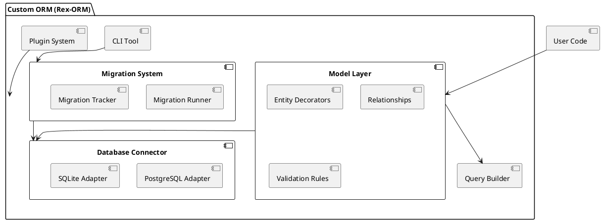

Below is an **expanded version** of the original document. It contains all the sections from the original but with additional details, clarifications, and best practices for each step and component. It also includes more **code examples**, deeper explanations of **design decisions**, and extra guidelines for a robust, maintainable, and extensible custom ORM, now referred to as **Rex-ORM**.

---

# Expanded Document for Rex-ORM

## == Requirements

Below are the expanded requirements for building a custom ORM for Deno. These requirements are divided into **Must-Have**, **Should-Have**, and **Could-Have** features:

### === Must-Have

1. **Database Connectivity**
   - **PostgreSQL**: Provide reliable connectivity using Deno’s PostgreSQL driver.
   - **SQLite**: Implement an adapter for lightweight local development or embedded applications.
   - **Connection Pooling**: Offer efficient connection reuse to handle concurrent requests.
   - **Transaction Management**: Simple API for transaction begin/commit/rollback.

2. **Type Safety**
   - **Leverage TypeScript**: Ensure strong compile-time checks for models, queries, and results.
   - **Strict Mode**: `tsconfig.json` must be configured with strict type checks to avoid `any` usage.

3. **CRUD Operations**
   - **Create/Read/Update/Delete**: Provide intuitive methods, e.g., `create()`, `find()`, `update()`, and `delete()` for interacting with data tables.

4. **Query Builder**
   - **Fluent API**: Implement a chainable query builder for advanced, yet readable SQL construction.
   - **Join Support**: Enable building joins on related tables.

5. **Schema Definition**
   - **Decorators**: Allow developers to define database tables and columns with TypeScript decorators.
   - **Type Mappings**: Provide mapping from TypeScript types (e.g., `string`, `number`) to SQL column types (e.g., `VARCHAR`, `INT`).

6. **Basic Relationships**
   - **One-to-One**, **One-to-Many**, **Many-to-Many**: Provide decorators or configuration options to define these relationships.
   - **Eager/Lazy Loading**: Optionally fetch related entities automatically.

7. **Error Handling**
   - **Descriptive Errors**: Throw domain-specific errors (e.g., `QueryError`, `MigrationError`) with helpful messages.
   - **Catch-all Handling**: Provide a uniform mechanism to catch and handle errors gracefully.

8. **Extensibility**
   - **Modular Design**: Structure the ORM so that new features (e.g., new DB adapters) can be plugged in without major rewrites.
   - **Plugin Architecture**: Officially support extension points.

### === Should-Have

1. **Migrations**
   - **Utility Scripts**: Provide methods to create, apply, and revert schema changes.
   - **Migration Tracking**: Keep a table of applied migrations.

2. **Custom Queries**
   - **Raw SQL**: Allow developers to execute SQL queries directly for advanced use cases or complex performance tuning.

3. **Validation**
   - **Property-Level**: Validate model properties using decorators (e.g., `@IsEmail()`, `@IsString()`).
   - **Schema-Level**: Support hooks for custom validation logic before saving data.

4. **Logging**
   - **Debug Output**: Make it possible to log generated SQL queries and bind parameters for troubleshooting.
   - **Configurable Levels**: Provide basic logging levels (error, warn, info, debug) with easy toggling.

5. **CLI Tool**
   - **Convenience Commands**: Simplify usage (e.g., generating models, running migrations).
   - **Scaffolding**: Optionally generate boilerplate files for new projects or modules.

### === Could-Have

1. **Caching**
   - **Simple Cache**: Possibly store frequently accessed queries in memory.
   - **Cache Invalidation**: Provide hooks to invalidate or refresh data.

2. **NoSQL Support**
   - **MongoDB or Others**: Potential future extension via plugins or specialized adapters.

---

## == Method

To build **Rex-ORM**, we use a **modular architecture** leveraging TypeScript for type safety, maintainability, and extensibility. The design focuses on ensuring that new features and database support can be added without breaking existing functionality.

### === Architecture Overview

The ORM is divided into the following core modules:

1. **Database Connector**
   - Handles low-level connectivity using adapters (PostgreSQL, SQLite).
   - Provides connection pooling, transaction management, and resource cleanup.

2. **Model Layer**
   - Offers decorators for marking classes as database entities.
   - Defines columns, primary keys, and relationships.
   - Handles validation logic (if enabled).

3. **Query Builder**
   - A chainable, fluent API to create simple or complex queries.
   - Maintains internal state to track `SELECT`, `FROM`, `WHERE`, `JOIN`, etc.

4. **Migration System**
   - Facilitates schema evolution.
   - Maintains a database table to track applied migrations.
   - Provides `up` and `down` methods for reversible changes.

5. **Plugin System**
   - Allows the introduction of new features (e.g., caching, advanced logging).
   - Streamlines adding support for new databases (NoSQL or other SQL dialects).

6. **CLI Tool**
   - Exposes basic commands to manage migrations, generate new models, and possibly run the application in a dev environment.

### === Technical Components

#### ==== Database Connector

- **Factory Pattern**: Instantiate the correct adapter (PostgreSQL or SQLite) based on config.
- **Connection Pool**: (For PostgreSQL) Use a pool to handle multiple concurrent connections.
- **Transactions**: API to begin, commit, and rollback.

```typescript
// FILE: src/adapters/DatabaseFactory.ts
import { DatabaseAdapter } from './interfaces/DatabaseAdapter.ts';
import { PostgresAdapter } from './PostgresAdapter.ts';
import { SQLiteAdapter } from './SQLiteAdapter.ts';

export class DatabaseFactory {
  static createAdapter(config: any): DatabaseAdapter {
    switch (config.database) {
      case 'postgres':
        return new PostgresAdapter(config);
      case 'sqlite':
        return new SQLiteAdapter(config);
      default:
        throw new Error(`Unsupported database type: ${config.database}`);
    }
  }
}
```

#### ==== Model Layer

- **Decorators**: Mark classes as entities, define columns, and specify relationships.
- **Validation**: Provide optional validation decorators.

```typescript
// FILE: src/models/decorators.ts
export function Entity(tableName: string) {
  return function (target: any) {
    Reflect.defineMetadata('tableName', tableName, target);
  };
}

export function PrimaryKey() {
  return function (target: any, propertyKey: string) {
    Reflect.defineMetadata('primaryKey', propertyKey, target.constructor);
  };
}

export function Column() {
  return function (target: any, propertyKey: string) {
    const columns = Reflect.getMetadata('columns', target.constructor) || [];
    columns.push(propertyKey);
    Reflect.defineMetadata('columns', columns, target.constructor);
  };
}
```

#### ==== Query Builder

- **Fluent API**: e.g., `select('id, name').from('users').where('age', '>', 18).execute()`.
- **Advanced Queries**: Built-in support for `JOIN`, nested queries, grouping, and ordering.

```typescript
// FILE: src/query/QueryBuilder.ts
import { DatabaseAdapter } from '../adapters/interfaces/DatabaseAdapter.ts';

export class QueryBuilder {
  private _select: string[] = [];
  private _from: string | null = null;
  private _where: string[] = [];
  private _joins: string[] = [];
  private _orderBy: string | null = null;
  private _limit: number | null = null;

  select(...columns: string[]): QueryBuilder {
    this._select = columns;
    return this;
  }

  from(table: string): QueryBuilder {
    this._from = table;
    return this;
  }

  where(column: string, operator: string, value: any): QueryBuilder {
    this._where.push(`${column} ${operator} '${value}'`);
    return this;
  }

  join(table: string, condition: string): QueryBuilder {
    this._joins.push(`JOIN ${table} ON ${condition}`);
    return this;
  }

  orderBy(column: string, direction: 'ASC' | 'DESC' = 'ASC'): QueryBuilder {
    this._orderBy = `${column} ${direction}`;
    return this;
  }

  limit(count: number): QueryBuilder {
    this._limit = count;
    return this;
  }

  buildQuery(): string {
    if (!this._from) {
      throw new Error('No table specified in QueryBuilder.');
    }

    let query = `SELECT ${this._select.length > 0 ? this._select.join(', ') : '*'} FROM ${this._from}`;
    if (this._joins.length) {
      query += ' ' + this._joins.join(' ');
    }
    if (this._where.length) {
      query += ` WHERE ${this._where.join(' AND ')}`;
    }
    if (this._orderBy) {
      query += ` ORDER BY ${this._orderBy}`;
    }
    if (this._limit !== null) {
      query += ` LIMIT ${this._limit}`;
    }
    return query;
  }

  async execute(adapter: DatabaseAdapter): Promise<any> {
    const query = this.buildQuery();
    return adapter.execute(query);
  }
}
```

#### ==== Migration System

- **Migration Files**: Each migration file exports an object with `up` and `down` methods.
- **Migration Runner**: Applies migrations in chronological order and tracks them in a dedicated table.

```typescript
// FILE: src/migrations/MigrationRunner.ts
import { DatabaseAdapter } from '../adapters/interfaces/DatabaseAdapter.ts';

export class MigrationRunner {
  constructor(private adapter: DatabaseAdapter) {}

  async run(migration: any) {
    if (typeof migration.up !== 'function') {
      throw new Error('Migration is missing an up() function');
    }
    await migration.up(this.adapter);
  }

  async rollback(migration: any) {
    if (typeof migration.down !== 'function') {
      throw new Error('Migration is missing a down() function');
    }
    await migration.down(this.adapter);
  }
}
```

#### ==== Plugin System

- **Register Plugin**: Provide a method on the main ORM class to load and initialize plugins.

```typescript
// FILE: src/plugins/PluginSystem.ts
export interface ORMPlugin {
  name: string;
  initialize(): void;
}

export class PluginSystem {
  private static _plugins: ORMPlugin[] = [];

  static registerPlugin(plugin: ORMPlugin) {
    this._plugins.push(plugin);
    plugin.initialize();
  }
}
```

#### ==== CLI Tool

- **Deno CLI Args**: Expose commands such as `migrate`, `rollback`, `generate:model`.
- **Scaffold**: Optionally create new directories and sample files (e.g., `models/`, `migrations/`).

```typescript
// FILE: cli.ts
if (import.meta.main) {
  const command = Deno.args[0];
  switch (command) {
    case 'migrate':
      // Execute migration logic
      break;
    case 'rollback':
      // Execute rollback logic
      break;
    case 'generate:model':
      // Generate a model template
      break;
    default:
      console.log('Unknown command.');
      break;
  }
}
```

### === PlantUML Diagram

Below is a high-level architectural diagram of the ORM, **including** our primary modules and their interactions:



---

## == Implementation

### === Step 1: Project Setup

1. **Initialize Deno Project**
   ```bash
   mkdir rex-orm && cd rex-orm
   # Deno doesn't have an official 'init' like Node does for package.json,
   # but we create a basic structure manually:
   mkdir src tests
   echo '# Rex-ORM' > README.md
   ```
   - Add a `deps.ts` file to manage third-party dependencies:
     ```typescript
     // FILE: deps.ts
     export { Client as PostgresClient } from "https://deno.land/x/postgres/mod.ts";
     export { DB as SQLiteDB } from "https://deno.land/x/sqlite/mod.ts";
     ```
   - (Optional) Create a `tsconfig.json` for stricter settings:
     ```json
     {
       "compilerOptions": {
         "strict": true,
         "noImplicitAny": true,
         "strictNullChecks": true,
         "target": "ESNext",
         "module": "ESNext"
       }
     }
     ```

2. **Setup Testing Framework**
   - Use Deno’s built-in test framework. Create a `tests` folder with sample tests:
     ```typescript
     // FILE: tests/sample.test.ts
     import { assertEquals } from "https://deno.land/std@0.190.0/testing/asserts.ts";

     Deno.test("Sample test", () => {
       assertEquals(1 + 1, 2);
     });
     ```

### === Step 2: Build the Database Connector

1. **Database Adapter Interface**
   ```typescript
   // FILE: src/adapters/interfaces/DatabaseAdapter.ts
   export interface DatabaseAdapter {
     connect(): Promise<void>;
     disconnect(): Promise<void>;
     execute(query: string, params?: any[]): Promise<any>;
     // Additional transaction methods:
     beginTransaction?(): Promise<void>;
     commitTransaction?(): Promise<void>;
     rollbackTransaction?(): Promise<void>;
   }
   ```

2. **PostgreSQL Adapter**
   ```typescript
   // FILE: src/adapters/PostgresAdapter.ts
   import { PostgresClient } from '../../deps.ts';
   import { DatabaseAdapter } from './interfaces/DatabaseAdapter.ts';

   export class PostgresAdapter implements DatabaseAdapter {
     private client: PostgresClient;

     constructor(private config: any) {
       this.client = new PostgresClient(config);
     }

     async connect() {
       await this.client.connect();
     }

     async disconnect() {
       await this.client.end();
     }

     async execute(query: string, params: any[] = []) {
       // For postgres driver, we usually do: client.queryObject or client.queryArray
       // Depending on your preferences:
       const result = await this.client.queryArray(query, ...params);
       return result.rows;
     }

     // Transaction methods
     async beginTransaction() {
       await this.execute("BEGIN");
     }

     async commitTransaction() {
       await this.execute("COMMIT");
     }

     async rollbackTransaction() {
       await this.execute("ROLLBACK");
     }
   }
   ```

3. **SQLite Adapter**
   ```typescript
   // FILE: src/adapters/SQLiteAdapter.ts
   import { SQLiteDB } from '../../deps.ts';
   import { DatabaseAdapter } from './interfaces/DatabaseAdapter.ts';

   export class SQLiteAdapter implements DatabaseAdapter {
     private db!: SQLiteDB;

     constructor(private config: any) {
       // config might contain a file path for the SQLite database
     }

     async connect() {
       this.db = new SQLiteDB(this.config.filePath || ':memory:');
     }

     async disconnect() {
       this.db.close();
     }

     async execute(query: string, params: any[] = []) {
       // For simplicity, we assume param substitution is handled manually
       // Alternatively, use placeholders (?) in the query
       // Example usage:
       const results = this.db.query(query, params);
       return results;
     }

     // Transaction methods
     async beginTransaction() {
       this.db.query("BEGIN");
     }

     async commitTransaction() {
       this.db.query("COMMIT");
     }

     async rollbackTransaction() {
       this.db.query("ROLLBACK");
     }
   }
   ```

### === Step 3: Model Layer

1. **Entity Decorators**
   ```typescript
   // FILE: src/models/decorators.ts
   // Using Reflect Metadata for storing model info
   import "https://deno.land/x/reflect_metadata@v0.1.12/mod.ts";

   export function Entity(tableName: string) {
     return function (target: any) {
       Reflect.defineMetadata('tableName', tableName, target);
     };
   }

   export function Column(columnOptions?: any) {
     return function (target: any, propertyKey: string) {
       const existingColumns = Reflect.getMetadata('columns', target.constructor) || [];
       existingColumns.push({
         propertyKey,
         options: columnOptions || {},
       });
       Reflect.defineMetadata('columns', existingColumns, target.constructor);
     };
   }

   export function PrimaryKey() {
     return function (target: any, propertyKey: string) {
       Reflect.defineMetadata('primaryKey', propertyKey, target.constructor);
     };
   }
   ```

2. **Relationship Decorators**
   ```typescript
   // FILE: src/models/relationships.ts
   import "https://deno.land/x/reflect_metadata@v0.1.12/mod.ts";

   export function OneToMany(relatedClass: () => any, mappedBy?: string) {
     return function (target: any, propertyKey: string) {
       const relationships = Reflect.getMetadata('relationships', target.constructor) || [];
       relationships.push({
         type: 'OneToMany',
         propertyKey,
         relatedClass: relatedClass(),
         mappedBy,
       });
       Reflect.defineMetadata('relationships', relationships, target.constructor);
     };
   }

   export function ManyToOne(relatedClass: () => any) {
     return function (target: any, propertyKey: string) {
       const relationships = Reflect.getMetadata('relationships', target.constructor) || [];
       relationships.push({
         type: 'ManyToOne',
         propertyKey,
         relatedClass: relatedClass(),
       });
       Reflect.defineMetadata('relationships', relationships, target.constructor);
     };
   }

   // Similarly for ManyToMany, OneToOne
   ```

3. **Example Usage**
   ```typescript
   // FILE: src/models/User.ts
   import { Entity, PrimaryKey, Column } from './decorators.ts';
   import { OneToMany } from './relationships.ts';
   import { Post } from './Post.ts';

   @Entity("users")
   export class User {
     @PrimaryKey()
     id!: number;

     @Column({ type: 'varchar', length: 255 })
     name!: string;

     @Column({ unique: true })
     email!: string;

     @OneToMany(() => Post, 'user')
     posts?: Post[];
   }
   ```

### === Step 4: Query Builder

**Chainable API**: We’ve already seen a partial implementation. Below is a slightly more comprehensive example with placeholders.

```typescript
// FILE: src/query/QueryBuilder.ts
import { DatabaseAdapter } from '../adapters/interfaces/DatabaseAdapter.ts';

export class QueryBuilder {
  private _select: string[] = [];
  private _table: string | null = null;
  private _whereClauses: Array<{ column: string; operator: string; value: any }> = [];
  private _joins: string[] = [];
  private _orderBy: string | null = null;
  private _limit: number | null = null;
  private _offset: number | null = null;

  select(...columns: string[]) {
    this._select = columns;
    return this;
  }

  from(table: string) {
    this._table = table;
    return this;
  }

  where(column: string, operator: string, value: any) {
    this._whereClauses.push({ column, operator, value });
    return this;
  }

  join(table: string, condition: string) {
    this._joins.push(`JOIN ${table} ON ${condition}`);
    return this;
  }

  orderBy(column: string, direction: 'ASC' | 'DESC' = 'ASC') {
    this._orderBy = `${column} ${direction}`;
    return this;
  }

  limit(count: number) {
    this._limit = count;
    return this;
  }

  offset(count: number) {
    this._offset = count;
    return this;
  }

  buildQuery(): string {
    if (!this._table) throw new Error('No table specified.');

    const selectClause = this._select.length > 0 ? this._select.join(', ') : '*';
    let query = `SELECT ${selectClause} FROM ${this._table}`;

    if (this._joins.length) {
      query += ' ' + this._joins.join(' ');
    }

    if (this._whereClauses.length) {
      const conditions = this._whereClauses
        .map((w) => `${w.column} ${w.operator} '${w.value}'`)
        .join(' AND ');
      query += ` WHERE ${conditions}`;
    }

    if (this._orderBy) {
      query += ` ORDER BY ${this._orderBy}`;
    }

    if (this._limit !== null) {
      query += ` LIMIT ${this._limit}`;
    }

    if (this._offset !== null) {
      query += ` OFFSET ${this._offset}`;
    }

    return query;
  }

  async execute(adapter: DatabaseAdapter) {
    const query = this.buildQuery();
    return adapter.execute(query);
  }
}
```

### === Step 5: Migration System

1. **Migration Runner**
   ```typescript
   // FILE: src/migrations/MigrationRunner.ts
   import { DatabaseAdapter } from '../adapters/interfaces/DatabaseAdapter.ts';

   export class MigrationRunner {
     constructor(private adapter: DatabaseAdapter) {}

     async run(migration: any) {
       if (typeof migration.up === 'function') {
         await migration.up(this.adapter);
       } else {
         throw new Error('Migration is missing an up() method');
       }
     }

     async rollback(migration: any) {
       if (typeof migration.down === 'function') {
         await migration.down(this.adapter);
       } else {
         throw new Error('Migration is missing a down() method');
       }
     }
   }
   ```

2. **Example Migration**
   ```typescript
   // FILE: src/migrations/1_create_users_table.ts
   export default {
     up: async (db: any) => {
       await db.execute(`
         CREATE TABLE IF NOT EXISTS users (
           id SERIAL PRIMARY KEY,
           name VARCHAR(255),
           email VARCHAR(255) UNIQUE
         )
       `);
     },
     down: async (db: any) => {
       await db.execute(`DROP TABLE IF EXISTS users`);
     },
   };
   ```

### === Step 6: CLI Tool

**Command Interface**: Parse `Deno.args` and dispatch accordingly. In a more advanced scenario, you might use a 3rd-party command parser.

```typescript
// FILE: cli.ts
import { DatabaseFactory } from './src/adapters/DatabaseFactory.ts';
import { MigrationRunner } from './src/migrations/MigrationRunner.ts';
// Example import for your migrations:
import createUsersTable from './src/migrations/1_create_users_table.ts';

if (import.meta.main) {
  const command = Deno.args[0];

  // Sample config
  const config = {
    database: 'postgres',
    host: 'localhost',
    user: 'admin',
    password: 'password',
    port: 5432,
  };

  const adapter = DatabaseFactory.createAdapter(config);
  const runner = new MigrationRunner(adapter);

  switch (command) {
    case 'migrate':
      await adapter.connect();
      await runner.run(createUsersTable);
      console.log('Migration applied.');
      await adapter.disconnect();
      break;
    case 'rollback':
      await adapter.connect();
      await runner.rollback(createUsersTable);
      console.log('Migration rolled back.');
      await adapter.disconnect();
      break;
    default:
      console.log('Unknown command.');
      break;
  }
}
```

### === Step 7: Testing and Documentation

1. **Unit Tests**
   - Create tests for each module in the `tests/` directory.
   - For example, test the QueryBuilder with a mock `DatabaseAdapter`.

2. **Documentation**
   - Provide Markdown files (e.g., `docs/QueryBuilder.md`, `docs/Models.md`) with usage instructions.
   - Include diagrams, code samples, and best practices.

---

## == Milestones

### === Milestone 1: Core Framework Setup

- **Tasks**:
  - Project initialization and `deps.ts` setup.
  - Implement `DatabaseAdapter` interface and basic adapters.
  - Write tests to verify connections and simple queries.
- **Deliverables**:
  - Working DB connectors (PostgreSQL, SQLite).
  - Basic unit tests.
- **Duration**: 2 weeks.

### === Milestone 2: Model Layer

- **Tasks**:
  - Develop entity, column, primary key decorators.
  - Implement relationships (`OneToMany`, `ManyToOne`) and validations.
  - Provide examples and unit tests.
- **Deliverables**:
  - Model definition API with relationships.
  - Example usage in `tests/models/`.
- **Duration**: 3 weeks.

### === Milestone 3: Query Builder

- **Tasks**:
  - Build a chainable QueryBuilder for CRUD and advanced queries.
  - Support nested queries, joins, ordering, limiting.
  - Write tests for correctness and performance.
- **Deliverables**:
  - Fully functional QueryBuilder with coverage.
  - Example queries tested.
- **Duration**: 2 weeks.

### === Milestone 4: Migration System

- **Tasks**:
  - Create the migration runner and a migration history table.
  - Provide utilities for generating/applying migrations.
  - Write example migrations and integration tests.
- **Deliverables**:
  - Migrations system with easy revert.
  - Database table for tracking migration states.
- **Duration**: 3 weeks.

### === Milestone 5: CLI Tool

- **Tasks**:
  - Build CLI commands (`migrate`, `rollback`, `generate:model`).
  - Provide debug/logging options.
  - Add usage examples in documentation.
- **Deliverables**:
  - CLI tool with helpful messages.
  - Basic scaffolding support.
- **Duration**: 2 weeks.

### === Milestone 6: Testing and Optimization

- **Tasks**:
  - Perform integration tests across all modules.
  - Optimize query construction and result handling.
  - Stress test with large datasets.
- **Deliverables**:
  - Well-tested, optimized code.
  - Performance benchmarks included in docs.
- **Duration**: 2 weeks.

### === Milestone 7: Documentation and Release

- **Tasks**:
  - Finish comprehensive documentation (Markdown, diagrams, examples).
  - Create a release on GitHub or Deno.land/x with version tags.
  - Gather initial community feedback.
- **Deliverables**:
  - Publicly available repository with full instructions.
  - Official release notes or changelog.
- **Duration**: 1 week.

---

## == Gathering Results

### === Functional Evaluation

1. **Database Compatibility**
   - Test with both PostgreSQL and SQLite.
   - Ensure all CRUD and migrations work without errors.

2. **Feature Completeness**
   - Verify all **Must-Have** items are stable.
   - Check **Should-Have** features (e.g., custom queries, migrations) do not degrade performance.

3. **Extensibility**
   - Develop a sample plugin (e.g., caching layer) to confirm plugin architecture is viable.

### === Performance Evaluation

1. **Query Performance**
   - Benchmark under various loads (light, medium, heavy).
   - Measure transaction overhead, especially in heavily concurrent applications.

2. **Resource Utilization**
   - Monitor CPU, memory usage.
   - Ensure minimal overhead from the ORM layers.

### === Developer Experience

1. **Ease of Use**
   - Solicit feedback on API clarity, decor usage, and documentation.
   - Check real-world adoption in small to medium projects.

2. **Error Feedback**
   - Confirm that errors provide useful information (e.g., which table or query caused an error).

### === Stability and Reliability

1. **Test Coverage**
   - Target at least **80%** coverage for unit and integration tests.
   - Include edge cases (e.g., incomplete config, invalid queries, large data sets).

2. **Real-World Usage**
   - Deploy in a small production project or pilot to confirm readiness.

### === Community Reception

1. **Open Source Contribution**
   - Publish roadmap, label issues for `help wanted`, encourage community pull requests.

2. **Adoption Metrics**
   - Track weekly downloads or GitHub stars.
   - Observe feedback for improvements or new features.

### === Iterative Improvements

1. **Bug Fixes**
   - Triage and fix reported bugs quickly, update tests accordingly.

2. **Feature Enhancements**
   - Expand on caching, advanced relationships, or NoSQL support.
   - Prioritize features based on user demand.

---

## == Code Standards for Rex-ORM

The following standards ensure **consistency**, **maintainability**, and alignment with project goals.

### === General Code Guidelines

1. **TypeScript Standards**
   - **Strict Mode**: Use the `strict` mode in `tsconfig.json`.
   - **Avoid `any`**: Use `unknown` or generics where necessary, plus runtime checks.
   - **Use `readonly`**: Mark immutable properties as `readonly`.

2. **File and Folder Structure**
   ```
   src/
     adapters/         # PostgreSQL, SQLite, and interface definitions
     models/           # Entity, relationships, validation
     query/            # Query builder logic
     migrations/       # Migration scripts and runner
     plugins/          # Plugin system and plugin examples
     utils/            # General utilities (types, constants)
   tests/
     # Unit and integration tests mirroring the src/ structure
   cli.ts             # Entry point for CLI commands
   deps.ts            # Third-party dependencies
   ```
   - Each module has implementation, type definitions, and a dedicated test file.

3. **Code Formatting**
   - Use `deno fmt`.
   - 2-space indentation, single quotes, 80-char line limit (soft).
   - Same-line curly braces for control statements.

4. **Naming Conventions**
   - **Classes/Decorators**: `PascalCase`
   - **Methods/Variables/Functions**: `camelCase`
   - **Constants**: `UPPER_CASE_WITH_UNDERSCORES`
   - **Private Properties**: `_prefix`.

5. **Documentation**
   - **JSDoc** for public classes and methods.
   - Additional Markdown docs (e.g., `docs/`) for complex modules.

6. **Error Handling**
   - Centralize error handling.
   - Use custom error classes (`QueryError`, `MigrationError`) for clarity.

### === Design Patterns

1. **Factory Pattern**
   - For dynamic adapter creation based on config.

2. **Decorator Pattern**
   - For `@Entity`, `@Column`, `@PrimaryKey`, etc.

3. **Chain of Responsibility**
   - Potentially for building query transforms or intercepting requests (caching, logging).

4. **Fluent Interface**
   - Query builder’s chainable methods.

5. **Observer Pattern**
   - For lifecycle hooks (e.g., `beforeSave`, `afterSave`).

6. **Repository Pattern**
   - Abstract data access in separate repository classes if desired.

### === Code Quality Standards

1. **Testing**
   - **Unit Tests**: For each function/module.
   - **Integration Tests**: Database connections, migrations, entire flow.

2. **Code Reviews**
   - Enforce peer reviews for each PR.
   - Check for style, tests, and maintainability.

3. **Performance**
   - Benchmark core functionalities, particularly query building and migrations.

4. **Security**
   - Default to parameterized queries to avoid SQL injection.
   - Validate user input at the model layer if possible.

### === Tooling

1. **Linters and Formatters**
   - `deno lint` and `deno fmt` included in CI.

2. **Testing Framework**
   - Native `deno test --coverage`.

3. **Version Control**
   - Git-based, semantic commit messages (`feat`, `fix`, `docs`).

4. **Continuous Integration**
   - Automated pipeline (GitHub Actions) for lint, format, and test:
     ```yaml
     name: CI

     on:
       push:
         branches: [ "main" ]
       pull_request:
         branches: [ "main" ]

     jobs:
       build-and-test:
         runs-on: ubuntu-latest
         steps:
           - uses: actions/checkout@v2
           - name: Install Deno
             uses: denoland/setup-deno@v1
             with:
               deno-version: v1.x
           - name: Lint
             run: deno lint
           - name: Format Check
             run: deno fmt --check
           - name: Test
             run: deno test --coverage
     ```

---

# Final Notes

With the steps, milestones, and guidelines outlined above, **Rex-ORM** aims to be a **robust**, **type-safe**, and **extensible** ORM for the Deno ecosystem. By following these patterns and best practices, developers can build complex data-driven applications while maintaining clean and maintainable code.

As the project matures, the **plugin architecture**, **community contributions**, and **detailed documentation** will ensure that Rex-ORM stays relevant and continues to evolve with the needs of Deno developers.
