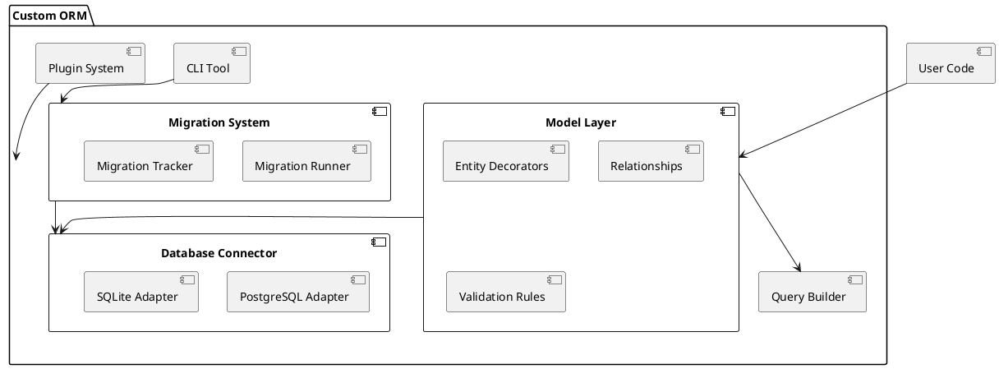

== Requirements

The following are the key requirements for building a custom ORM for Deno:

=== Must-Have
- **Database Connectivity**: Support for PostgreSQL and SQLite with connection pooling and transaction management.
- **Type Safety**: Leverage TypeScript to ensure strong type safety for models, queries, and results.
- **CRUD Operations**: Provide intuitive methods for Create, Read, Update, and Delete operations.
- **Query Builder**: Enable building complex queries programmatically with a fluent API.
- **Schema Definition**: Support defining database schemas directly in TypeScript.
- **Basic Relationships**: Handle basic relationships such as one-to-one, one-to-many, and many-to-many.
- **Error Handling**: Robust error handling and descriptive error messages.
- **Extensibility**: Modular design to allow plugins for additional database support or functionality.

=== Should-Have
- **Migrations**: Provide utilities for creating and applying schema migrations.
- **Custom Queries**: Allow execution of raw SQL queries when needed.
- **Validation**: Support validation rules for model properties.
- **Logging**: Provide query logging and debug utilities.
- **CLI Tool**: Command-line interface for managing migrations and generating models.

=== Could-Have
- **Caching**: Simple caching for frequently queried data.
- **NoSQL Support**: Potentially include a way to support NoSQL databases in future extensions.


Here’s the **Method** section, detailing the architecture and design choices for your custom ORM for Deno. It includes technical explanations, a modular design approach, and a high-level PlantUML diagram.

```asciidoc
== Method

To build the custom ORM for Deno, we adopt a modular architecture that leverages TypeScript for type safety and ensures compatibility with multiple databases. The design emphasizes extensibility, ensuring new features and database integrations can be added seamlessly.

=== Architecture Overview

The ORM is divided into the following core modules:

1. **Database Connector**:
   - Manages low-level connectivity to databases.
   - Supports PostgreSQL and SQLite with adapters for each.
   - Includes connection pooling and transaction management.

2. **Model Layer**:
   - Provides APIs for defining and managing database models.
   - Enforces schema definitions using TypeScript interfaces.
   - Supports decorators for defining relationships and validations.

3. **Query Builder**:
   - Implements a fluent API for constructing SQL queries programmatically.
   - Supports nested queries and joins for advanced functionality.

4. **Migration System**:
   - Includes utilities for generating and applying schema migrations.
   - Provides a mechanism to track migration history in the database.

5. **Plugin System**:
   - Allows integration of new features or support for additional databases via plugins.

6. **CLI Tool**:
   - Offers commands for creating migrations, generating models, and debugging queries.

=== Technical Components

==== Database Connector

- Implements a factory pattern to initialize database connections based on user configuration.
- Example configuration object:
  ```typescript
  const config = {
    database: "postgres",
    user: "admin",
    password: "password",
    host: "localhost",
    port: 5432,
  };
  ```

==== Model Layer

- Models are defined as classes with decorators to map them to tables:
  ```typescript
  @Entity("users")
  class User {
    @PrimaryKey()
    id: number;

    @Column()
    name: string;

    @Column()
    email: string;

    @OneToMany(() => Post, (post) => post.user)
    posts: Post[];
  }
  ```

==== Query Builder

- Provides a chainable API for building queries:
  ```typescript
  const users = await queryBuilder
    .select("*")
    .from("users")
    .where("age", ">", 18)
    .execute();
  ```

==== Migrations

- Migrations are created via TypeScript files and stored in a `migrations` directory:
  ```typescript
  export default {
    up: async (db) => {
      await db.createTable("users", {
        id: "serial primary key",
        name: "varchar(255)",
        email: "varchar(255)",
      });
    },
    down: async (db) => {
      await db.dropTable("users");
    },
  };
  ```

==== Plugin System

- Plugins can extend the ORM's capabilities by registering new features:
  ```typescript
  import { ORM } from "./orm";
  ORM.registerPlugin(myCustomPlugin);
  ```

=== PlantUML Diagram

Below is a high-level architectural diagram of the ORM:



```

### Next Steps
1. Review this **Method** section to ensure it aligns with your expectations.
2. Once approved, I will proceed to the **Implementation** section, detailing how to build out the ORM step-by-step.

Let me know your thoughts or any specific adjustments you'd like!
