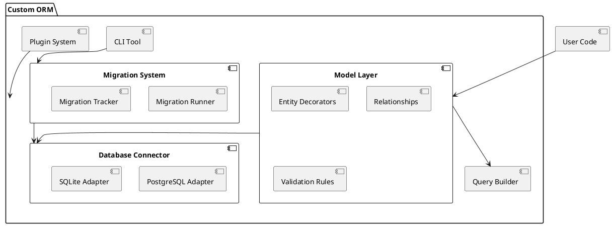

== Requirements

The following are the key requirements for building a custom ORM for Deno:

=== Must-Have
- **Database Connectivity**: Support for PostgreSQL and SQLite with connection pooling and transaction management.
- **Type Safety**: Leverage TypeScript to ensure strong type safety for models, queries, and results.
- **CRUD Operations**: Provide intuitive methods for Create, Read, Update, and Delete operations.
- **Query Builder**: Enable building complex queries programmatically with a fluent API.
- **Schema Definition**: Support defining database schemas directly in TypeScript.
- **Basic Relationships**: Handle basic relationships such as one-to-one, one-to-many, and many-to-many.
- **Error Handling**: Robust error handling and descriptive error messages.
- **Extensibility**: Modular design to allow plugins for additional database support or functionality.

=== Should-Have
- **Migrations**: Provide utilities for creating and applying schema migrations.
- **Custom Queries**: Allow execution of raw SQL queries when needed.
- **Validation**: Support validation rules for model properties.
- **Logging**: Provide query logging and debug utilities.
- **CLI Tool**: Command-line interface for managing migrations and generating models.

=== Could-Have
- **Caching**: Simple caching for frequently queried data.
- **NoSQL Support**: Potentially include a way to support NoSQL databases in future extensions.


== Method

To build the custom ORM for Deno, we adopt a modular architecture that leverages TypeScript for type safety and ensures compatibility with multiple databases. The design emphasizes extensibility, ensuring new features and database integrations can be added seamlessly.

=== Architecture Overview

The ORM is divided into the following core modules:

1. **Database Connector**:
   - Manages low-level connectivity to databases.
   - Supports PostgreSQL and SQLite with adapters for each.
   - Includes connection pooling and transaction management.

2. **Model Layer**:
   - Provides APIs for defining and managing database models.
   - Enforces schema definitions using TypeScript interfaces.
   - Supports decorators for defining relationships and validations.

3. **Query Builder**:
   - Implements a fluent API for constructing SQL queries programmatically.
   - Supports nested queries and joins for advanced functionality.

4. **Migration System**:
   - Includes utilities for generating and applying schema migrations.
   - Provides a mechanism to track migration history in the database.

5. **Plugin System**:
   - Allows integration of new features or support for additional databases via plugins.

6. **CLI Tool**:
   - Offers commands for creating migrations, generating models, and debugging queries.

=== Technical Components

==== Database Connector

- Implements a factory pattern to initialize database connections based on user configuration.
- Example configuration object:
  ```typescript
  const config = {
    database: "postgres",
    user: "admin",
    password: "password",
    host: "localhost",
    port: 5432,
  };
  ```

==== Model Layer

- Models are defined as classes with decorators to map them to tables:
  ```typescript
  @Entity("users")
  class User {
    @PrimaryKey()
    id: number;

    @Column()
    name: string;

    @Column()
    email: string;

    @OneToMany(() => Post, (post) => post.user)
    posts: Post[];
  }
  ```

==== Query Builder

- Provides a chainable API for building queries:
  ```typescript
  const users = await queryBuilder
    .select("*")
    .from("users")
    .where("age", ">", 18)
    .execute();
  ```

==== Migrations

- Migrations are created via TypeScript files and stored in a `migrations` directory:
  ```typescript
  export default {
    up: async (db) => {
      await db.createTable("users", {
        id: "serial primary key",
        name: "varchar(255)",
        email: "varchar(255)",
      });
    },
    down: async (db) => {
      await db.dropTable("users");
    },
  };
  ```

==== Plugin System

- Plugins can extend the ORM's capabilities by registering new features:
  ```typescript
  import { ORM } from "./orm";
  ORM.registerPlugin(myCustomPlugin);
  ```

=== PlantUML Diagram

Below is a high-level architectural diagram of the ORM:


== Implementation

The implementation of Rex-ORM involves the following steps:

=== Step 1: Project Setup
1. **Initialize Deno Project**:
   - Create a new project directory and initialize it:
     ```bash
     mkdir rex-orm && cd rex-orm
     deno init
     ```
   - Add a `deps.ts` file to manage third-party dependencies (e.g., Deno’s PostgreSQL driver):
     ```typescript
     export { Client as PostgresClient } from "https://deno.land/x/postgres/mod.ts";
     export { DB as SQLiteDB } from "https://deno.land/x/sqlite/mod.ts";
     ```

2. **Setup Testing Framework**:
   - Use Deno's built-in test framework and set up a test directory with example tests.

=== Step 2: Build the Database Connector
1. **Database Adapter Interface**:
   - Define a common interface for database adapters:
     ```typescript
     export interface DatabaseAdapter {
       connect(): Promise<void>;
       disconnect(): Promise<void>;
       execute(query: string, params?: any[]): Promise<any>;
     }
     ```

2. **PostgreSQL Adapter**:
   - Implement a PostgreSQL adapter:
     ```typescript
     import { PostgresClient } from "./deps.ts";
     import { DatabaseAdapter } from "./interfaces/DatabaseAdapter.ts";

     export class PostgresAdapter implements DatabaseAdapter {
       private client: PostgresClient;

       constructor(config: any) {
         this.client = new PostgresClient(config);
       }

       async connect() {
         await this.client.connect();
       }

       async disconnect() {
         await this.client.end();
       }

       async execute(query: string, params: any[] = []) {
         return this.client.queryArray(query, ...params);
       }
     }
     ```

3. **SQLite Adapter**:
   - Implement a similar adapter for SQLite.

=== Step 3: Model Layer
1. **Entity Decorators**:
   - Create decorators for defining models:
     ```typescript
     export function Entity(tableName: string) {
       return function (target: any) {
         target.tableName = tableName;
       };
     }

     export function Column() {
       return function (target: any, propertyKey: string) {
         if (!target.columns) target.columns = [];
         target.columns.push(propertyKey);
       };
     }
     ```

2. **Primary Key and Relationships**:
   - Add decorators for primary keys and relationships:
     ```typescript
     export function PrimaryKey() {
       return function (target: any, propertyKey: string) {
         target.primaryKey = propertyKey;
       };
     }
     ```

=== Step 4: Query Builder
1. **Chainable API**:
   - Implement a fluent API for constructing queries:
     ```typescript
     export class QueryBuilder {
       private query: string = "";

       select(columns: string) {
         this.query += `SELECT ${columns}`;
         return this;
       }

       from(table: string) {
         this.query += ` FROM ${table}`;
         return this;
       }

       where(column: string, operator: string, value: any) {
         this.query += ` WHERE ${column} ${operator} ${value}`;
         return this;
       }

       execute(adapter: DatabaseAdapter) {
         return adapter.execute(this.query);
       }
     }
     ```

=== Step 5: Migration System
1. **Migration Runner**:
   - Create a migration runner to apply and revert migrations:
     ```typescript
     export class MigrationRunner {
       constructor(private adapter: DatabaseAdapter) {}

       async run(migration: any) {
         await migration.up(this.adapter);
       }

       async rollback(migration: any) {
         await migration.down(this.adapter);
       }
     }
     ```

=== Step 6: CLI Tool
1. **Command Interface**:
   - Use Deno's CLI arguments API to handle commands for generating migrations and running them:
     ```typescript
     if (Deno.args[0] === "migrate") {
       // Run migrations
     } else if (Deno.args[0] === "generate:model") {
       // Generate model boilerplate
     }
     ```

=== Step 7: Testing and Documentation
1. **Unit Tests**:
   - Write unit tests for each module to ensure reliability.
2. **Documentation**:
   - Provide usage examples and API documentation in Markdown format.

== Milestones

The implementation of Rex-ORM is divided into the following milestones:

=== Milestone 1: Core Framework Setup
- **Tasks**:
  - Initialize the project and setup `deps.ts` for dependency management.
  - Implement the `DatabaseAdapter` interface and adapters for PostgreSQL and SQLite.
  - Write basic tests to verify connectivity and query execution.
- **Deliverables**:
  - A working database connector for PostgreSQL and SQLite.
  - Unit tests for adapters.
- **Duration**: 2 weeks.

=== Milestone 2: Model Layer
- **Tasks**:
  - Develop entity and column decorators for defining models.
  - Implement primary key and relationship decorators (e.g., `OneToMany`, `ManyToOne`).
  - Write validation rules for model properties.
- **Deliverables**:
  - API for defining models with relationships and validations.
  - Example models and unit tests.
- **Duration**: 3 weeks.

=== Milestone 3: Query Builder
- **Tasks**:
  - Implement the `QueryBuilder` with chainable methods for CRUD and advanced queries.
  - Add support for nested queries and joins.
- **Deliverables**:
  - A functional query builder with tests for basic and advanced queries.
- **Duration**: 2 weeks.

=== Milestone 4: Migration System
- **Tasks**:
  - Create a migration runner and tracker to manage schema changes.
  - Add utilities for generating and applying migrations.
  - Develop a migration history table for tracking applied migrations.
- **Deliverables**:
  - Migration system with `up` and `down` functionality.
  - Example migrations and tests.
- **Duration**: 3 weeks.

=== Milestone 5: CLI Tool
- **Tasks**:
  - Develop CLI commands for managing migrations (`migrate`, `rollback`) and generating models.
  - Add debug options for query inspection.
- **Deliverables**:
  - A CLI tool for managing ORM features.
  - Documentation for CLI usage.
- **Duration**: 2 weeks.

=== Milestone 6: Testing and Optimization
- **Tasks**:
  - Conduct integration tests across all modules (connectors, models, query builder, migrations).
  - Optimize performance for large datasets and queries.
- **Deliverables**:
  - Fully tested and optimized ORM.
- **Duration**: 2 weeks.

=== Milestone 7: Documentation and Release
- **Tasks**:
  - Write comprehensive documentation for setup, API usage, and examples.
  - Create a landing page or repository readme with examples.
- **Deliverables**:
  - Complete documentation.
  - Public release on GitHub or Deno.land/x.
- **Duration**: 1 week.

== Gathering Results

The success of Rex-ORM will be evaluated based on the following criteria:

=== Functional Evaluation
1. **Database Compatibility**:
   - Test connectivity and query execution with PostgreSQL and SQLite.
   - Verify smooth handling of CRUD operations and schema migrations.
2. **Feature Completeness**:
   - Ensure all Must-Have features (e.g., type safety, relationships, query builder) are implemented and function as expected.
   - Validate that Should-Have features (e.g., migrations, custom queries) work without performance degradation.
3. **Extensibility**:
   - Test plugin architecture by developing a simple plugin for additional database support.

=== Performance Evaluation
1. **Query Performance**:
   - Benchmark query execution times for basic and complex queries with varying data sizes.
   - Ensure efficient handling of transactions and connection pooling.
2. **Resource Utilization**:
   - Measure CPU and memory usage during intensive operations to ensure the ORM is lightweight.

=== Developer Experience
1. **Ease of Use**:
   - Gather feedback from developers on API design, documentation clarity, and onboarding experience.
2. **Error Feedback**:
   - Validate that error messages are descriptive and help debug issues effectively.

=== Stability and Reliability
1. **Test Coverage**:
   - Achieve at least 80% unit and integration test coverage across all modules.
   - Test for edge cases such as schema mismatches and invalid queries.
2. **Real-World Usage**:
   - Pilot the ORM in a real-world project to validate stability and feature completeness.

=== Community Reception
1. **Open Source Contribution**:
   - Gauge interest and contributions from the open-source community.
   - Monitor feedback, issues, and feature requests on the repository.
2. **Adoption Metrics**:
   - Track downloads and usage metrics from Deno.land/x or other distribution platforms.

=== Iterative Improvements
1. **Bug Fixes**:
   - Address bugs and usability issues reported during evaluation.
2. **Feature Enhancements**:
   - Prioritize and implement features based on user feedback and adoption trends.

