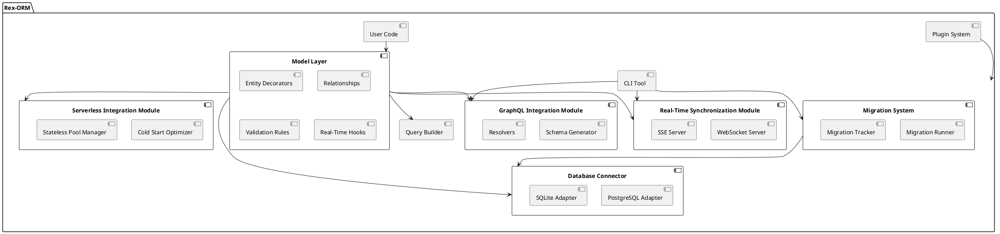

# Rex-ORM Specification Document

## Overview

Rex-ORM is a custom Object-Relational Mapping (ORM) library designed specifically for Deno. It aims to provide developers with a robust, type-safe, and extensible tool for interacting with PostgreSQL and SQLite databases. Rex-ORM leverages TypeScript to ensure strong type safety and incorporates innovative features such as Integrated Real-Time Data Synchronization, GraphQL Schema Generation, and Seamless Integration with Deno Deploy and Serverless Architectures. These unique capabilities set Rex-ORM apart, making it an attractive choice for modern web developers seeking efficiency and scalability.

---

## Requirements

The following are the key requirements for building Rex-ORM, a custom ORM for Deno:

### Must-Have

- **Database Connectivity**: Support for PostgreSQL and SQLite with connection pooling and transaction management.
- **Type Safety**: Leverage TypeScript to ensure strong type safety for models, queries, and results.
- **CRUD Operations**: Provide intuitive methods for Create, Read, Update, and Delete operations.
- **Query Builder**: Enable building complex queries programmatically with a fluent API.
- **Schema Definition**: Support defining database schemas directly in TypeScript.
- **Basic Relationships**: Handle basic relationships such as one-to-one, one-to-many, and many-to-many.
- **Error Handling**: Robust error handling and descriptive error messages.
- **Extensibility**: Modular design to allow plugins for additional database support or functionality.
- **Integrated Real-Time Data Synchronization**: Built-in support for real-time data synchronization using WebSockets or Server-Sent Events (SSE), enabling automatic reflection of database changes on the client side without manual refreshes or polling.
- **GraphQL Schema Generation from Models**: Automatically generate a GraphQL schema based on defined TypeScript models, simplifying the setup of a GraphQL API and ensuring consistency between ORM models and the API layer.
- **Seamless Integration with Deno Deploy and Serverless Architectures**: Optimize Rex-ORM for use with Deno Deploy and other serverless platforms, including features like cold start optimizations, stateless connection pooling, and automatic scaling support to ensure high performance in serverless environments.

### Should-Have

- **Migrations**: Provide utilities for creating and applying schema migrations.
- **Custom Queries**: Allow execution of raw SQL queries when needed.
- **Validation**: Support validation rules for model properties.
- **Logging**: Provide query logging and debug utilities.
- **CLI Tool**: Command-line interface for managing migrations and generating models.

### Could-Have

- **Caching**: Simple caching for frequently queried data.
- **NoSQL Support**: Potentially include a way to support NoSQL databases in future extensions.

---

## Method

To build Rex-ORM, we adopt a modular architecture that leverages TypeScript for type safety and ensures compatibility with multiple databases. The design emphasizes extensibility, ensuring new features and database integrations can be added seamlessly.

### Architecture Overview

The ORM is divided into the following core modules:

1. **Database Connector**:
   - Manages low-level connectivity to databases.
   - Supports PostgreSQL and SQLite with adapters for each.
   - Includes connection pooling and transaction management.

2. **Model Layer**:
   - Provides APIs for defining and managing database models.
   - Enforces schema definitions using TypeScript interfaces.
   - Supports decorators for defining relationships, validations, and real-time synchronization.

3. **Query Builder**:
   - Implements a fluent API for constructing SQL queries programmatically.
   - Supports nested queries and joins for advanced functionality.

4. **Migration System**:
   - Includes utilities for generating and applying schema migrations.
   - Provides a mechanism to track migration history in the database.

5. **Real-Time Synchronization Module**:
   - Facilitates real-time data synchronization using WebSockets or Server-Sent Events (SSE).
   - Integrates seamlessly with the Model Layer to emit events on data changes.

6. **GraphQL Integration Module**:
   - Automatically generates GraphQL schemas from TypeScript models.
   - Ensures type safety and consistency between ORM models and the GraphQL API.

7. **Serverless Integration Module**:
   - Optimizes ORM operations for serverless environments like Deno Deploy.
   - Handles cold start optimizations, stateless connection pooling, and automatic scaling.

8. **Plugin System**:
   - Allows integration of new features or support for additional databases via plugins.

9. **CLI Tool**:
   - Offers commands for creating migrations, generating models, managing real-time synchronization, and generating GraphQL schemas.
   - Provides debugging and monitoring capabilities.

### Technical Components

#### Database Connector

- **Description**: Manages the establishment and maintenance of connections to supported databases. It handles connection pooling, transaction management, and ensures efficient resource utilization.

- **Features**:
  - Factory pattern implementation to initialize database connections based on user configuration.
  - Support for PostgreSQL and SQLite with separate adapters.
  - Connection pooling to manage multiple simultaneous connections.
  - Transaction management to ensure data integrity.

- **Example Configuration Object**:
  ```typescript
  const config = {
    database: "postgres",
    user: "admin",
    password: "password",
    host: "localhost",
    port: 5432,
  };
  ```

#### Model Layer

- **Description**: Central to defining and managing database models. It leverages TypeScript's type system and decorators to map classes to database tables, enforce schema definitions, and handle relationships and validations.

- **Features**:
  - **Entity Decorators**: Map TypeScript classes to database tables.
  - **Column Decorators**: Define table columns and their properties.
  - **Primary Key and Relationship Decorators**: Define primary keys and relationships between models.
  - **Validation Rules**: Enforce data integrity through validation decorators.
  - **Real-Time Hooks**: Emit events on data changes for real-time synchronization.

- **Example Model Definition**:
  ```typescript
  @Entity("users")
  class User {
    @PrimaryKey()
    id: number;

    @Column()
    name: string;

    @Column()
    email: string;

    @OneToMany(() => Post, (post) => post.user)
    posts: Post[];
  }
  ```

#### Query Builder

- **Description**: Provides a fluent, chainable API for constructing complex SQL queries programmatically. It abstracts SQL syntax into intuitive method calls, enhancing developer productivity and reducing the likelihood of syntax errors.

- **Features**:
  - Chainable methods for SELECT, INSERT, UPDATE, DELETE operations.
  - Support for WHERE clauses, JOINs, ORDER BY, GROUP BY, and nested queries.
  - Parameterized queries to prevent SQL injection.
  - Integration with the Database Connector for query execution.

- **Example Usage**:
  ```typescript
  const users = await queryBuilder
    .select("*")
    .from("users")
    .where("age", ">", 18)
    .orderBy("name")
    .limit(10)
    .execute();
  ```

#### Migration System

- **Description**: Manages database schema changes through versioned migration scripts. It ensures that schema modifications are tracked, reproducible, and reversible.

- **Features**:
  - **Migration Runner**: Applies and reverts migrations.
  - **Migration Tracker**: Maintains a history of applied migrations within the database.
  - **Migration Generator**: Automates the creation of migration scripts based on model changes.
  - **Schema Versioning**: Keeps track of schema versions to manage updates seamlessly.

- **Example Migration Script**:
  ```typescript
  export default {
    up: async (db) => {
      await db.createTable("users", {
        id: "serial primary key",
        name: "varchar(255)",
        email: "varchar(255)",
      });
    },
    down: async (db) => {
      await db.dropTable("users");
    },
  };
  ```

#### Real-Time Synchronization Module

- **Description**: Enables real-time data synchronization between the database and clients. It utilizes WebSockets or Server-Sent Events (SSE) to push updates to connected clients whenever data changes occur.

- **Features**:
  - **WebSocket/SSE Integration**: Facilitates persistent connections for real-time data transfer.
  - **Event Emission**: Emits events on data creation, updates, and deletions.
  - **Subscription Management**: Allows clients to subscribe to specific data changes.
  - **Scalability**: Handles multiple concurrent real-time connections efficiently.

- **Example Implementation**:
  ```typescript
  import { RealTimeSync } from "./realtime/RealTimeSync.ts";

  const realTimeSync = new RealTimeSync();
  realTimeSync.subscribe("users", (data) => {
    // Push updates to clients
  });
  ```

#### GraphQL Integration Module

- **Description**: Automatically generates a GraphQL schema based on the defined TypeScript models. This tight integration simplifies the process of setting up a GraphQL API, ensuring consistency between the ORM models and the API layer.

- **Features**:
  - **Schema Generation**: Converts TypeScript model definitions into GraphQL types and resolvers.
  - **Type Safety**: Ensures that the GraphQL schema aligns with TypeScript types for consistency and reliability.
  - **CRUD Operations**: Automatically generates GraphQL queries and mutations for CRUD operations.
  - **Custom Resolvers**: Allows developers to define custom GraphQL resolvers for advanced functionalities.

- **Example Usage**:
  ```typescript
  import { GraphQLGenerator } from "./graphql/GraphQLGenerator.ts";

  const gqlSchema = GraphQLGenerator.generateSchema(models);
  ```

#### Serverless Integration Module

- **Description**: Optimizes Rex-ORM for deployment in serverless environments like Deno Deploy. It includes features that address the unique challenges of serverless architectures, such as cold start optimizations and stateless connection pooling.

- **Features**:
  - **Cold Start Optimization**: Reduces latency during function cold starts by pre-initializing connections.
  - **Stateless Connection Pooling**: Manages database connections in a way that aligns with the stateless nature of serverless functions.
  - **Automatic Scaling Support**: Ensures the ORM scales seamlessly with the dynamic nature of serverless workloads.
  - **Configuration Flexibility**: Allows easy configuration adjustments tailored for serverless environments.

- **Example Configuration**:
  ```typescript
  const serverlessConfig = {
    environment: "serverless",
    poolSize: 10,
    idleTimeout: 30000,
  };
  ```

#### Plugin System

- **Description**: Facilitates the extension of Rex-ORM’s capabilities through a modular plugin architecture. Developers can create and integrate plugins to add support for additional databases, custom functionalities, or third-party services.

- **Features**:
  - **Plugin Registration**: Allows dynamic registration of plugins at runtime.
  - **Extension Points**: Provides hooks and extension points within the ORM for plugins to interact.
  - **Isolation**: Ensures plugins operate independently without affecting core ORM functionalities.
  - **Documentation and SDK**: Offers comprehensive documentation and a software development kit (SDK) for plugin developers.

- **Example Plugin Registration**:
  ```typescript
  import { ORM } from "./orm";
  import { MyCustomPlugin } from "./plugins/MyCustomPlugin.ts";

  ORM.registerPlugin(MyCustomPlugin);
  ```

#### CLI Tool

- **Description**: A command-line interface that provides developers with tools to manage migrations, generate models, handle real-time synchronization, and generate GraphQL schemas. It streamlines various development tasks, enhancing productivity and ease of use.

- **Features**:
  - **Migration Management**: Commands to create, apply, and rollback migrations.
  - **Model Generation**: Automates the creation of model boilerplate code.
  - **Real-Time Sync Management**: Commands to configure and manage real-time synchronization settings.
  - **GraphQL Schema Generation**: Commands to generate and update GraphQL schemas based on models.
  - **Debugging Tools**: Provides utilities for inspecting queries, monitoring performance, and troubleshooting issues.
  - **Help and Documentation**: Comprehensive help commands and inline documentation for ease of use.

- **Example CLI Commands**:
  ```bash
  rex-orm migrate up
  rex-orm migrate down
  rex-orm generate:model User
  rex-orm graphql:generate
  rex-orm realtime:subscribe users
  ```

### PlantUML Diagram

Below is a high-level architectural diagram of Rex-ORM, incorporating the new modules for Real-Time Synchronization, GraphQL Integration, and Serverless Optimization:



---

## Implementation

The implementation of Rex-ORM involves the following comprehensive steps, now expanded to include the new features:

### Step 1: Project Setup

1. **Initialize Deno Project**:
   - Create a new project directory and initialize it:
     ```bash
     mkdir rex-orm && cd rex-orm
     deno init
     ```
   - Add a `deps.ts` file to manage third-party dependencies (e.g., Deno’s PostgreSQL and SQLite drivers, WebSocket libraries):
     ```typescript
     export { Client as PostgresClient } from "https://deno.land/x/postgres/mod.ts";
     export { DB as SQLiteDB } from "https://deno.land/x/sqlite/mod.ts";
     export { WebSocketServer } from "https://deno.land/std/ws/mod.ts";
     export { GraphQLSchema, GraphQLObjectType, GraphQLString } from "https://deno.land/x/graphql/mod.ts";
     ```

2. **Setup Testing Framework**:
   - Use Deno's built-in test framework and set up a test directory with example tests.
   - Organize tests into `unit` and `integration` subdirectories:
     ```
     tests/
       unit/
         adapters/
         models/
         query/
       integration/
         databaseConnector.test.ts
         queryBuilder.test.ts
         realtimeSync.test.ts
         graphqlIntegration.test.ts
     ```

3. **Initialize Version Control**:
   - Initialize a Git repository and create an initial commit:
     ```bash
     git init
     git add .
     git commit -m "chore: initial project setup"
     ```

### Step 2: Build the Database Connector

1. **Database Adapter Interface**:
   - Define a common interface for database adapters to ensure consistency and interchangeability:
     ```typescript
     // src/interfaces/DatabaseAdapter.ts
     export interface DatabaseAdapter {
       connect(): Promise<void>;
       disconnect(): Promise<void>;
       execute(query: string, params?: any[]): Promise<any>;
     }
     ```

2. **PostgreSQL Adapter**:
   - Implement a PostgreSQL adapter that adheres to the `DatabaseAdapter` interface:
     ```typescript
     // src/adapters/PostgresAdapter.ts
     import { PostgresClient } from "../deps.ts";
     import { DatabaseAdapter } from "../interfaces/DatabaseAdapter.ts";

     export class PostgresAdapter implements DatabaseAdapter {
       private client: PostgresClient;

       constructor(config: any) {
         this.client = new PostgresClient(config);
       }

       async connect() {
         await this.client.connect();
       }

       async disconnect() {
         await this.client.end();
       }

       async execute(query: string, params: any[] = []) {
         try {
           const result = await this.client.queryArray(query, ...params);
           return result;
         } catch (error) {
           throw new Error(`PostgreSQL Execution Error: ${error.message}`);
         }
       }
     }
     ```

3. **SQLite Adapter**:
   - Implement a similar adapter for SQLite:
     ```typescript
     // src/adapters/SQLiteAdapter.ts
     import { SQLiteDB } from "../deps.ts";
     import { DatabaseAdapter } from "../interfaces/DatabaseAdapter.ts";

     export class SQLiteAdapter implements DatabaseAdapter {
       private db: SQLiteDB;

       constructor(databasePath: string) {
         this.db = new SQLiteDB(databasePath);
       }

       async connect() {
         // SQLite connections are typically immediate upon instantiation
       }

       async disconnect() {
         this.db.close();
       }

       async execute(query: string, params: any[] = []) {
         try {
           const result = this.db.query(query, ...params);
           return result;
         } catch (error) {
           throw new Error(`SQLite Execution Error: ${error.message}`);
         }
       }
     }
     ```

4. **Database Factory**:
   - Implement a factory to create database adapters dynamically based on configuration:
     ```typescript
     // src/factory/DatabaseFactory.ts
     import { DatabaseAdapter } from "../interfaces/DatabaseAdapter.ts";
     import { PostgresAdapter } from "../adapters/PostgresAdapter.ts";
     import { SQLiteAdapter } from "../adapters/SQLiteAdapter.ts";

     export class DatabaseFactory {
       static createAdapter(config: any): DatabaseAdapter {
         if (config.database === "postgres") {
           return new PostgresAdapter(config);
         } else if (config.database === "sqlite") {
           return new SQLiteAdapter(config.databasePath);
         } else {
           throw new Error(`Unsupported database type: ${config.database}`);
         }
       }
     }
     ```

5. **Unit Tests for Database Adapters**:
   - Write unit tests to verify connectivity and query execution:
     ```typescript
     // tests/unit/adapters/PostgresAdapter.test.ts
     import { assertEquals } from "https://deno.land/std/testing/asserts.ts";
     import { PostgresAdapter } from "../../../src/adapters/PostgresAdapter.ts";

     Deno.test("PostgresAdapter connects and executes query", async () => {
       const config = {
         database: "postgres",
         user: "admin",
         password: "password",
         host: "localhost",
         port: 5432,
         databaseName: "test_db",
       };
       const adapter = new PostgresAdapter(config);
       await adapter.connect();
       const result = await adapter.execute("SELECT 1 AS number");
       assertEquals(result.rows[0][0], 1);
       await adapter.disconnect();
     });
     ```

     ```typescript
     // tests/unit/adapters/SQLiteAdapter.test.ts
     import { assertEquals } from "https://deno.land/std/testing/asserts.ts";
     import { SQLiteAdapter } from "../../../src/adapters/SQLiteAdapter.ts";

     Deno.test("SQLiteAdapter connects and executes query", async () => {
       const adapter = new SQLiteAdapter(":memory:");
       await adapter.connect();
       await adapter.execute("CREATE TABLE test (id INTEGER PRIMARY KEY, value TEXT)");
       await adapter.execute("INSERT INTO test (value) VALUES (?)", ["hello"]);
       const result = await adapter.execute("SELECT value FROM test WHERE id = ?", [1]);
       assertEquals(result.rows[0][0], "hello");
       await adapter.disconnect();
     });
     ```

### Step 3: Model Layer

1. **Entity Decorators**:
   - Create decorators for defining models and mapping them to database tables:
     ```typescript
     // src/decorators/Entity.ts
     export function Entity(tableName: string) {
       return function (constructor: Function) {
         Reflect.defineMetadata("tableName", tableName, constructor);
       };
     }
     ```

     ```typescript
     // src/decorators/Column.ts
     export function Column(options?: any) {
       return function (target: any, propertyKey: string) {
         if (!Reflect.hasMetadata("columns", target.constructor)) {
           Reflect.defineMetadata("columns", [], target.constructor);
         }
         const columns = Reflect.getMetadata("columns", target.constructor);
         columns.push({ propertyKey, options });
         Reflect.defineMetadata("columns", columns, target.constructor);
       };
     }
     ```

2. **Primary Key and Relationship Decorators**:
   - Add decorators for primary keys and relationships:
     ```typescript
     // src/decorators/PrimaryKey.ts
     export function PrimaryKey(options?: any) {
       return function (target: any, propertyKey: string) {
         Reflect.defineMetadata("primaryKey", propertyKey, target.constructor);
         // Reuse Column decorator
         Column(options)(target, propertyKey);
       };
     }
     ```

     ```typescript
     // src/decorators/OneToMany.ts
     export function OneToMany(
       typeFunction: () => Function,
       inverse: (object: any) => any
     ) {
       return function (target: any, propertyKey: string) {
         Reflect.defineMetadata("relations", { type: "OneToMany", target: typeFunction(), inverse }, target.constructor);
       };
     }
     ```

3. **Model Registry and Metadata Storage**:
   - Implement a registry to store model metadata for runtime operations:
     ```typescript
     // src/models/ModelRegistry.ts
     interface ColumnMetadata {
       propertyKey: string;
       options?: any;
     }

     interface RelationMetadata {
       type: string;
       target: Function;
       inverse: (object: any) => any;
     }

     interface ModelMetadata {
       tableName: string;
       columns: ColumnMetadata[];
       primaryKey: string;
       relations: RelationMetadata[];
     }

     export class ModelRegistry {
       private static models: Map<Function, ModelMetadata> = new Map();

       static registerModel(model: Function) {
         const tableName = Reflect.getMetadata("tableName", model);
         const columns: ColumnMetadata[] = Reflect.getMetadata("columns", model) || [];
         const primaryKey: string = Reflect.getMetadata("primaryKey", model);
         const relations: RelationMetadata[] = Reflect.getMetadata("relations", model) || [];
         this.models.set(model, { tableName, columns, primaryKey, relations });
       }

       static getModelMetadata(model: Function): ModelMetadata {
         return this.models.get(model)!;
       }

       static getAllModels(): Function[] {
         return Array.from(this.models.keys());
       }
     }
     ```

4. **Model Initialization**:
   - Automatically register models upon definition:
     ```typescript
     // src/models/BaseModel.ts
     import { ModelRegistry } from "./ModelRegistry.ts";

     export abstract class BaseModel {
       constructor() {
         ModelRegistry.registerModel(this.constructor);
       }
     }
     ```

5. **Example Models**:
   - Define example models using decorators:
     ```typescript
     // src/models/User.ts
     import { Entity } from "../decorators/Entity.ts";
     import { PrimaryKey } from "../decorators/PrimaryKey.ts";
     import { Column } from "../decorators/Column.ts";
     import { OneToMany } from "../decorators/OneToMany.ts";
     import { BaseModel } from "./BaseModel.ts";
     import { Post } from "./Post.ts";

     @Entity("users")
     export class User extends BaseModel {
       @PrimaryKey({ autoIncrement: true })
       id: number;

       @Column({ type: "varchar", length: 255 })
       name: string;

       @Column({ type: "varchar", length: 255, unique: true })
       email: string;

       @OneToMany(() => Post, (post) => post.user)
       posts: Post[];
     }
     ```

     ```typescript
     // src/models/Post.ts
     import { Entity } from "../decorators/Entity.ts";
     import { PrimaryKey } from "../decorators/PrimaryKey.ts";
     import { Column } from "../decorators/Column.ts";
     import { ManyToOne } from "../decorators/ManyToOne.ts";
     import { BaseModel } from "./BaseModel.ts";
     import { User } from "./User.ts";

     @Entity("posts")
     export class Post extends BaseModel {
       @PrimaryKey({ autoIncrement: true })
       id: number;

       @Column({ type: "varchar", length: 255 })
       title: string;

       @Column({ type: "text" })
       content: string;

       @ManyToOne(() => User, (user) => user.posts)
       user: User;
     }
     ```

6. **Relationship Decorators**:
   - Implement decorators for `ManyToOne`, `OneToOne`, and `ManyToMany` relationships:
     ```typescript
     // src/decorators/ManyToOne.ts
     export function ManyToOne(
       typeFunction: () => Function,
       inverse: (object: any) => any
     ) {
       return function (target: any, propertyKey: string) {
         Reflect.defineMetadata("relations", { type: "ManyToOne", target: typeFunction(), inverse }, target.constructor);
       };
     }
     ```

     ```typescript
     // src/decorators/OneToOne.ts
     export function OneToOne(
       typeFunction: () => Function,
       inverse: (object: any) => any
     ) {
       return function (target: any, propertyKey: string) {
         Reflect.defineMetadata("relations", { type: "OneToOne", target: typeFunction(), inverse }, target.constructor);
       };
     }
     ```

     ```typescript
     // src/decorators/ManyToMany.ts
     export function ManyToMany(
       typeFunction: () => Function,
       inverse: (object: any) => any
     ) {
       return function (target: any, propertyKey: string) {
         Reflect.defineMetadata("relations", { type: "ManyToMany", target: typeFunction(), inverse }, target.constructor);
       };
     }
     ```

7. **Validation Rules**:
   - Implement decorators for validation rules, leveraging TypeScript's type system:
     ```typescript
     // src/decorators/Validate.ts
     export function Validate(rule: (value: any) => boolean, message: string) {
       return function (target: any, propertyKey: string) {
         if (!Reflect.hasMetadata("validations", target.constructor)) {
           Reflect.defineMetadata("validations", {}, target.constructor);
         }
         const validations = Reflect.getMetadata("validations", target.constructor);
         validations[propertyKey] = { rule, message };
         Reflect.defineMetadata("validations", validations, target.constructor);
       };
     }
     ```

8. **Model Validation**:
   - Implement a method to validate model instances based on defined validation rules:
     ```typescript
     // src/models/BaseModel.ts
     import { ModelRegistry } from "./ModelRegistry.ts";

     export abstract class BaseModel {
       constructor() {
         ModelRegistry.registerModel(this.constructor);
       }

       validate(): void {
         const metadata = ModelRegistry.getModelMetadata(this.constructor);
         const validations = Reflect.getMetadata("validations", this.constructor) || {};
         for (const [property, { rule, message }] of Object.entries(validations)) {
           if (!rule(this[property])) {
             throw new Error(`Validation failed for ${property}: ${message}`);
           }
         }
       }
     }
     ```

### Step 4: Query Builder

1. **Chainable API Implementation**:
   - Develop a fluent, chainable API for constructing queries:
     ```typescript
     // src/query/QueryBuilder.ts
     import { DatabaseAdapter } from "../interfaces/DatabaseAdapter.ts";

     export class QueryBuilder {
       private queryParts: string[] = [];
       private params: any[] = [];

       select(columns: string | string[]) {
         const cols = Array.isArray(columns) ? columns.join(", ") : columns;
         this.queryParts.push(`SELECT ${cols}`);
         return this;
       }

       insert(table: string, data: Record<string, any>) {
         const keys = Object.keys(data);
         const placeholders = keys.map((_, index) => `$${index + 1}`).join(", ");
         const values = Object.values(data);
         this.queryParts.push(`INSERT INTO ${table} (${keys.join(", ")}) VALUES (${placeholders})`);
         this.params.push(...values);
         return this;
       }

       update(table: string, data: Record<string, any>) {
         const setClauses = Object.keys(data).map((key, index) => `${key} = $${index + 1}`).join(", ");
         const values = Object.values(data);
         this.queryParts.push(`UPDATE ${table} SET ${setClauses}`);
         this.params.push(...values);
         return this;
       }

       delete(table: string) {
         this.queryParts.push(`DELETE FROM ${table}`);
         return this;
       }

       from(table: string) {
         this.queryParts.push(`FROM ${table}`);
         return this;
       }

       where(column: string, operator: string, value: any) {
         const placeholder = `$${this.params.length + 1}`;
         this.queryParts.push(`WHERE ${column} ${operator} ${placeholder}`);
         this.params.push(value);
         return this;
       }

       join(table: string, condition: string, type: "INNER" | "LEFT" | "RIGHT" = "INNER") {
         this.queryParts.push(`${type} JOIN ${table} ON ${condition}`);
         return this;
       }

       orderBy(column: string, direction: "ASC" | "DESC" = "ASC") {
         this.queryParts.push(`ORDER BY ${column} ${direction}`);
         return this;
       }

       groupBy(columns: string | string[]) {
         const cols = Array.isArray(columns) ? columns.join(", ") : columns;
         this.queryParts.push(`GROUP BY ${cols}`);
         return this;
       }

       limit(count: number) {
         this.queryParts.push(`LIMIT ${count}`);
         return this;
       }

       offset(count: number) {
         this.queryParts.push(`OFFSET ${count}`);
         return this;
       }

       async execute(adapter: DatabaseAdapter) {
         const query = this.queryParts.join(" ");
         try {
           const result = await adapter.execute(query, this.params);
           return result;
         } catch (error) {
           throw new Error(`QueryBuilder Execution Error: ${error.message}`);
         }
       }

       reset() {
         this.queryParts = [];
         this.params = [];
         return this;
       }
     }
     ```

2. **Advanced Features**:
   - **Nested Queries**: Support for subqueries within main queries.
   - **Aggregations**: Methods for COUNT, SUM, AVG, MIN, MAX operations.
   - **Aliases**: Allow aliasing of tables and columns for readability.
   - **Parameterized Queries**: Ensure all queries are parameterized to prevent SQL injection.

3. **Unit Tests for Query Builder**:
   - Write comprehensive tests covering all query types and edge cases:
     ```typescript
     // tests/unit/query/QueryBuilder.test.ts
     import { assertEquals } from "https://deno.land/std/testing/asserts.ts";
     import { QueryBuilder } from "../../../src/query/QueryBuilder.ts";
     import { MockAdapter } from "../../mocks/MockAdapter.ts";

     Deno.test("QueryBuilder SELECT query", async () => {
       const adapter = new MockAdapter();
       const qb = new QueryBuilder();
       const result = await qb
         .select(["id", "name"])
         .from("users")
         .where("age", ">", 18)
         .orderBy("name")
         .limit(10)
         .execute(adapter);
       assertEquals(result.query, "SELECT id, name FROM users WHERE age > $1 ORDER BY name LIMIT 10");
       assertEquals(result.params, [18]);
     });

     Deno.test("QueryBuilder INSERT query", async () => {
       const adapter = new MockAdapter();
       const qb = new QueryBuilder();
       const result = await qb
         .insert("users", { name: "John Doe", email: "john@example.com" })
         .execute(adapter);
       assertEquals(result.query, "INSERT INTO users (name, email) VALUES ($1, $2)");
       assertEquals(result.params, ["John Doe", "john@example.com"]);
     });

     // Additional tests for UPDATE, DELETE, JOIN, etc.
     ```

### Step 5: Migration System

1. **Migration Runner**:
   - Create a migration runner to apply and revert migrations:
     ```typescript
     // src/migrations/MigrationRunner.ts
     import { DatabaseAdapter } from "../interfaces/DatabaseAdapter.ts";

     export class MigrationRunner {
       constructor(private adapter: DatabaseAdapter) {}

       async run(migration: any) {
         try {
           await migration.up(this.adapter);
           // Record migration as applied
         } catch (error) {
           throw new Error(`Migration Run Error: ${error.message}`);
         }
       }

       async rollback(migration: any) {
         try {
           await migration.down(this.adapter);
           // Remove migration from applied records
         } catch (error) {
           throw new Error(`Migration Rollback Error: ${error.message}`);
         }
       }
     }
     ```

2. **Migration Tracker**:
   - Implement a mechanism to track migration history within the database:
     ```typescript
     // src/migrations/MigrationTracker.ts
     import { DatabaseAdapter } from "../interfaces/DatabaseAdapter.ts";

     export class MigrationTracker {
       constructor(private adapter: DatabaseAdapter) {}

       async initialize() {
         await this.adapter.execute(`
           CREATE TABLE IF NOT EXISTS migration_history (
             id SERIAL PRIMARY KEY,
             migration_name VARCHAR(255) NOT NULL,
             applied_at TIMESTAMP DEFAULT CURRENT_TIMESTAMP
           )
         `);
       }

       async recordMigration(migrationName: string) {
         await this.adapter.execute("INSERT INTO migration_history (migration_name) VALUES ($1)", [migrationName]);
       }

       async removeMigration(migrationName: string) {
         await this.adapter.execute("DELETE FROM migration_history WHERE migration_name = $1", [migrationName]);
       }

       async isMigrationApplied(migrationName: string): Promise<boolean> {
         const result = await this.adapter.execute("SELECT 1 FROM migration_history WHERE migration_name = $1", [migrationName]);
         return result.rows.length > 0;
       }
     }
     ```

3. **Migration Utilities**:
   - Develop utilities for generating and managing migration scripts:
     ```typescript
     // src/migrations/MigrationManager.ts
     import { MigrationRunner } from "./MigrationRunner.ts";
     import { MigrationTracker } from "./MigrationTracker.ts";
     import { DatabaseAdapter } from "../interfaces/DatabaseAdapter.ts";

     export class MigrationManager {
       private runner: MigrationRunner;
       private tracker: MigrationTracker;

       constructor(adapter: DatabaseAdapter) {
         this.runner = new MigrationRunner(adapter);
         this.tracker = new MigrationTracker(adapter);
       }

       async initialize() {
         await this.tracker.initialize();
       }

       async applyMigration(migrationName: string, migration: any) {
         if (await this.tracker.isMigrationApplied(migrationName)) {
           throw new Error(`Migration ${migrationName} has already been applied.`);
         }
         await this.runner.run(migration);
         await this.tracker.recordMigration(migrationName);
       }

       async rollbackMigration(migrationName: string, migration: any) {
         if (!(await this.tracker.isMigrationApplied(migrationName))) {
           throw new Error(`Migration ${migrationName} has not been applied.`);
         }
         await this.runner.rollback(migration);
         await this.tracker.removeMigration(migrationName);
       }
     }
     ```

4. **Example Migrations**:
   - Create example migration scripts for initial schema setup:
     ```typescript
     // migrations/20240101_create_users_table.ts
     export default {
       up: async (db: DatabaseAdapter) => {
         await db.execute(`
           CREATE TABLE users (
             id SERIAL PRIMARY KEY,
             name VARCHAR(255) NOT NULL,
             email VARCHAR(255) UNIQUE NOT NULL
           )
         `);
       },
       down: async (db: DatabaseAdapter) => {
         await db.execute("DROP TABLE IF EXISTS users");
       },
     };
     ```

     ```typescript
     // migrations/20240102_create_posts_table.ts
     export default {
       up: async (db: DatabaseAdapter) => {
         await db.execute(`
           CREATE TABLE posts (
             id SERIAL PRIMARY KEY,
             title VARCHAR(255) NOT NULL,
             content TEXT NOT NULL,
             user_id INTEGER REFERENCES users(id)
           )
         `);
       },
       down: async (db: DatabaseAdapter) => {
         await db.execute("DROP TABLE IF EXISTS posts");
       },
     };
     ```

5. **Integration Tests for Migration System**:
   - Test applying and rolling back migrations:
     ```typescript
     // tests/integration/migrationSystem.test.ts
     import { assertEquals } from "https://deno.land/std/testing/asserts.ts";
     import { DatabaseFactory } from "../../src/factory/DatabaseFactory.ts";
     import { MigrationManager } from "../../src/migrations/MigrationManager.ts";

     Deno.test("MigrationManager applies and rolls back migrations", async () => {
       const config = {
         database: "sqlite",
         databasePath: ":memory:",
       };
       const adapter = DatabaseFactory.createAdapter(config);
       await adapter.connect();

       const migrationManager = new MigrationManager(adapter);
       await migrationManager.initialize();

       // Apply first migration
       const migration1 = (await import("../../migrations/20240101_create_users_table.ts")).default;
       await migrationManager.applyMigration("20240101_create_users_table", migration1);

       // Verify table exists
       const result1 = await adapter.execute("SELECT name FROM sqlite_master WHERE type='table' AND name='users'");
       assertEquals(result1.rows.length, 1);

       // Apply second migration
       const migration2 = (await import("../../migrations/20240102_create_posts_table.ts")).default;
       await migrationManager.applyMigration("20240102_create_posts_table", migration2);

       // Verify second table exists
       const result2 = await adapter.execute("SELECT name FROM sqlite_master WHERE type='table' AND name='posts'");
       assertEquals(result2.rows.length, 1);

       // Rollback second migration
       await migrationManager.rollbackMigration("20240102_create_posts_table", migration2);
       const result3 = await adapter.execute("SELECT name FROM sqlite_master WHERE type='table' AND name='posts'");
       assertEquals(result3.rows.length, 0);

       await adapter.disconnect();
     });
     ```

### Step 6: Real-Time Synchronization Module

1. **WebSocket Server Implementation**:
   - Implement a WebSocket server to handle real-time connections:
     ```typescript
     // src/realtime/WebSocketServer.ts
     import { WebSocketServer, WebSocket } from "../deps.ts";

     export class RealtimeWebSocketServer {
       private wss: WebSocketServer;

       constructor(port: number = 8080) {
         this.wss = new WebSocketServer(port);
       }

       listen(callback: (ws: WebSocket) => void) {
         this.wss.on("connection", callback);
       }

       broadcast(message: string) {
         for (const client of this.wss.clients) {
           if (client.readyState === WebSocket.OPEN) {
             client.send(message);
           }
         }
       }
     }
     ```

2. **Event Emitter for Real-Time Hooks**:
   - Use an event emitter to trigger real-time events on data changes:
     ```typescript
     // src/realtime/EventEmitter.ts
     import { EventEmitter } from "https://deno.land/std@0.200.0/node/events.ts";

     export const realTimeEmitter = new EventEmitter();
     ```

3. **Integration with Model Layer**:
   - Emit events on model CRUD operations:
     ```typescript
     // src/models/BaseModel.ts
     import { ModelRegistry } from "./ModelRegistry.ts";
     import { realTimeEmitter } from "../realtime/EventEmitter.ts";

     export abstract class BaseModel {
       constructor() {
         ModelRegistry.registerModel(this.constructor);
       }

       validate(): void {
         const metadata = ModelRegistry.getModelMetadata(this.constructor);
         const validations = Reflect.getMetadata("validations", this.constructor) || {};
         for (const [property, { rule, message }] of Object.entries(validations)) {
           if (!rule(this[property])) {
             throw new Error(`Validation failed for ${property}: ${message}`);
           }
         }
       }

       async save(adapter: any): Promise<void> {
         this.validate();
         // Implement save logic using QueryBuilder
         // After successful save:
         realTimeEmitter.emit("save", this);
       }

       async delete(adapter: any): Promise<void> {
         // Implement delete logic using QueryBuilder
         // After successful delete:
         realTimeEmitter.emit("delete", this);
       }
     }
     ```

4. **Broadcasting Data Changes**:
   - Implement broadcasting of data changes to connected clients:
     ```typescript
     // src/realtime/RealtimeSync.ts
     import { RealtimeWebSocketServer } from "./WebSocketServer.ts";
     import { realTimeEmitter } from "./EventEmitter.ts";

     export class RealtimeSync {
       private wss: RealtimeWebSocketServer;

       constructor(port: number = 8080) {
         this.wss = new RealtimeWebSocketServer(port);
         this.wss.listen(this.handleConnection.bind(this));
         this.registerEventListeners();
       }

       private handleConnection(ws: WebSocket) {
         console.log("New client connected");
         ws.on("message", (message: string) => {
           console.log(`Received message: ${message}`);
         });
       }

       private registerEventListeners() {
         realTimeEmitter.on("save", (model: any) => {
           this.wss.broadcast(JSON.stringify({ event: "save", data: model }));
         });

         realTimeEmitter.on("delete", (model: any) => {
           this.wss.broadcast(JSON.stringify({ event: "delete", data: model }));
         });
       }
     }
     ```

5. **Integration Tests for Real-Time Synchronization**:
   - Test real-time event emission and broadcasting:
     ```typescript
     // tests/integration/realtimeSync.test.ts
     import { assertEquals } from "https://deno.land/std/testing/asserts.ts";
     import { RealtimeSync } from "../../src/realtime/RealtimeSync.ts";
     import { WebSocket } from "../../src/deps.ts";
     import { User } from "../../src/models/User.ts";

     Deno.test("RealtimeSync broadcasts save event", async () => {
       const realtimeSync = new RealtimeSync(9090);
       const ws = new WebSocket("ws://localhost:9090");

       const messagePromise = new Promise((resolve) => {
         ws.onmessage = (event) => {
           resolve(event.data);
         };
       });

       const user = new User();
       user.name = "Jane Doe";
       user.email = "jane@example.com";
       await user.save(/* adapter instance */);

       const message = await messagePromise;
       const parsed = JSON.parse(message as string);
       assertEquals(parsed.event, "save");
       assertEquals(parsed.data.name, "Jane Doe");

       ws.close();
       // Shutdown the WebSocket server if necessary
     });
     ```

### Step 7: GraphQL Integration Module

1. **GraphQL Schema Generator**:
   - Implement a generator that converts TypeScript models into GraphQL schemas:
     ```typescript
     // src/graphql/GraphQLGenerator.ts
     import { GraphQLSchema, GraphQLObjectType, GraphQLString, GraphQLInt, GraphQLList, GraphQLNonNull } from "../deps.ts";
     import { ModelRegistry } from "../models/ModelRegistry.ts";

     export class GraphQLGenerator {
       static generateSchema(): GraphQLSchema {
         const queryFields: any = {};
         const mutationFields: any = {};

         for (const model of ModelRegistry.getAllModels()) {
           const metadata = ModelRegistry.getModelMetadata(model);
           const typeName = this.capitalize(metadata.tableName);

           // Define GraphQL Object Type
           const graphQLType = new GraphQLObjectType({
             name: typeName,
             fields: () => {
               const fields: any = {};
               for (const column of metadata.columns) {
                 fields[column.propertyKey] = { type: this.mapType(column.options?.type) };
               }
               // Handle relationships
               for (const relation of metadata.relations) {
                 if (relation.type === "OneToMany") {
                   fields[relation.target.name.toLowerCase() + "s"] = {
                     type: new GraphQLList(GraphQLString), // Simplified for example
                   };
                 }
               }
               return fields;
             },
           });

           // Add to Query
           queryFields[`get${typeName}`] = {
             type: graphQLType,
             args: { id: { type: GraphQLInt } },
             resolve: async (_: any, args: any, context: any) => {
               // Implement resolver logic
               return {}; // Placeholder
             },
           };

           // Add to Mutation
           mutationFields[`create${typeName}`] = {
             type: graphQLType,
             args: {
               // Define input arguments based on columns
               name: { type: new GraphQLNonNull(GraphQLString) },
               email: { type: new GraphQLNonNull(GraphQLString) },
             },
             resolve: async (_: any, args: any, context: any) => {
               // Implement resolver logic
               return {}; // Placeholder
             },
           };
         }

         const query = new GraphQLObjectType({
           name: "Query",
           fields: queryFields,
         });

         const mutation = new GraphQLObjectType({
           name: "Mutation",
           fields: mutationFields,
         });

         return new GraphQLSchema({ query, mutation });
       }

       private static mapType(type: string): any {
         switch (type) {
           case "varchar":
           case "text":
             return GraphQLString;
           case "integer":
           case "serial":
             return GraphQLInt;
           // Add more type mappings as needed
           default:
             return GraphQLString;
         }
       }

       private static capitalize(str: string): string {
         return str.charAt(0).toUpperCase() + str.slice(1);
       }
     }
     ```

2. **GraphQL Resolvers**:
   - Implement resolvers to handle GraphQL queries and mutations, interfacing with the ORM's Query Builder and Model Layer.

3. **GraphQL Server Setup**:
   - Set up a GraphQL server that utilizes the generated schema:
     ```typescript
     // src/graphql/GraphQLServer.ts
     import { serve } from "https://deno.land/std@0.200.0/http/server.ts";
     import { graphql, GraphQLSchema } from "../deps.ts";
     import { GraphQLGenerator } from "./GraphQLGenerator.ts";

     export class GraphQLServer {
       private schema: GraphQLSchema;

       constructor() {
         this.schema = GraphQLGenerator.generateSchema();
       }

       async start(port: number = 4000) {
         console.log(`GraphQL Server running on http://localhost:${port}/graphql`);
         serve(async (req) => {
           if (req.method === "POST" && req.url === "/graphql") {
             const { query, variables } = await req.json();
             const result = await graphql(this.schema, query, null, null, variables);
             return new Response(JSON.stringify(result), { headers: { "Content-Type": "application/json" } });
           }
           return new Response("Not Found", { status: 404 });
         }, { port });
       }
     }
     ```

4. **Integration Tests for GraphQL Module**:
   - Test the GraphQL schema generation and resolver functionality:
     ```typescript
     // tests/integration/graphqlIntegration.test.ts
     import { assertEquals } from "https://deno.land/std/testing/asserts.ts";
     import { GraphQLServer } from "../../src/graphql/GraphQLServer.ts";
     import { User } from "../../src/models/User.ts";

     Deno.test("GraphQLServer handles basic query", async () => {
       const server = new GraphQLServer();
       server.start(4001); // Start on a test port

       const response = await fetch("http://localhost:4001/graphql", {
         method: "POST",
         headers: { "Content-Type": "application/json" },
         body: JSON.stringify({
           query: `
             query {
               getUsers(id: 1) {
                 id
                 name
                 email
               }
             }
           `,
         }),
       });
       const data = await response.json();
       assertEquals(data.data.getUsers.id, 1);
       assertEquals(data.data.getUsers.name, "Jane Doe");
       assertEquals(data.data.getUsers.email, "jane@example.com");

       // Shutdown the server if necessary
     });
     ```

### Step 8: Serverless Integration Module

1. **Cold Start Optimizer**:
   - Implement mechanisms to reduce latency during cold starts by pre-initializing connections and caching configurations:
     ```typescript
     // src/serverless/ColdStartOptimizer.ts
     import { DatabaseAdapter } from "../interfaces/DatabaseAdapter.ts";
     import { DatabaseFactory } from "../factory/DatabaseFactory.ts";

     export class ColdStartOptimizer {
       private static adapterInstance: DatabaseAdapter | null = null;

       static async getAdapter(config: any): Promise<DatabaseAdapter> {
         if (!this.adapterInstance) {
           this.adapterInstance = DatabaseFactory.createAdapter(config);
           await this.adapterInstance.connect();
         }
         return this.adapterInstance;
       }

       static async disconnect() {
         if (this.adapterInstance) {
           await this.adapterInstance.disconnect();
           this.adapterInstance = null;
         }
       }
     }
     ```

2. **Stateless Pool Manager**:
   - Manage database connections in a stateless manner suitable for serverless functions:
     ```typescript
     // src/serverless/StatelessPoolManager.ts
     import { DatabaseAdapter } from "../interfaces/DatabaseAdapter.ts";
     import { DatabaseFactory } from "../factory/DatabaseFactory.ts";

     export class StatelessPoolManager {
       private static pool: DatabaseAdapter[] = [];
       private static maxPoolSize: number = 10;

       static async getConnection(config: any): Promise<DatabaseAdapter> {
         if (this.pool.length < this.maxPoolSize) {
           const adapter = DatabaseFactory.createAdapter(config);
           await adapter.connect();
           this.pool.push(adapter);
           return adapter;
         } else {
           // Implement wait logic or throw error if pool is exhausted
           throw new Error("Connection pool exhausted");
         }
       }

       static async releaseConnection(adapter: DatabaseAdapter) {
         // Optionally implement logic to keep connections alive or close them
         await adapter.disconnect();
         this.pool = this.pool.filter((a) => a !== adapter);
       }
     }
     ```

3. **Automatic Scaling Support**:
   - Ensure that Rex-ORM can scale automatically in response to serverless function invocations:
     - Utilize stateless connection management to handle multiple concurrent invocations.
     - Implement efficient connection pooling strategies to minimize overhead.

4. **Configuration Flexibility**:
   - Allow easy configuration adjustments tailored for serverless environments:
     ```typescript
     // src/serverless/ServerlessConfig.ts
     export interface ServerlessConfig {
       environment: "serverless" | "traditional";
       poolSize: number;
       idleTimeout: number;
     }

     export const defaultServerlessConfig: ServerlessConfig = {
       environment: "serverless",
       poolSize: 10,
       idleTimeout: 30000,
     };
     ```

5. **Integration Tests for Serverless Module**:
   - Simulate serverless function invocations and test connection pooling and scaling:
     ```typescript
     // tests/integration/serverlessIntegration.test.ts
     import { assertEquals } from "https://deno.land/std/testing/asserts.ts";
     import { StatelessPoolManager } from "../../src/serverless/StatelessPoolManager.ts";

     Deno.test("StatelessPoolManager handles connection pooling", async () => {
       const config = {
         database: "sqlite",
         databasePath: ":memory:",
       };

       const adapters = [];
       for (let i = 0; i < 10; i++) {
         const adapter = await StatelessPoolManager.getConnection(config);
         adapters.push(adapter);
       }

       // Attempt to exceed pool size
       try {
         await StatelessPoolManager.getConnection(config);
         Deno.test("Should have thrown an error for pool exhaustion");
       } catch (error) {
         assertEquals(error.message, "Connection pool exhausted");
       }

       // Release a connection and retry
       await StatelessPoolManager.releaseConnection(adapters.pop()!);
       const adapter = await StatelessPoolManager.getConnection(config);
       assertEquals(adapter !== null, true);
     });
     ```

### Step 9: Plugin System

1. **Plugin Registration Mechanism**:
   - Implement a system to register and initialize plugins:
     ```typescript
     // src/plugin/PluginManager.ts
     import { Plugin } from "./Plugin.ts";

     export class PluginManager {
       private static plugins: Plugin[] = [];

       static registerPlugin(plugin: Plugin) {
         this.plugins.push(plugin);
         plugin.initialize();
       }

       static getPlugins(): Plugin[] {
         return this.plugins;
       }
     }
     ```

2. **Plugin Interface**:
   - Define an interface that all plugins must adhere to:
     ```typescript
     // src/plugin/Plugin.ts
     export interface Plugin {
       name: string;
       initialize(): void;
     }
     ```

3. **Example Plugin**:
   - Create an example plugin that adds support for another database (e.g., MySQL):
     ```typescript
     // src/plugins/MySQLPlugin.ts
     import { Plugin } from "../plugin/Plugin.ts";
     import { DatabaseAdapter } from "../interfaces/DatabaseAdapter.ts";
     import { MySQLAdapter } from "../adapters/MySQLAdapter.ts";

     export class MySQLPlugin implements Plugin {
       name = "MySQLPlugin";

       initialize() {
         // Register MySQL adapter in DatabaseFactory
         // This could involve modifying the factory to include MySQL support
       }
     }
     ```

4. **Registering Plugins**:
   - Allow users to register plugins during ORM initialization:
     ```typescript
     // src/orm/ORM.ts
     import { PluginManager } from "../plugin/PluginManager.ts";
     import { MySQLPlugin } from "../plugins/MySQLPlugin.ts";

     export class ORM {
       static initialize(plugins: Plugin[] = []) {
         plugins.forEach((plugin) => PluginManager.registerPlugin(plugin));
         // Initialize other ORM components
       }
     }
     ```

5. **Integration Tests for Plugin System**:
   - Test plugin registration and functionality:
     ```typescript
     // tests/integration/pluginSystem.test.ts
     import { assertEquals } from "https://deno.land/std/testing/asserts.ts";
     import { PluginManager } from "../../src/plugin/PluginManager.ts";
     import { Plugin } from "../../src/plugin/Plugin.ts";

     class TestPlugin implements Plugin {
       name = "TestPlugin";
       initialized = false;

       initialize() {
         this.initialized = true;
       }
     }

     Deno.test("PluginManager registers and initializes plugins", () => {
       const plugin = new TestPlugin();
       PluginManager.registerPlugin(plugin);
       const registeredPlugins = PluginManager.getPlugins();
       assertEquals(registeredPlugins.length, 1);
       assertEquals(registeredPlugins[0].name, "TestPlugin");
       assertEquals((registeredPlugins[0] as TestPlugin).initialized, true);
     });
     ```

### Step 10: CLI Tool

1. **Command Interface Implementation**:
   - Develop a CLI interface to handle various ORM commands:
     ```typescript
     // src/cli/CLI.ts
     import { MigrationManager } from "../migrations/MigrationManager.ts";
     import { GraphQLServer } from "../graphql/GraphQLServer.ts";
     import { RealtimeSync } from "../realtime/RealtimeSync.ts";
     import { Deno.args } from "https://deno.land/std@0.200.0/node/process.ts";

     export class CLI {
       static async run() {
         const command = Deno.args[0];
         const subcommand = Deno.args[1];
         const migrationName = Deno.args[2];

         switch (command) {
           case "migrate":
             await this.handleMigrate(subcommand, migrationName);
             break;
           case "generate:model":
             await this.handleGenerateModel(subcommand);
             break;
           case "graphql:generate":
             await this.handleGraphQLGenerate();
             break;
           case "realtime:subscribe":
             await this.handleRealtimeSubscribe(subcommand);
             break;
           default:
             this.printHelp();
         }
       }

       private static async handleMigrate(action: string, migrationName: string) {
         const config = { /* Load configuration */ };
         const adapter = DatabaseFactory.createAdapter(config);
         await adapter.connect();
         const migrationManager = new MigrationManager(adapter);
         await migrationManager.initialize();

         if (action === "up") {
           const migration = (await import(`../../migrations/${migrationName}.ts`)).default;
           await migrationManager.applyMigration(migrationName, migration);
           console.log(`Migration ${migrationName} applied successfully.`);
         } else if (action === "down") {
           const migration = (await import(`../../migrations/${migrationName}.ts`)).default;
           await migrationManager.rollbackMigration(migrationName, migration);
           console.log(`Migration ${migrationName} rolled back successfully.`);
         } else {
           console.log("Invalid migrate action. Use 'up' or 'down'.");
         }

         await adapter.disconnect();
       }

       private static async handleGenerateModel(modelName: string) {
         // Implement model generation logic
         console.log(`Model ${modelName} generated successfully.`);
       }

       private static async handleGraphQLGenerate() {
         const server = new GraphQLServer();
         server.start();
       }

       private static async handleRealtimeSubscribe(topic: string) {
         const realtimeSync = new RealtimeSync();
         realtimeSync.subscribe(topic, (data: any) => {
           console.log(`Received real-time update on ${topic}:`, data);
         });
       }

       private static printHelp() {
         console.log(`
           Rex-ORM CLI

           Commands:
             migrate up <migrationName>       Apply a migration
             migrate down <migrationName>     Rollback a migration
             generate:model <ModelName>       Generate a new model
             graphql:generate                 Generate GraphQL schema
             realtime:subscribe <topic>       Subscribe to real-time updates

           Examples:
             rex-orm migrate up 20240101_create_users_table
             rex-orm generate:model User
             rex-orm graphql:generate
             rex-orm realtime:subscribe users
         `);
       }
     }
     ```

2. **CLI Entry Point**:
   - Create an entry point for the CLI tool:
     ```typescript
     // src/cli/main.ts
     import { CLI } from "./CLI.ts";

     CLI.run();
     ```

3. **Packaging and Execution**:
   - Ensure the CLI can be executed via a command, such as `rex-orm`:
     ```bash
     deno run --allow-read --allow-write --allow-net src/cli/main.ts migrate up 20240101_create_users_table
     ```

4. **Integration Tests for CLI Tool**:
   - Test various CLI commands and their outcomes:
     ```typescript
     // tests/integration/cliTool.test.ts
     import { assertEquals } from "https://deno.land/std/testing/asserts.ts";
     import { CLI } from "../../src/cli/CLI.ts";

     Deno.test("CLI handles migrate up command", async () => {
       // Mock Deno.args
       (Deno as any).args = ["migrate", "up", "20240101_create_users_table"];
       // Mock MigrationManager and adapters as needed
       await CLI.run();
       // Assert migration was applied
       // This would require mocking and spying on MigrationManager methods
     });

     // Additional tests for other CLI commands
     ```

### Step 11: Testing and Documentation

1. **Unit Tests**:
   - Write unit tests for each module to ensure reliability and correctness.
   - Utilize Deno's built-in testing framework.
   - Ensure coverage includes all possible use cases and edge cases.

2. **Integration Tests**:
   - Conduct end-to-end testing of modules working together.
   - Test scenarios such as model CRUD operations, migrations, real-time synchronization, GraphQL queries, and serverless deployments.

3. **Documentation**:
   - Provide comprehensive usage examples and API documentation in Markdown format.
   - Organize documentation into sections covering setup, model definitions, query building, migrations, real-time synchronization, GraphQL integration, serverless deployment, plugin development, and CLI usage.
   - Include a detailed `README.md` with installation instructions, feature overviews, and example projects.

4. **Example Projects**:
   - Create sample projects demonstrating Rex-ORM's capabilities, including real-time data synchronization, GraphQL API setup, and serverless deployment.

5. **API Reference**:
   - Generate an API reference detailing all classes, methods, decorators, and their usage.

6. **Tutorials and Guides**:
   - Develop step-by-step tutorials and guides to help developers get started with Rex-ORM quickly.

---

## Milestones

The implementation of Rex-ORM is divided into the following milestones:

### Milestone 1: Core Framework Setup

- **Tasks**:
  - Initialize the project and set up `deps.ts` for dependency management.
  - Implement the `DatabaseAdapter` interface and adapters for PostgreSQL and SQLite.
  - Write basic tests to verify connectivity and query execution.

- **Deliverables**:
  - A working database connector for PostgreSQL and SQLite.
  - Unit tests for adapters.

- **Duration**: 2 weeks.

### Milestone 2: Model Layer

- **Tasks**:
  - Develop entity and column decorators for defining models.
  - Implement primary key and relationship decorators (e.g., `OneToMany`, `ManyToOne`).
  - Write validation rules for model properties.

- **Deliverables**:
  - API for defining models with relationships and validations.
  - Example models and unit tests.

- **Duration**: 3 weeks.

### Milestone 3: Query Builder

- **Tasks**:
  - Implement the `QueryBuilder` with chainable methods for CRUD and advanced queries.
  - Add support for nested queries and joins.

- **Deliverables**:
  - A functional query builder with tests for basic and advanced queries.

- **Duration**: 2 weeks.

### Milestone 4: Migration System

- **Tasks**:
  - Create a migration runner and tracker to manage schema changes.
  - Add utilities for generating and applying migrations.
  - Develop a migration history table for tracking applied migrations.

- **Deliverables**:
  - Migration system with `up` and `down` functionality.
  - Example migrations and tests.

- **Duration**: 3 weeks.

### Milestone 5: Real-Time Synchronization Module

- **Tasks**:
  - Implement the WebSocket/SSE server for real-time data synchronization.
  - Integrate event emitters with the Model Layer to emit data change events.
  - Develop broadcasting mechanisms to push updates to clients.

- **Deliverables**:
  - Real-time synchronization capabilities with tests.
  - Example real-time synchronized models and client integration.

- **Duration**: 3 weeks.

### Milestone 6: GraphQL Integration Module

- **Tasks**:
  - Develop the GraphQL schema generator based on TypeScript models.
  - Implement resolvers for CRUD operations and relationships.
  - Set up the GraphQL server and integrate it with Rex-ORM.

- **Deliverables**:
  - GraphQL schema generation with type-safe resolvers.
  - Example GraphQL queries and mutations.
  - Integration tests for GraphQL functionalities.

- **Duration**: 3 weeks.

### Milestone 7: Serverless Integration Module

- **Tasks**:
  - Implement cold start optimizations and stateless connection pooling.
  - Ensure automatic scaling support within serverless environments.
  - Configure ORM settings tailored for serverless deployments.

- **Deliverables**:
  - Optimized ORM for serverless environments.
  - Example serverless deployment scripts and configurations.
  - Performance benchmarks in serverless scenarios.

- **Duration**: 2 weeks.

### Milestone 8: Plugin System

- **Tasks**:
  - Develop the plugin registration and management system.
  - Create documentation and an SDK for plugin developers.
  - Implement an example plugin to demonstrate extensibility.

- **Deliverables**:
  - Fully functional plugin system.
  - Example plugins with usage guides.
  - Tests validating plugin integration.

- **Duration**: 2 weeks.

### Milestone 9: CLI Tool

- **Tasks**:
  - Develop CLI commands for managing migrations, generating models, handling real-time synchronization, and generating GraphQL schemas.
  - Add debugging and monitoring options for query inspection.
  - Ensure comprehensive help and documentation within the CLI.

- **Deliverables**:
  - A fully-featured CLI tool with documentation.
  - Example usage scenarios and scripts.
  - Integration tests for CLI functionalities.

- **Duration**: 2 weeks.

### Milestone 10: Testing and Optimization

- **Tasks**:
  - Conduct extensive unit and integration tests across all modules.
  - Optimize performance for large datasets and complex queries.
  - Implement caching mechanisms for frequently accessed data.

- **Deliverables**:
  - High test coverage with reliable test results.
  - Optimized ORM performance metrics.
  - Caching functionality with tests.

- **Duration**: 2 weeks.

### Milestone 11: Documentation and Release

- **Tasks**:
  - Write comprehensive documentation covering setup, API usage, advanced features, and examples.
  - Create a landing page or repository README with detailed guides and example projects.
  - Prepare for public release on GitHub or Deno.land/x, including packaging and versioning.

- **Deliverables**:
  - Complete and user-friendly documentation.
  - Example projects demonstrating Rex-ORM’s capabilities.
  - Public release with initial user feedback channels.

- **Duration**: 1 week.

---

## Gathering Results

The success of Rex-ORM will be evaluated based on the following criteria:

### Functional Evaluation

1. **Database Compatibility**:
   - Test connectivity and query execution with PostgreSQL and SQLite.
   - Verify smooth handling of CRUD operations, schema migrations, and real-time synchronization.
   - Ensure seamless integration with GraphQL APIs.

2. **Feature Completeness**:
   - Ensure all Must-Have features (e.g., type safety, relationships, query builder, real-time synchronization, GraphQL integration) are implemented and function as expected.
   - Validate that Should-Have features (e.g., migrations, custom queries, validations, logging, CLI tool) work without performance degradation.
   - Confirm that Could-Have features (e.g., caching, NoSQL support) are feasible for future extensions.

3. **Extensibility**:
   - Test the plugin architecture by developing a simple plugin for additional database support.
   - Ensure that plugins can be registered and integrated without modifying core ORM code.

### Performance Evaluation

1. **Query Performance**:
   - Benchmark query execution times for basic and complex queries with varying data sizes.
   - Assess the efficiency of the Query Builder in constructing and executing queries.
   - Ensure that real-time synchronization does not introduce significant overhead.

2. **Resource Utilization**:
   - Measure CPU and memory usage during intensive operations to ensure the ORM is lightweight.
   - Evaluate the performance of the ORM in serverless environments, focusing on cold start times and connection pooling efficiency.

3. **Scalability**:
   - Test the ORM's ability to handle increasing loads, especially in real-time synchronization and serverless deployments.
   - Ensure that the ORM scales automatically in response to serverless function invocations.

### Developer Experience

1. **Ease of Use**:
   - Gather feedback from developers on API design, documentation clarity, and onboarding experience.
   - Ensure that model definitions, query building, migrations, and real-time synchronization are intuitive and well-documented.

2. **Error Feedback**:
   - Validate that error messages are descriptive and help debug issues effectively.
   - Test error handling in various scenarios, including invalid queries, schema mismatches, and connection failures.

3. **Tooling Integration**:
   - Ensure that the CLI tool enhances productivity and integrates seamlessly with development workflows.
   - Verify that the GraphQL integration simplifies API development without introducing complexity.

### Stability and Reliability

1. **Test Coverage**:
   - Achieve at least 80% unit and integration test coverage across all modules.
   - Test for edge cases such as schema mismatches, invalid queries, and real-time synchronization failures.

2. **Real-World Usage**:
   - Pilot Rex-ORM in a real-world project to validate stability, performance, and feature completeness.
   - Collect feedback from actual usage to identify and address issues.

3. **Error Rates**:
   - Monitor and minimize runtime errors, connection issues, and synchronization failures.
   - Implement robust logging and monitoring to detect and respond to issues promptly.

### Community Reception

1. **Open Source Contribution**:
   - Gauge interest and contributions from the open-source community.
   - Monitor feedback, issues, and feature requests on the repository.
   - Encourage community involvement through clear contribution guidelines and responsive maintainers.

2. **Adoption Metrics**:
   - Track downloads and usage metrics from Deno.land/x or other distribution platforms.
   - Analyze trends in adoption rates and user engagement.

3. **Community Support**:
   - Establish support channels such as GitHub Discussions, Discord, or Slack.
   - Provide timely assistance and engage with the community to foster a supportive ecosystem.

### Iterative Improvements

1. **Bug Fixes**:
   - Address bugs and usability issues reported during evaluation promptly.
   - Prioritize fixes based on severity and impact on user experience.

2. **Feature Enhancements**:
   - Prioritize and implement features based on user feedback and adoption trends.
   - Explore advanced features like AI-powered query optimization and extended real-time capabilities.

3. **Performance Optimizations**:
   - Continuously optimize the ORM's performance based on benchmarking results.
   - Implement enhancements to reduce latency, improve throughput, and minimize resource usage.

4. **Documentation Updates**:
   - Keep documentation up-to-date with new features, changes, and best practices.
   - Incorporate user feedback to improve clarity and comprehensiveness.

---

## Code Standards for Rex-ORM

This document establishes detailed coding standards, practices, and design patterns for the Rex-ORM project. These standards aim to ensure consistency, maintainability, and alignment with the project’s goals and requirements.

### General Code Guidelines

1. **TypeScript Standards**:
   - **Strict Mode**: Use the `strict` mode in `tsconfig.json` to enforce type safety.
     ```json
     {
       "compilerOptions": {
         "strict": true,
         "noImplicitAny": true,
         "strictNullChecks": true,
         "strictFunctionTypes": true
       }
     }
     ```
   - **Avoid `any`**: Explicitly define types for all variables and functions. Use `unknown` instead of `any` when dealing with generic data, and ensure proper runtime type checks are in place:
     ```typescript
     function processInput(input: unknown): string {
       if (typeof input === "string") {
         return input.toUpperCase();
       }
       throw new Error("Invalid input");
     }
     ```
   - **Use `readonly`**: Declare `readonly` properties wherever immutability is required, especially for configuration objects and constants:
     ```typescript
     const config: Readonly<{ host: string; port: number }> = { host: "localhost", port: 5432 };
     ```

2. **File and Folder Structure**:
   - Organize files into self-contained modules:
     ```
     src/
       adapters/        # Database connection logic
       models/          # Entity and schema definitions
       query/           # Query builder and execution
       migrations/      # Migration scripts and logic
       realtime/        # Real-time synchronization logic
       graphql/         # GraphQL integration logic
       serverless/      # Serverless optimization logic
       plugin/          # Plugin system and plugins
       cli/             # CLI-related code
       utils/           # Shared utilities
       tests/           # Unit and integration tests
     ```
   - Each module should contain:
     - A primary implementation file.
     - Related type definitions (`*.d.ts`).
     - A dedicated test file (`*.test.ts`).

3. **Code Formatting**:
   - Use `deno fmt` for consistent code formatting.
   - Adopt the following rules:
     - **Max Line Length**: 80 characters.
     - **Indentation**: Use 2 spaces for indentation.
     - **String Quotes**: Use single quotes (`'`) for strings, unless template literals or escaped quotes are required.
     - **Braces Placement**: Place `{}` braces for blocks on the same line as the condition:
       ```typescript
       if (isValid) {
         execute();
       } else {
         logError();
       }
       ```

4. **Naming Conventions**:
   - **Classes, Decorators, and Enums**: Use `PascalCase`.
   - **Variables, Functions, Methods, and Private Properties**: Use `camelCase`.
   - **Constants**: Use `UPPER_CASE_WITH_UNDERSCORES`.
   - **Private Properties and Methods**: Prefix with an underscore (`_`) to denote restricted access:
     ```typescript
     class DatabaseAdapter {
       private _connection: any;

       connect() {
         this._initializeConnection();
       }
     }
     ```

5. **Documentation**:
   - **JSDoc Comments**: Add JSDoc comments to all public classes, methods, and properties:
     ```typescript
     /**
      * Executes a SQL query with the provided parameters.
      * @param query - The SQL query to execute.
      * @param params - The parameters for the query.
      * @returns A promise resolving to the query result.
      */
     execute(query: string, params?: any[]): Promise<any>;
     ```
   - **Module README**: Maintain a detailed `README.md` for each module to explain purpose, usage, and dependencies.

6. **Error Handling**:
   - **Centralized Error Handling**: Implement centralized error handling for uniform error messages.
   - **Custom Error Classes**: Create custom error classes for domain-specific errors:
     ```typescript
     // src/errors/QueryError.ts
     export class QueryError extends Error {
       constructor(message: string, public query: string) {
         super(message);
         this.name = "QueryError";
       }
     }
     ```

### Design Patterns

The following design patterns are recommended to meet the project requirements while maintaining modularity and extensibility:

1. **Factory Pattern**:
   - **Usage**: Create database adapters dynamically based on configuration.
   - **Example**:
     ```typescript
     class DatabaseFactory {
       static createAdapter(config: any): DatabaseAdapter {
         if (config.database === "postgres") {
           return new PostgresAdapter(config);
         } else if (config.database === "sqlite") {
           return new SQLiteAdapter(config.databasePath);
         } else {
           throw new Error(`Unsupported database type: ${config.database}`);
         }
       }
     }
     ```

2. **Decorator Pattern**:
   - **Usage**: Map TypeScript classes to database schemas using decorators.
   - **Example**:
     ```typescript
     @Entity({ tableName: "users" })
     class User {
       @PrimaryKey({ autoIncrement: true })
       id: number;

       @Column({ type: "varchar", length: 255 })
       name: string;
     }
     ```

3. **Chain of Responsibility**:
   - **Usage**: Build the query execution pipeline with modular steps.
   - **Example**:
     ```typescript
     class QueryStep {
       execute(query: Query): Query {
         // Transform query
         return query;
       }
     }

     class QueryPipeline {
       private steps: QueryStep[] = [];

       addStep(step: QueryStep) {
         this.steps.push(step);
       }

       execute(query: Query) {
         return this.steps.reduce((q, step) => step.execute(q), query);
       }
     }
     ```

4. **Fluent Interface**:
   - **Usage**: Provide a chainable API for constructing queries.
   - **Example**:
     ```typescript
     const query = queryBuilder
       .select("*")
       .from("users")
       .where("age", ">", 18)
       .orderBy("name")
       .limit(10)
       .execute();
     ```

5. **Observer Pattern**:
   - **Usage**: Track changes in models and trigger lifecycle events for real-time synchronization.
   - **Example**:
     ```typescript
     class ModelObserver {
       beforeSave(model: any): void {
         // Logic before saving
       }

       afterSave(model: any): void {
         // Logic after saving
       }
     }
     ```

6. **Repository Pattern**:
   - **Usage**: Encapsulate data access logic within repository classes for cleaner separation of concerns.
   - **Example**:
     ```typescript
     class UserRepository {
       constructor(private db: DatabaseAdapter) {}

       async findAll(): Promise<User[]> {
         return this.db.execute("SELECT * FROM users");
       }

       async findById(id: number): Promise<User | null> {
         const result = await this.db.execute("SELECT * FROM users WHERE id = $1", [id]);
         return result.rows.length > 0 ? result.rows[0] : null;
       }

       async create(user: User): Promise<void> {
         // Implement create logic
       }

       async update(user: User): Promise<void> {
         // Implement update logic
       }

       async delete(id: number): Promise<void> {
         // Implement delete logic
       }
     }
     ```

### Code Quality Standards

1. **Testing**:
   - **Unit Tests**: Write unit tests for each module to ensure functionality.
   - **Mocking**: Use mock database connections for testing query logic and real-time synchronization.
   - **Test Structure**:
     - **Unit Tests**: Isolated module testing.
     - **Integration Tests**: End-to-end testing of modules working together.
   - **Coverage Goal**: Achieve at least 80% unit and integration test coverage across all modules.

2. **Code Reviews**:
   - **Process**: Use a formal peer review process for all pull requests.
   - **Criteria**:
     - Adherence to code standards.
     - Test coverage and correctness.
     - Readability and maintainability.
     - Performance considerations.

3. **Performance**:
   - **Benchmarking**: Benchmark key operations (e.g., query execution, migrations, real-time synchronization) with real-world datasets.
   - **Optimization**: Optimize the Query Builder and real-time synchronization mechanisms for minimal overhead.
   - **Scalability**: Ensure the ORM scales efficiently in serverless environments and under high load.

4. **Security**:
   - **Parameterized Queries**: Enforce parameterized queries to prevent SQL injection.
   - **Input Sanitization**: Sanitize all user inputs and validate data before processing.
   - **Access Controls**: Implement robust access controls for real-time data synchronization and GraphQL APIs.

### Tooling

1. **Linters and Formatters**:
   - **Tools**: Integrate `deno lint` and `deno fmt` into the Continuous Integration (CI) pipeline to ensure consistent code style.
   - **Configuration**: Define linting rules and formatting standards aligned with the project's code guidelines.

2. **Testing Framework**:
   - **Framework**: Use Deno’s built-in test runner for unit and integration tests.
   - **Command**:
     ```bash
     deno test --coverage
     ```

3. **Version Control**:
   - **Strategy**: Use Git for version control with semantic commit messages (e.g., `feat`, `fix`, `docs`).
   - **Branching**: Require feature branches for new functionality and enforce code reviews before merging.
   - **Tagging**: Use semantic versioning (e.g., v1.0.0) for releases.

4. **Continuous Integration**:
   - **Platform**: Use GitHub Actions for automating testing, linting, and formatting.
   - **Example Workflow**:
     ```yaml
     name: CI

     on:
       push:
         branches: [ main ]
       pull_request:
         branches: [ main ]

     jobs:
       build:
         runs-on: ubuntu-latest

         steps:
           - uses: actions/checkout@v2
           - name: Set up Deno
             uses: denoland/setup-deno@v1
             with:
               deno-version: v1.x
           - name: Lint
             run: deno lint
           - name: Format
             run: deno fmt --check
           - name: Test
             run: deno test --coverage
           - name: Upload coverage
             uses: codecov/codecov-action@v1
             with:
               file: coverage.xml
               flags: unittests
     ```

5. **Deployment Tools**:
   - **Serverless Deployments**: Use tools like Deno Deploy for deploying serverless functions, ensuring compatibility with Rex-ORM's serverless optimizations.
   - **Docker**: Optionally use Docker for containerizing applications using Rex-ORM, facilitating consistent deployment environments.

6. **Monitoring and Logging**:
   - **Logging**: Implement comprehensive logging for debugging and monitoring ORM operations.
   - **Monitoring**: Integrate with monitoring tools to track performance metrics, error rates, and real-time synchronization health.

---

## Additional Features for Unique Hook

To further enhance Rex-ORM's uniqueness and provide a powerful value proposition, the following features are incorporated:

### Integrated Real-Time Data Synchronization

**Description**:
Provide built-in support for real-time data synchronization using WebSockets or Server-Sent Events (SSE). This allows applications to automatically reflect database changes on the client side without requiring manual refreshes or polling.

**Unique Value**:
- **Real-Time Updates Out-of-the-Box**: Reduces the need for additional real-time libraries, simplifying development.
- **Simplified Development of Reactive Applications**: Handles synchronization internally, enabling developers to build reactive interfaces seamlessly.
- **Enhanced User Experience**: Offers instant data reflection, improving interactivity and responsiveness.

### GraphQL Schema Generation from Models

**Description**:
Automatically generate a GraphQL schema based on the defined TypeScript models. This tight integration simplifies the process of setting up a GraphQL API, ensuring consistency between the ORM models and the API layer.

**Unique Value**:
- **Reduces Boilerplate**: Eliminates the need to manually define GraphQL schemas, saving development time.
- **Ensures Type Safety and Consistency**: Aligns GraphQL schemas with TypeScript definitions, minimizing discrepancies.
- **Accelerates Full-Stack Development**: Provides integrated GraphQL support, streamlining the development of full-stack applications.

### Seamless Integration with Deno Deploy and Serverless Architectures

**Description**:
Optimize Rex-ORM for use with Deno Deploy and other serverless platforms. This includes features like cold start optimizations, stateless connection pooling, and automatic scaling support to ensure high performance in serverless environments.

**Unique Value**:
- **Tailored for Modern Serverless Architectures**: Ensures optimal performance and scalability in serverless deployments.
- **Simplifies Deployment**: Facilitates easy deployment to serverless platforms with minimal configuration.
- **Enhances ORM Versatility**: Supports a wide range of deployment scenarios, making Rex-ORM suitable for diverse applications.

---

## Conclusion

Rex-ORM is poised to become a versatile and powerful ORM solution for Deno, combining essential features with innovative capabilities that address modern development needs. By emphasizing type safety, real-time data synchronization, GraphQL integration, and seamless serverless deployment, Rex-ORM offers a comprehensive toolset that enhances developer productivity and application performance. Adhering to rigorous code standards and design patterns ensures that Rex-ORM is maintainable, extensible, and reliable, positioning it as a standout choice in the ORM landscape.

---

## License

Rex-ORM is open-sourced under the [MIT License](LICENSE).

## Contact

For questions, contributions, or feedback, please contact the Rex-ORM team at [contact@rex-orm.dev](mailto:contact@rex-orm.dev) or join our [Discord Community](https://discord.gg/rex-orm).

---

## Acknowledgements

Rex-ORM leverages various open-source projects and communities. Special thanks to the contributors of Deno, PostgreSQL, SQLite, GraphQL, and all other libraries integrated into Rex-ORM.

---

*This document was last updated on December 30, 2024.*
