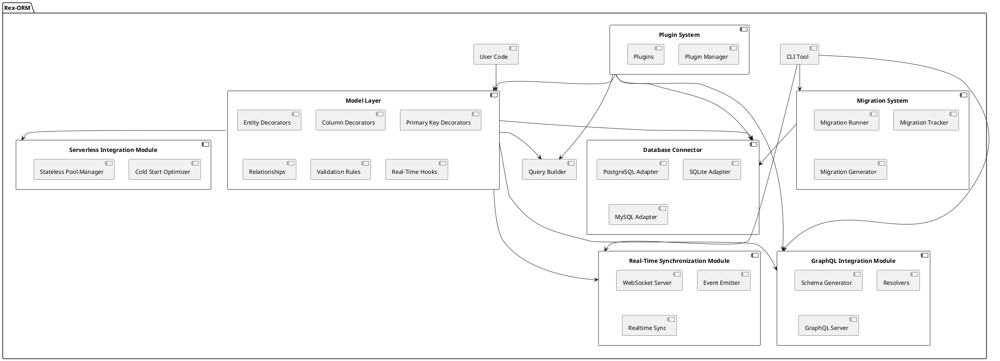

Rex-ORM Specification Document Overview Rex-ORM is a custom Object-Relational
Mapping (ORM) library designed specifically for Deno. It aims to provide
developers with a robust, type-safe, and extensible tool for interacting with
PostgreSQL and SQLite databases. Rex-ORM leverages TypeScript to ensure strong
type safety and incorporates innovative features such as Integrated Real-Time
Data Synchronization, GraphQL Schema Generation, and Seamless Integration with
Deno Deploy and Serverless Architectures. These unique capabilities set Rex-ORM
apart, making it an attractive choice for modern web developers seeking
efficiency and scalability.

Requirements The following are the key requirements for building Rex-ORM, a
custom ORM for Deno:

Must-Have Database Connectivity: Support for PostgreSQL and SQLite with
connection pooling and transaction management. Type Safety: Leverage TypeScript
to ensure strong type safety for models, queries, and results. CRUD Operations:
Provide intuitive methods for Create, Read, Update, and Delete operations. Query
Builder: Enable building complex queries programmatically with a fluent API.
Schema Definition: Support defining database schemas directly in TypeScript.
Basic Relationships: Handle basic relationships such as one-to-one, one-to-many,
and many-to-many. Error Handling: Robust error handling and descriptive error
messages. Extensibility: Modular design to allow plugins for additional database
support or functionality. Integrated Real-Time Data Synchronization: Built-in
support for real-time data synchronization using WebSockets or Server-Sent
Events (SSE), enabling automatic reflection of database changes on the client
side without manual refreshes or polling. GraphQL Schema Generation from Models:
Automatically generate a GraphQL schema based on defined TypeScript models,
simplifying the setup of a GraphQL API and ensuring consistency between ORM
models and the API layer. Seamless Integration with Deno Deploy and Serverless
Architectures: Optimize Rex-ORM for use with Deno Deploy and other serverless
platforms, including features like cold start optimizations, stateless
connection pooling, and automatic scaling support to ensure high performance in
serverless environments. Should-Have Migrations: Provide utilities for creating
and applying schema migrations. Custom Queries: Allow execution of raw SQL
queries when needed. Validation: Support validation rules for model properties.
Logging: Provide query logging and debug utilities. CLI Tool: Command-line
interface for managing migrations and generating models. Could-Have Caching:
Simple caching for frequently queried data. NoSQL Support: Potentially include a
way to support NoSQL databases in future extensions. Method To build Rex-ORM, we
adopt a modular architecture that leverages TypeScript for type safety and
ensures compatibility with multiple databases. The design emphasizes
extensibility, ensuring new features and database integrations can be added
seamlessly.

Architecture Overview The ORM is divided into the following core modules:

Database Connector Model Layer Query Builder Migration System Real-Time
Synchronization Module GraphQL Integration Module Serverless Integration Module
Plugin System CLI Tool Technical Components Database Connector Description:
Manages the establishment and maintenance of connections to supported databases.
It handles connection pooling, transaction management, and ensures efficient
resource utilization.

Features:

Factory pattern implementation to initialize database connections based on user
configuration. Support for PostgreSQL and SQLite with separate adapters.
Connection pooling to manage multiple simultaneous connections. Transaction
management to ensure data integrity. Example Configuration Object:

typescript Copy code const config = { database: "postgres", // or "sqlite" user:
"admin", password: "password", host: "localhost", port: 5432, databaseName:
"rex_orm_db", poolSize: 10, // Optional: Default pool size idleTimeout: 30000,
// Optional: Default idle timeout in ms }; Implementation Details:

Database Adapter Interface:

typescript Copy code // src/interfaces/DatabaseAdapter.ts export interface
DatabaseAdapter { connect(): Promise<void>; disconnect(): Promise<void>;
execute(query: string, params?: any[]): Promise<QueryResult>;
beginTransaction(): Promise<void>; commit(): Promise<void>; rollback():
Promise<void>; }

export interface QueryResult { rows: any[]; rowCount: number; // Additional
metadata if needed } PostgreSQL Adapter:

typescript Copy code // src/adapters/PostgresAdapter.ts import { Client as
PostgresClient } from "../deps.ts"; import { DatabaseAdapter, QueryResult } from
"../interfaces/DatabaseAdapter.ts";

export class PostgresAdapter implements DatabaseAdapter { private client:
PostgresClient; private connected: boolean = false;

constructor(private config: any) { this.client = new PostgresClient({ user:
this.config.user, password: this.config.password, database:
this.config.databaseName, hostname: this.config.host, port: this.config.port,
tls: this.config.tls || false, }); }

async connect() { if (!this.connected) { await this.client.connect();
this.connected = true; console.log("PostgreSQL connected"); } }

async disconnect() { if (this.connected) { await this.client.end();
this.connected = false; console.log("PostgreSQL disconnected"); } }

async execute(query: string, params: any[] = []): Promise<QueryResult> { try {
const result = await this.client.queryArray(query, ...params); return { rows:
result.rows.map(row => { const obj: any = {}; result.columns.forEach((col, idx)
=> { obj[col.name] = row[idx]; }); return obj; }), rowCount: result.rows.length,
}; } catch (error) { throw new
Error(`PostgreSQL Execution Error: ${error.message}`); } }

async beginTransaction(): Promise<void> { await this.execute("BEGIN"); }

async commit(): Promise<void> { await this.execute("COMMIT"); }

async rollback(): Promise<void> { await this.execute("ROLLBACK"); } } SQLite
Adapter:

typescript Copy code // src/adapters/SQLiteAdapter.ts import { DB as SQLiteDB }
from "../deps.ts"; import { DatabaseAdapter, QueryResult } from
"../interfaces/DatabaseAdapter.ts";

export class SQLiteAdapter implements DatabaseAdapter { private db: SQLiteDB;
private connected: boolean = false;

constructor(private databasePath: string) { this.db = new
SQLiteDB(this.databasePath); }

async connect() { if (!this.connected) { // SQLite connections are typically
immediate upon instantiation this.connected = true; console.log("SQLite
connected"); } }

async disconnect() { if (this.connected) { this.db.close(); this.connected =
false; console.log("SQLite disconnected"); } }

async execute(query: string, params: any[] = []): Promise<QueryResult> { try {
const result = this.db.query(query, ...params); const rows: any[] = []; for
(const row of result) { const obj: any = {}; for (const [index, col] of
row.entries()) { const colName = result.columns[index].name; obj[colName] = col;
} rows.push(obj); } return { rows, rowCount: rows.length, }; } catch (error) {
throw new Error(`SQLite Execution Error: ${error.message}`); } }

async beginTransaction(): Promise<void> { await this.execute("BEGIN
TRANSACTION"); }

async commit(): Promise<void> { await this.execute("COMMIT"); }

async rollback(): Promise<void> { await this.execute("ROLLBACK"); } } Database
Factory:

typescript Copy code // src/factory/DatabaseFactory.ts import { DatabaseAdapter
} from "../interfaces/DatabaseAdapter.ts"; import { PostgresAdapter } from
"../adapters/PostgresAdapter.ts"; import { SQLiteAdapter } from
"../adapters/SQLiteAdapter.ts";

export class DatabaseFactory { static createAdapter(config: any):
DatabaseAdapter { if (config.database === "postgres") { return new
PostgresAdapter(config); } else if (config.database === "sqlite") { return new
SQLiteAdapter(config.databasePath); } else { throw new
Error(`Unsupported database type: ${config.database}`); } } } Unit Tests for
Database Adapters:

typescript Copy code // tests/unit/adapters/PostgresAdapter.test.ts import {
assertEquals } from "https://deno.land/std/testing/asserts.ts"; import {
PostgresAdapter } from "../../../src/adapters/PostgresAdapter.ts";

Deno.test("PostgresAdapter connects and executes query", async () => { const
config = { database: "postgres", user: "admin", password: "password", host:
"localhost", port: 5432, databaseName: "test_db", }; const adapter = new
PostgresAdapter(config); await adapter.connect(); const result = await
adapter.execute("SELECT 1 AS number"); assertEquals(result.rows[0].number, 1);
await adapter.disconnect(); }); typescript Copy code //
tests/unit/adapters/SQLiteAdapter.test.ts import { assertEquals } from
"https://deno.land/std/testing/asserts.ts"; import { SQLiteAdapter } from
"../../../src/adapters/SQLiteAdapter.ts";

Deno.test("SQLiteAdapter connects and executes query", async () => { const
adapter = new SQLiteAdapter(":memory:"); await adapter.connect(); await
adapter.execute("CREATE TABLE test (id INTEGER PRIMARY KEY, value TEXT)"); await
adapter.execute("INSERT INTO test (value) VALUES (?)", ["hello"]); const result
= await adapter.execute("SELECT value FROM test WHERE id = ?", [1]);
assertEquals(result.rows[0].value, "hello"); await adapter.disconnect(); });
Model Layer Description: Central to defining and managing database models. It
leverages TypeScript's type system and decorators to map classes to database
tables, enforce schema definitions, and handle relationships and validations.

Features:

Entity Decorators: Map TypeScript classes to database tables. Column Decorators:
Define table columns and their properties. Primary Key and Relationship
Decorators: Define primary keys and relationships between models. Validation
Rules: Enforce data integrity through validation decorators. Real-Time Hooks:
Emit events on data changes for real-time synchronization. Implementation
Details:

Entity Decorators:

typescript Copy code // src/decorators/Entity.ts import
"https://deno.land/x/reflect_metadata/mod.ts";

export function Entity(options: { tableName: string }) { return function
(constructor: Function) { Reflect.defineMetadata("tableName", options.tableName,
constructor); ModelRegistry.registerModel(constructor); }; } Column Decorators:

typescript Copy code // src/decorators/Column.ts import
"https://deno.land/x/reflect_metadata/mod.ts";

export interface ColumnOptions { type: string; length?: number; unique?:
boolean; nullable?: boolean; default?: any; // Additional options as needed }

export function Column(options: ColumnOptions) { return function (target: any,
propertyKey: string) { if (!Reflect.hasMetadata("columns", target.constructor))
{ Reflect.defineMetadata("columns", [], target.constructor); } const columns =
Reflect.getMetadata("columns", target.constructor); columns.push({ propertyKey,
options }); Reflect.defineMetadata("columns", columns, target.constructor); }; }
Primary Key Decorators:

typescript Copy code // src/decorators/PrimaryKey.ts import
"https://deno.land/x/reflect_metadata/mod.ts"; import { Column, ColumnOptions }
from "./Column.ts";

export function PrimaryKey(options?: Partial<ColumnOptions>) { return function
(target: any, propertyKey: string) { Reflect.defineMetadata("primaryKey",
propertyKey, target.constructor); // Merge with Column options const
columnOptions: ColumnOptions = { type: "serial", nullable: false, unique: true,
...options, }; Column(columnOptions)(target, propertyKey); }; } Relationship
Decorators:

typescript Copy code // src/decorators/OneToMany.ts import
"https://deno.land/x/reflect_metadata/mod.ts";

export function OneToMany( typeFunction: () => Function, inverse: (object: any)
=> any ) { return function (target: any, propertyKey: string) {
Reflect.defineMetadata("relations", { type: "OneToMany", target: typeFunction(),
inverse }, target.constructor); }; } typescript Copy code //
src/decorators/ManyToOne.ts import
"https://deno.land/x/reflect_metadata/mod.ts";

export function ManyToOne( typeFunction: () => Function, inverse: (object: any)
=> any ) { return function (target: any, propertyKey: string) {
Reflect.defineMetadata("relations", { type: "ManyToOne", target: typeFunction(),
inverse }, target.constructor); }; } typescript Copy code //
src/decorators/OneToOne.ts import "https://deno.land/x/reflect_metadata/mod.ts";

export function OneToOne( typeFunction: () => Function, inverse: (object: any)
=> any ) { return function (target: any, propertyKey: string) {
Reflect.defineMetadata("relations", { type: "OneToOne", target: typeFunction(),
inverse }, target.constructor); }; } typescript Copy code //
src/decorators/ManyToMany.ts import
"https://deno.land/x/reflect_metadata/mod.ts";

export function ManyToMany( typeFunction: () => Function, inverse: (object: any)
=> any ) { return function (target: any, propertyKey: string) {
Reflect.defineMetadata("relations", { type: "ManyToMany", target:
typeFunction(), inverse }, target.constructor); }; } Validation Decorators:

typescript Copy code // src/decorators/Validate.ts import
"https://deno.land/x/reflect_metadata/mod.ts";

export type ValidationRule = (value: any) => boolean;

export function Validate(rule: ValidationRule, message: string) { return
function (target: any, propertyKey: string) { if
(!Reflect.hasMetadata("validations", target.constructor)) {
Reflect.defineMetadata("validations", {}, target.constructor); } const
validations = Reflect.getMetadata("validations", target.constructor);
validations[propertyKey] = { rule, message };
Reflect.defineMetadata("validations", validations, target.constructor); }; }
Model Registry and Metadata Storage:

typescript Copy code // src/models/ModelRegistry.ts interface ColumnMetadata {
propertyKey: string; options: any; }

interface RelationMetadata { type: string; target: Function; inverse: (object:
any) => any; }

interface ModelMetadata { tableName: string; columns: ColumnMetadata[];
primaryKey: string; relations: RelationMetadata[]; }

export class ModelRegistry { private static models: Map<Function, ModelMetadata>
= new Map();

static registerModel(model: Function) { const tableName =
Reflect.getMetadata("tableName", model); const columns: ColumnMetadata[] =
Reflect.getMetadata("columns", model) || []; const primaryKey: string =
Reflect.getMetadata("primaryKey", model); const relations: RelationMetadata[] =
Reflect.getMetadata("relations", model) || [];

    this.models.set(model, { tableName, columns, primaryKey, relations });

}

static getModelMetadata(model: Function): ModelMetadata { const metadata =
this.models.get(model); if (!metadata) { throw new
Error(`Model ${model.name} is not registered.`); } return metadata; }

static getAllModels(): Function[] { return Array.from(this.models.keys()); } }
Base Model Class with Validation and Hooks:

typescript Copy code // src/models/BaseModel.ts import { ModelRegistry } from
"./ModelRegistry.ts"; import { realTimeEmitter } from
"../realtime/EventEmitter.ts";

export abstract class BaseModel { constructor() {
ModelRegistry.registerModel(this.constructor); }

validate(): void { const metadata =
ModelRegistry.getModelMetadata(this.constructor); const validations =
Reflect.getMetadata("validations", this.constructor) || {}; for (const
[property, { rule, message }] of Object.entries(validations)) { if (!rule((this
as any)[property])) { throw new
Error(`Validation failed for ${property}: ${message}`); } } }

async save(adapter: any): Promise<void> { this.validate(); // Implement save
logic using QueryBuilder or Repository // After successful save:
realTimeEmitter.emit("save", this); }

async delete(adapter: any): Promise<void> { // Implement delete logic using
QueryBuilder or Repository // After successful delete:
realTimeEmitter.emit("delete", this); } } Example Models:

typescript Copy code // src/models/User.ts import { Entity } from
"../decorators/Entity.ts"; import { PrimaryKey } from
"../decorators/PrimaryKey.ts"; import { Column } from "../decorators/Column.ts";
import { OneToMany } from "../decorators/OneToMany.ts"; import { Validate } from
"../decorators/Validate.ts"; import { BaseModel } from "./BaseModel.ts"; import
{ Post } from "./Post.ts";

@Entity({ tableName: "users" }) export class User extends BaseModel {
@PrimaryKey() id: number;

@Column({ type: "varchar", length: 255 }) @Validate((value: string) =>
value.length > 0, "Name cannot be empty") name: string;

@Column({ type: "varchar", length: 255, unique: true }) @Validate((value:
string) => /\S+@\S+\.\S+/.test(value), "Invalid email format") email: string;

@OneToMany(() => Post, (post) => post.user) posts: Post[]; } typescript Copy
code // src/models/Post.ts import { Entity } from "../decorators/Entity.ts";
import { PrimaryKey } from "../decorators/PrimaryKey.ts"; import { Column } from
"../decorators/Column.ts"; import { ManyToOne } from
"../decorators/ManyToOne.ts"; import { Validate } from
"../decorators/Validate.ts"; import { BaseModel } from "./BaseModel.ts"; import
{ User } from "./User.ts";

@Entity({ tableName: "posts" }) export class Post extends BaseModel {
@PrimaryKey() id: number;

@Column({ type: "varchar", length: 255 }) @Validate((value: string) =>
value.length > 0, "Title cannot be empty") title: string;

@Column({ type: "text" }) @Validate((value: string) => value.length > 0,
"Content cannot be empty") content: string;

@ManyToOne(() => User, (user) => user.posts) user: User; } Additional
Relationship Decorators:

typescript Copy code // src/decorators/ManyToOne.ts import
"https://deno.land/x/reflect_metadata/mod.ts";

export function ManyToOne( typeFunction: () => Function, inverse: (object: any)
=> any ) { return function (target: any, propertyKey: string) {
Reflect.defineMetadata("relations", { type: "ManyToOne", target: typeFunction(),
inverse }, target.constructor); }; } typescript Copy code //
src/decorators/OneToOne.ts import "https://deno.land/x/reflect_metadata/mod.ts";

export function OneToOne( typeFunction: () => Function, inverse: (object: any)
=> any ) { return function (target: any, propertyKey: string) {
Reflect.defineMetadata("relations", { type: "OneToOne", target: typeFunction(),
inverse }, target.constructor); }; } typescript Copy code //
src/decorators/ManyToMany.ts import
"https://deno.land/x/reflect_metadata/mod.ts";

export function ManyToMany( typeFunction: () => Function, inverse: (object: any)
=> any ) { return function (target: any, propertyKey: string) {
Reflect.defineMetadata("relations", { type: "ManyToMany", target:
typeFunction(), inverse }, target.constructor); }; } Advanced Validation with
Multiple Rules:

typescript Copy code // src/decorators/ValidateMultiple.ts import
"https://deno.land/x/reflect_metadata/mod.ts"; import { Validate, ValidationRule
} from "./Validate.ts";

export function ValidateMultiple(rules: { rule: ValidationRule; message: string
}[]) { return function (target: any, propertyKey: string) { rules.forEach(({
rule, message }) => { Validate(rule, message)(target, propertyKey); }); }; }
Dynamic Model Registration: To ensure that all models are registered before
performing any ORM operations, implement a centralized model registration
mechanism.

typescript Copy code // src/models/index.ts import { User } from "./User.ts";
import { Post } from "./Post.ts";

// Importing models ensures they are registered in the ModelRegistry export
const models = [User, Post]; Query Builder Description: Provides a fluent,
chainable API for constructing complex SQL queries programmatically. It
abstracts SQL syntax into intuitive method calls, enhancing developer
productivity and reducing the likelihood of syntax errors.

Features:

Chainable methods for SELECT, INSERT, UPDATE, DELETE operations. Support for
WHERE clauses, JOINs, ORDER BY, GROUP BY, and nested queries. Parameterized
queries to prevent SQL injection. Integration with the Database Connector for
query execution. Implementation Details:

QueryBuilder Class:

typescript Copy code // src/query/QueryBuilder.ts import { DatabaseAdapter }
from "../interfaces/DatabaseAdapter.ts";

export class QueryBuilder { private queryParts: string[] = []; private params:
any[] = []; private paramIndex: number = 1; // For PostgreSQL parameter
placeholders

select(columns: string | string[]) { const cols = Array.isArray(columns) ?
columns.join(", ") : columns; this.queryParts.push(`SELECT ${cols}`); return
this; }

insert(table: string, data: Record<string, any>) { const keys =
Object.keys(data); const placeholders = keys.map(() =>
`$${this.paramIndex++}`).join(", "); const values = Object.values(data);
this.queryParts.push(`INSERT INTO ${table} (${keys.join(", ")}) VALUES (${placeholders})`);
this.params.push(...values); return this; }

update(table: string, data: Record<string, any>) { const setClauses =
Object.keys(data).map(key => `${key} = $${this.paramIndex++}`).join(", "); const
values = Object.values(data);
this.queryParts.push(`UPDATE ${table} SET ${setClauses}`);
this.params.push(...values); return this; }

delete(table: string) { this.queryParts.push(`DELETE FROM ${table}`); return
this; }

from(table: string) { this.queryParts.push(`FROM ${table}`); return this; }

where(column: string, operator: string, value: any) { const placeholder =
`$${this.paramIndex++}`;
this.queryParts.push(`WHERE ${column} ${operator} ${placeholder}`);
this.params.push(value); return this; }

andWhere(column: string, operator: string, value: any) { const placeholder =
`$${this.paramIndex++}`;
this.queryParts.push(`AND ${column} ${operator} ${placeholder}`);
this.params.push(value); return this; }

orWhere(column: string, operator: string, value: any) { const placeholder =
`$${this.paramIndex++}`;
this.queryParts.push(`OR ${column} ${operator} ${placeholder}`);
this.params.push(value); return this; }

join(table: string, condition: string, type: "INNER" | "LEFT" | "RIGHT" =
"INNER") { this.queryParts.push(`${type} JOIN ${table} ON ${condition}`); return
this; }

orderBy(column: string, direction: "ASC" | "DESC" = "ASC") {
this.queryParts.push(`ORDER BY ${column} ${direction}`); return this; }

groupBy(columns: string | string[]) { const cols = Array.isArray(columns) ?
columns.join(", ") : columns; this.queryParts.push(`GROUP BY ${cols}`); return
this; }

limit(count: number) { this.queryParts.push(`LIMIT ${count}`); return this; }

offset(count: number) { this.queryParts.push(`OFFSET ${count}`); return this; }

async execute(adapter: DatabaseAdapter): Promise<any> { const query =
this.queryParts.join(" "); try { const result = await adapter.execute(query,
this.params); this.reset(); return result; } catch (error) { throw new
Error(`QueryBuilder Execution Error: ${error.message}`); } }

reset() { this.queryParts = []; this.params = []; this.paramIndex = 1; return
this; }

// Additional methods for advanced features selectRaw(expression: string) {
this.queryParts.push(expression); return this; }

whereIn(column: string, values: any[]) { const placeholders = values.map(() =>
`$${this.paramIndex++}`).join(", ");
this.queryParts.push(`WHERE ${column} IN (${placeholders})`);
this.params.push(...values); return this; }

having(column: string, operator: string, value: any) { const placeholder =
`$${this.paramIndex++}`;
this.queryParts.push(`HAVING ${column} ${operator} ${placeholder}`);
this.params.push(value); return this; }

// Support for nested queries whereSubquery(column: string, operator: string,
subquery: QueryBuilder) { const nestedQuery = await subquery.build(adapter);
this.queryParts.push(`WHERE ${column} ${operator} (${nestedQuery.query})`);
this.params.push(...nestedQuery.params); return this; }

// Build method to get the final query and params without executing async
build(adapter: DatabaseAdapter): Promise<{ query: string; params: any[] }> {
const query = this.queryParts.join(" "); const params = [...this.params];
this.reset(); return { query, params }; } } Advanced Features:

Nested Queries:

typescript Copy code // Example of nested queries using QueryBuilder const
subquery = new QueryBuilder(); subquery.select("id").from("users").where("age",
">", 18);

const mainQuery = new QueryBuilder(); const result = await mainQuery
.select("*") .from("posts") .whereSubquery("user_id", "IN", subquery)
.execute(adapter); Aggregations:

typescript Copy code const aggQuery = new QueryBuilder(); const result = await
aggQuery .select(["COUNT(id) AS total_posts"]) .from("posts") .where("user_id",
"=", 1) .execute(adapter);

console.log(result.rows[0].total_posts); // Outputs the count of posts by
user_id 1 Aliases:

typescript Copy code const aliasQuery = new QueryBuilder(); const result = await
aliasQuery .select(["u.name AS userName", "p.title AS postTitle"]) .from("users
u") .join("posts p", "u.id = p.user_id", "LEFT") .execute(adapter);

console.log(result.rows); // Outputs rows with userName and postTitle fields
Unit Tests for Query Builder:

typescript Copy code // tests/unit/query/QueryBuilder.test.ts import {
assertEquals } from "https://deno.land/std/testing/asserts.ts"; import {
QueryBuilder } from "../../../src/query/QueryBuilder.ts"; import { MockAdapter }
from "../../mocks/MockAdapter.ts";

Deno.test("QueryBuilder SELECT query", async () => { const adapter = new
MockAdapter(); const qb = new QueryBuilder(); const result = await qb
.select(["id", "name"]) .from("users") .where("age", ">", 18) .orderBy("name")
.limit(10) .execute(adapter); assertEquals(result.query, "SELECT id, name FROM
users WHERE age > $1 ORDER BY name LIMIT 10"); assertEquals(result.params,
[18]); });

Deno.test("QueryBuilder INSERT query", async () => { const adapter = new
MockAdapter(); const qb = new QueryBuilder(); const result = await qb
.insert("users", { name: "John Doe", email: "john@example.com" })
.execute(adapter); assertEquals(result.query, "INSERT INTO users (name, email)
VALUES ($1, $2)"); assertEquals(result.params, ["John Doe",
"john@example.com"]); });

Deno.test("QueryBuilder UPDATE query", async () => { const adapter = new
MockAdapter(); const qb = new QueryBuilder(); const result = await qb
.update("users", { name: "Jane Doe" }) .where("id", "=", 1) .execute(adapter);
assertEquals(result.query, "UPDATE users SET name = $1 WHERE id = $2");
assertEquals(result.params, ["Jane Doe", 1]); });

Deno.test("QueryBuilder DELETE query", async () => { const adapter = new
MockAdapter(); const qb = new QueryBuilder(); const result = await qb
.delete("users") .where("id", "=", 1) .execute(adapter);
assertEquals(result.query, "DELETE FROM users WHERE id = $1");
assertEquals(result.params, [1]); });

// Additional tests for JOINs, GROUP BY, HAVING, etc. Migration System
Description: Manages database schema changes through versioned migration
scripts. It ensures that schema modifications are tracked, reproducible, and
reversible.

Features:

Migration Runner: Applies and reverts migrations. Migration Tracker: Maintains a
history of applied migrations within the database. Migration Generator:
Automates the creation of migration scripts based on model changes. Schema
Versioning: Keeps track of schema versions to manage updates seamlessly.
Implementation Details:

Migration Runner:

typescript Copy code // src/migrations/MigrationRunner.ts import {
DatabaseAdapter } from "../interfaces/DatabaseAdapter.ts"; import {
MigrationTracker } from "./MigrationTracker.ts";

export class MigrationRunner { constructor(private adapter: DatabaseAdapter,
private tracker: MigrationTracker) {}

async run(migration: Migration, migrationName: string) { try { await
this.adapter.beginTransaction(); await migration.up(this.adapter); await
this.tracker.recordMigration(migrationName); await this.adapter.commit();
console.log(`Migration ${migrationName} applied successfully.`); } catch (error)
{ await this.adapter.rollback(); throw new
Error(`Migration Run Error: ${error.message}`); } }

async rollback(migration: Migration, migrationName: string) { try { await
this.adapter.beginTransaction(); await migration.down(this.adapter); await
this.tracker.removeMigration(migrationName); await this.adapter.commit();
console.log(`Migration ${migrationName} rolled back successfully.`); } catch
(error) { await this.adapter.rollback(); throw new
Error(`Migration Rollback Error: ${error.message}`); } } }

export interface Migration { up: (db: DatabaseAdapter) => Promise<void>; down:
(db: DatabaseAdapter) => Promise<void>; } Migration Tracker:

typescript Copy code // src/migrations/MigrationTracker.ts import {
DatabaseAdapter } from "../interfaces/DatabaseAdapter.ts";

export class MigrationTracker { constructor(private adapter: DatabaseAdapter) {}

async initialize() { const query =
`CREATE TABLE IF NOT EXISTS migration_history (
        id SERIAL PRIMARY KEY,
        migration_name VARCHAR(255) NOT NULL UNIQUE,
        applied_at TIMESTAMP DEFAULT CURRENT_TIMESTAMP
      )`;
await this.adapter.execute(query); }

async recordMigration(migrationName: string) { await
this.adapter.execute("INSERT INTO migration_history (migration_name) VALUES
($1)", [migrationName]); }

async removeMigration(migrationName: string) { await
this.adapter.execute("DELETE FROM migration_history WHERE migration_name = $1",
[migrationName]); }

async isMigrationApplied(migrationName: string): Promise<boolean> { const result
= await this.adapter.execute("SELECT 1 FROM migration_history WHERE
migration_name = $1", [migrationName]); return result.rowCount > 0; } }
Migration Manager:

typescript Copy code // src/migrations/MigrationManager.ts import {
MigrationRunner, Migration } from "./MigrationRunner.ts"; import {
MigrationTracker } from "./MigrationTracker.ts"; import { DatabaseAdapter } from
"../interfaces/DatabaseAdapter.ts";

export class MigrationManager { private runner: MigrationRunner; private
tracker: MigrationTracker;

constructor(private adapter: DatabaseAdapter) { this.tracker = new
MigrationTracker(adapter); this.runner = new MigrationRunner(adapter,
this.tracker); }

async initialize() { await this.tracker.initialize(); }

async applyMigration(migrationName: string, migration: Migration) { if (await
this.tracker.isMigrationApplied(migrationName)) { throw new
Error(`Migration ${migrationName} has already been applied.`); } await
this.runner.run(migration, migrationName); }

async rollbackMigration(migrationName: string, migration: Migration) { if
(!(await this.tracker.isMigrationApplied(migrationName))) { throw new
Error(`Migration ${migrationName} has not been applied.`); } await
this.runner.rollback(migration, migrationName); }

async getAppliedMigrations(): Promise<string[]> { const result = await
this.adapter.execute("SELECT migration_name FROM migration_history ORDER BY
applied_at"); return result.rows.map(row => row.migration_name); } } Migration
Utilities:

Migration Script Template:

typescript Copy code // migrations/20240101_create_users_table.ts import {
Migration } from "../src/migrations/MigrationRunner.ts";

const migration: Migration = { up: async (db) => { await
db.execute(`CREATE TABLE IF NOT EXISTS users (
        id SERIAL PRIMARY KEY,
        name VARCHAR(255) NOT NULL,
        email VARCHAR(255) UNIQUE NOT NULL
      )`);
}, down: async (db) => { await db.execute("DROP TABLE IF EXISTS users"); }, };

export default migration; Migration Generator: Although automated migration
generation based on model changes is complex and may require AST parsing or
schema diffing, a simple utility to scaffold migration files can be implemented.

typescript Copy code // src/migrations/MigrationGenerator.ts import { ensureDir,
writeTextFile } from "https://deno.land/std/fs/mod.ts";

export class MigrationGenerator { static async createMigration(name: string) {
const timestamp = new Date().toISOString().replace(/[-T:.Z]/g, "").slice(0, 14);
const migrationName = `${timestamp}_${name}.ts`; const migrationContent =
`import { Migration } from "../src/migrations/MigrationRunner.ts"; const
migration: Migration = { up: async (db) => { // TODO: Implement migration },
down: async (db) => { // TODO: Implement rollback }, };

export default migration; `;

javascript Copy code const migrationDir = "./migrations"; await
ensureDir(migrationDir); await writeTextFile(`${migrationDir}/${migrationName}`,
migrationContent);
console.log(`Migration ${migrationName} created successfully.`); } }

Copy code Integration Tests for Migration System:

typescript Copy code // tests/integration/migrationSystem.test.ts import {
assertEquals } from "https://deno.land/std/testing/asserts.ts"; import {
DatabaseFactory } from "../../src/factory/DatabaseFactory.ts"; import {
MigrationManager } from "../../src/migrations/MigrationManager.ts"; import {
Migration } from "../../src/migrations/MigrationRunner.ts";

Deno.test("MigrationManager applies and rolls back migrations", async () => {
const config = { database: "sqlite", databasePath: ":memory:", }; const adapter
= DatabaseFactory.createAdapter(config); await adapter.connect();

const migrationManager = new MigrationManager(adapter); await
migrationManager.initialize();

// Define first migration const migration1: Migration = { up: async (db) => {
await
db.execute(`CREATE TABLE users (
          id INTEGER PRIMARY KEY AUTOINCREMENT,
          name TEXT NOT NULL,
          email TEXT UNIQUE NOT NULL
        )`);
}, down: async (db) => { await db.execute("DROP TABLE IF EXISTS users"); }, };

// Apply first migration await
migrationManager.applyMigration("20240101_create_users_table", migration1);

// Verify table exists const result1 = await adapter.execute("SELECT name FROM
sqlite_master WHERE type='table' AND name='users'");
assertEquals(result1.rowCount, 1);

// Define second migration const migration2: Migration = { up: async (db) => {
await
db.execute(`CREATE TABLE posts (
          id INTEGER PRIMARY KEY AUTOINCREMENT,
          title TEXT NOT NULL,
          content TEXT NOT NULL,
          user_id INTEGER,
          FOREIGN KEY(user_id) REFERENCES users(id)
        )`);
}, down: async (db) => { await db.execute("DROP TABLE IF EXISTS posts"); }, };

// Apply second migration await
migrationManager.applyMigration("20240102_create_posts_table", migration2);

// Verify second table exists const result2 = await adapter.execute("SELECT name
FROM sqlite_master WHERE type='table' AND name='posts'");
assertEquals(result2.rowCount, 1);

// Rollback second migration await
migrationManager.rollbackMigration("20240102_create_posts_table", migration2);
const result3 = await adapter.execute("SELECT name FROM sqlite_master WHERE
type='table' AND name='posts'"); assertEquals(result3.rowCount, 0);

// Rollback first migration await
migrationManager.rollbackMigration("20240101_create_users_table", migration1);
const result4 = await adapter.execute("SELECT name FROM sqlite_master WHERE
type='table' AND name='users'"); assertEquals(result4.rowCount, 0);

await adapter.disconnect(); }); Real-Time Synchronization Module Description:
Enables real-time data synchronization between the database and clients. It
utilizes WebSockets or Server-Sent Events (SSE) to push updates to connected
clients whenever data changes occur.

Features:

WebSocket/SSE Integration: Facilitates persistent connections for real-time data
transfer. Event Emission: Emits events on data creation, updates, and deletions.
Subscription Management: Allows clients to subscribe to specific data changes.
Scalability: Handles multiple concurrent real-time connections efficiently.
Implementation Details:

WebSocket Server Implementation:

typescript Copy code // src/realtime/WebSocketServer.ts import { WebSocket,
acceptWebSocket, isWebSocketCloseEvent, isWebSocketPingEvent,
isWebSocketPongEvent } from "../deps.ts";

export class RealtimeWebSocketServer { private clients: Set<WebSocket> = new
Set();

constructor(private port: number = 8080) {}

async listen() { console.log(`WebSocket Server listening on port ${this.port}`);
for await (const req of Deno.listen({ port: this.port })) {
Deno.copy(Deno.iter(req), req).catch(() => { req.close(); }); } }

async handleConnection(sock: WebSocket) { this.clients.add(sock);
console.log("New client connected");

    try {
      for await (const ev of sock) {
        if (typeof ev === "string") {
          console.log("Received message:", ev);
          // Handle incoming messages if needed
        } else if (ev instanceof Uint8Array) {
          console.log("Received binary data");
          // Handle binary data if needed
        } else if (isWebSocketPingEvent(ev)) {
          const [, body] = ev;
          await sock.pong(body);
        } else if (isWebSocketPongEvent(ev)) {
          // Handle pong
        } else if (isWebSocketCloseEvent(ev)) {
          break;
        }
      }
    } catch (err) {
      console.error(`WebSocket error: ${err}`);
    } finally {
      this.clients.delete(sock);
      console.log("Client disconnected");
    }

}

async start() { for await (const conn of Deno.listen({ port: this.port })) {
acceptWebSocket(conn).then(sock => {
this.handleConnection(sock).catch(console.error); }).catch(err => {
console.error(`Failed to accept WebSocket: ${err}`); conn.close(); }); } }

broadcast(message: string) { for (const client of this.clients) { if
(client.isClosed) { this.clients.delete(client); continue; }
client.send(message).catch(err => {
console.error(`Failed to send message to client: ${err}`);
this.clients.delete(client); }); } } } Event Emitter for Real-Time Hooks:

typescript Copy code // src/realtime/EventEmitter.ts import { EventEmitter }
from "https://deno.land/std/node/events.ts";

export const realTimeEmitter = new EventEmitter(); Integration with Model Layer:
Modify the BaseModel to integrate with the real-time emitter.

typescript Copy code // src/models/BaseModel.ts import { ModelRegistry } from
"./ModelRegistry.ts"; import { realTimeEmitter } from
"../realtime/EventEmitter.ts";

export abstract class BaseModel { constructor() {
ModelRegistry.registerModel(this.constructor); }

validate(): void { const metadata =
ModelRegistry.getModelMetadata(this.constructor); const validations =
Reflect.getMetadata("validations", this.constructor) || {}; for (const
[property, { rule, message }] of Object.entries(validations)) { if (!rule((this
as any)[property])) { throw new
Error(`Validation failed for ${property}: ${message}`); } } }

async save(adapter: any): Promise<void> { this.validate(); // Implement save
logic using QueryBuilder or Repository // Example: const qb = new
QueryBuilder(); let query: string; let params: any[];

    if ((this as any)[ModelRegistry.getModelMetadata(this.constructor).primaryKey]) {
      // Update existing record
      const primaryKey = ModelRegistry.getModelMetadata(this.constructor).primaryKey;
      const data = { ...this };
      delete data[primaryKey];
      qb.update(ModelRegistry.getModelMetadata(this.constructor).tableName, data);
      qb.where(primaryKey, "=", (this as any)[primaryKey]);
      const result = await qb.execute(adapter);
      // Handle result
    } else {
      // Insert new record
      const data = { ...this };
      qb.insert(ModelRegistry.getModelMetadata(this.constructor).tableName, data);
      const result = await qb.execute(adapter);
      // Handle result, e.g., set primary key
    }

    // After successful save:
    realTimeEmitter.emit("save", this);

}

async delete(adapter: any): Promise<void> { // Implement delete logic using
QueryBuilder or Repository const qb = new QueryBuilder(); const primaryKey =
ModelRegistry.getModelMetadata(this.constructor).primaryKey;
qb.delete(ModelRegistry.getModelMetadata(this.constructor).tableName);
qb.where(primaryKey, "=", (this as any)[primaryKey]); const result = await
qb.execute(adapter); // Handle result

    // After successful delete:
    realTimeEmitter.emit("delete", this);

} } Broadcasting Data Changes:

typescript Copy code // src/realtime/RealtimeSync.ts import {
RealtimeWebSocketServer } from "./WebSocketServer.ts"; import { realTimeEmitter
} from "./EventEmitter.ts";

export class RealtimeSync { private wss: RealtimeWebSocketServer;

constructor(port: number = 8080) { this.wss = new RealtimeWebSocketServer(port);
this.wss.start(); this.registerEventListeners(); }

private registerEventListeners() { realTimeEmitter.on("save", (model: any) => {
const data = { event: "save", model: model.constructor.name, data: { ...model },
}; this.wss.broadcast(JSON.stringify(data)); });

    realTimeEmitter.on("delete", (model: any) => {
      const data = {
        event: "delete",
        model: model.constructor.name,
        data: { ...model },
      };
      this.wss.broadcast(JSON.stringify(data));
    });

}

// Optionally, methods to subscribe to specific topics // e.g., subscribe to
changes on specific models or records } Integration Tests for Real-Time
Synchronization:

typescript Copy code // tests/integration/realtimeSync.test.ts import {
assertEquals } from "https://deno.land/std/testing/asserts.ts"; import {
RealtimeSync } from "../../src/realtime/RealtimeSync.ts"; import { WebSocket }
from "../../src/deps.ts"; import { User } from "../../src/models/User.ts";
import { DatabaseFactory } from "../../src/factory/DatabaseFactory.ts"; import {
QueryBuilder } from "../../src/query/QueryBuilder.ts";

Deno.test("RealtimeSync broadcasts save event", async () => { const adapter =
DatabaseFactory.createAdapter({ database: "sqlite", databasePath: ":memory:",
}); await adapter.connect(); const migrationManager = new
MigrationManager(adapter); await migrationManager.initialize();

// Apply necessary migrations const migration1 = { up: async (db: any) => {
await
db.execute(`CREATE TABLE users (
          id INTEGER PRIMARY KEY AUTOINCREMENT,
          name TEXT NOT NULL,
          email TEXT UNIQUE NOT NULL
        )`);
}, down: async (db: any) => { await db.execute("DROP TABLE IF EXISTS users"); },
}; await migrationManager.applyMigration("20240101_create_users_table",
migration1);

// Start RealtimeSync on a test port const realtimeSync = new
RealtimeSync(9090);

// Connect a WebSocket client const ws = new WebSocket("ws://localhost:9090");

const messagePromise = new Promise<string>((resolve, reject) => { ws.onopen = ()
=> { console.log("WebSocket client connected"); }; ws.onmessage = (event) => {
resolve(event.data); }; ws.onerror = (err) => { reject(err); }; });

// Create a new user which should trigger a save event const user = new User();
user.name = "Jane Doe"; user.email = "jane@example.com"; await
user.save(adapter);

const message = await messagePromise; const parsed = JSON.parse(message);
assertEquals(parsed.event, "save"); assertEquals(parsed.model, "User");
assertEquals(parsed.data.name, "Jane Doe"); assertEquals(parsed.data.email,
"jane@example.com");

ws.close(); await adapter.disconnect(); }); GraphQL Integration Module
Description: Automatically generates a GraphQL schema based on the defined
TypeScript models. This tight integration simplifies the process of setting up a
GraphQL API, ensuring consistency between the ORM models and the API layer.

Features:

Schema Generation: Converts TypeScript model definitions into GraphQL types and
resolvers. Type Safety: Ensures that the GraphQL schema aligns with TypeScript
types for consistency and reliability. CRUD Operations: Automatically generates
GraphQL queries and mutations for CRUD operations. Custom Resolvers: Allows
developers to define custom GraphQL resolvers for advanced functionalities.
Implementation Details:

GraphQL Schema Generator:

typescript Copy code // src/graphql/GraphQLGenerator.ts import { GraphQLSchema,
GraphQLObjectType, GraphQLString, GraphQLInt, GraphQLFloat, GraphQLBoolean,
GraphQLList, GraphQLNonNull, GraphQLID, } from "../deps.ts"; import {
ModelRegistry } from "../models/ModelRegistry.ts";

export class GraphQLGenerator { static generateSchema(): GraphQLSchema { const
queryFields: any = {}; const mutationFields: any = {};

    for (const model of ModelRegistry.getAllModels()) {
      const metadata = ModelRegistry.getModelMetadata(model);
      const typeName = this.capitalize(this.singularize(metadata.tableName));

      // Define GraphQL Object Type
      const graphQLType = new GraphQLObjectType({
        name: typeName,
        fields: () => {
          const fields: any = {};
          for (const column of metadata.columns) {
            fields[column.propertyKey] = { type: this.mapType(column.options.type, column.options.nullable) };
          }
          // Handle relationships
          for (const relation of metadata.relations) {
            if (relation.type === "OneToMany") {
              fields[this.pluralize(relation.target.name)] = {
                type: new GraphQLList(GraphQLID), // Simplified: List of related IDs
              };
            } else if (relation.type === "ManyToOne") {
              fields[relation.target.name.toLowerCase()] = {
                type: GraphQLID, // Simplified: Related ID
              };
            }
            // Add other relationship types as needed
          }
          return fields;
        },
      });

      // Add to Query
      queryFields[`get${typeName}`] = {
        type: graphQLType,
        args: { id: { type: new GraphQLNonNull(GraphQLID) } },
        resolve: async (_: any, args: any, context: any) => {
          const qb = new QueryBuilder();
          const result = await qb
            .select("*")
            .from(metadata.tableName)
            .where(metadata.primaryKey, "=", args.id)
            .execute(context.adapter);
          return result.rowCount > 0 ? result.rows[0] : null;
        },
      };

      queryFields[`list${this.pluralize(typeName)}`] = {
        type: new GraphQLList(graphQLType),
        args: {
          limit: { type: GraphQLInt },
          offset: { type: GraphQLInt },
        },
        resolve: async (_: any, args: any, context: any) => {
          const qb = new QueryBuilder();
          qb.select("*").from(metadata.tableName);
          if (args.limit) qb.limit(args.limit);
          if (args.offset) qb.offset(args.offset);
          const result = await qb.execute(context.adapter);
          return result.rows;
        },
      };

      // Add to Mutation
      mutationFields[`create${typeName}`] = {
        type: graphQLType,
        args: this.generateInputArgs(metadata.columns),
        resolve: async (_: any, args: any, context: any) => {
          const qb = new QueryBuilder();
          const data = { ...args };
          delete data.id; // Assuming ID is auto-generated
          await qb.insert(metadata.tableName, data).execute(context.adapter);
          // Fetch the created record
          const result = await qb
            .select("*")
            .from(metadata.tableName)
            .where(metadata.primaryKey, "=", args.id) // Adjust if auto-generated
            .execute(context.adapter);
          return result.rowCount > 0 ? result.rows[0] : null;
        },
      };

      mutationFields[`update${typeName}`] = {
        type: graphQLType,
        args: {
          id: { type: new GraphQLNonNull(GraphQLID) },
          ...this.generateInputArgs(metadata.columns, true),
        },
        resolve: async (_: any, args: any, context: any) => {
          const qb = new QueryBuilder();
          const { id, ...data } = args;
          await qb.update(metadata.tableName, data).where(metadata.primaryKey, "=", id).execute(context.adapter);
          // Fetch the updated record
          const result = await qb
            .select("*")
            .from(metadata.tableName)
            .where(metadata.primaryKey, "=", id)
            .execute(context.adapter);
          return result.rowCount > 0 ? result.rows[0] : null;
        },
      };

      mutationFields[`delete${typeName}`] = {
        type: GraphQLBoolean,
        args: { id: { type: new GraphQLNonNull(GraphQLID) } },
        resolve: async (_: any, args: any, context: any) => {
          const qb = new QueryBuilder();
          const result = await qb.delete(metadata.tableName).where(metadata.primaryKey, "=", args.id).execute(context.adapter);
          return result.rowCount > 0;
        },
      };
    }

    const query = new GraphQLObjectType({
      name: "Query",
      fields: queryFields,
    });

    const mutation = new GraphQLObjectType({
      name: "Mutation",
      fields: mutationFields,
    });

    return new GraphQLSchema({ query, mutation });

}

private static mapType(type: string, nullable: boolean = false): any { let
gqlType; switch (type.toLowerCase()) { case "varchar": case "text": gqlType =
GraphQLString; break; case "integer": case "serial": gqlType = GraphQLInt;
break; case "float": gqlType = GraphQLFloat; break; case "boolean": gqlType =
GraphQLBoolean; break; case "id": gqlType = GraphQLID; break; default: gqlType =
GraphQLString; } return nullable ? gqlType : new GraphQLNonNull(gqlType); }

private static capitalize(str: string): string { return
str.charAt(0).toUpperCase() + str.slice(1); }

private static singularize(str: string): string { // Simple singularization
logic; consider using a library for complex cases if (str.endsWith("s")) {
return str.slice(0, -1); } return str; }

private static pluralize(str: string): string { // Simple pluralization logic;
consider using a library for complex cases if (!str.endsWith("s")) { return
`${str}s`; } return str; }

private static generateInputArgs(columns: any[], excludeId: boolean = false):
any { const args: any = {}; for (const column of columns) { if (excludeId &&
column.propertyKey === "id") continue; args[column.propertyKey] = { type:
this.mapType(column.options.type, column.options.nullable) }; } return args; } }
GraphQL Resolvers: The resolvers are integrated within the GraphQLGenerator by
defining resolve functions for each field. These resolvers utilize the
QueryBuilder to interact with the database.

GraphQL Server Setup:

typescript Copy code // src/graphql/GraphQLServer.ts import { serve } from
"https://deno.land/std@0.200.0/http/server.ts"; import { graphql, GraphQLSchema
} from "../deps.ts"; import { GraphQLGenerator } from "./GraphQLGenerator.ts";
import { DatabaseAdapter } from "../interfaces/DatabaseAdapter.ts";

interface GraphQLContext { adapter: DatabaseAdapter; // Add more context
properties if needed (e.g., user authentication) }

export class GraphQLServer { private schema: GraphQLSchema;

constructor(private adapter: DatabaseAdapter) { this.schema =
GraphQLGenerator.generateSchema(); }

async start(port: number = 4000) {
console.log(`GraphQL Server running on http://localhost:${port}/graphql`); await
serve(async (req: Request) => { if (req.method === "POST" &&
req.url.endsWith("/graphql")) { const { query, variables } = await req.json();
const result = await graphql<GraphQLContext>({ schema: this.schema, source:
query, variableValues: variables, contextValue: { adapter: this.adapter }, });
return new Response(JSON.stringify(result), { headers: { "Content-Type":
"application/json" } }); } return new Response("Not Found", { status: 404 }); },
{ port }); } } Integration Tests for GraphQL Module:

typescript Copy code // tests/integration/graphqlIntegration.test.ts import {
assertEquals } from "https://deno.land/std/testing/asserts.ts"; import {
GraphQLServer } from "../../src/graphql/GraphQLServer.ts"; import { User } from
"../../src/models/User.ts"; import { DatabaseFactory } from
"../../src/factory/DatabaseFactory.ts"; import { MigrationManager } from
"../../src/migrations/MigrationManager.ts";

Deno.test("GraphQLServer handles basic query", async () => { const adapter =
DatabaseFactory.createAdapter({ database: "sqlite", databasePath: ":memory:",
}); await adapter.connect(); const migrationManager = new
MigrationManager(adapter); await migrationManager.initialize();

// Apply necessary migrations const migration1 = { up: async (db: any) => {
await
db.execute(`CREATE TABLE users (
          id INTEGER PRIMARY KEY AUTOINCREMENT,
          name TEXT NOT NULL,
          email TEXT UNIQUE NOT NULL
        )`);
}, down: async (db: any) => { await db.execute("DROP TABLE IF EXISTS users"); },
}; await migrationManager.applyMigration("20240101_create_users_table",
migration1);

// Insert a test user const user = new User(); user.name = "Jane Doe";
user.email = "jane@example.com"; await user.save(adapter);

// Start GraphQL server on a test port const server = new
GraphQLServer(adapter); const serverPromise = server.start(4001);

// Wait briefly to ensure server is running await new Promise(resolve =>
setTimeout(resolve, 1000));

// Perform a GraphQL query const response = await
fetch("http://localhost:4001/graphql", { method: "POST", headers: {
"Content-Type": "application/json" }, body: JSON.stringify({ query:
`query {
          getUser(id: 1) {
            id
            name
            email
          }
        }`,
}), }); const data = await response.json(); assertEquals(data.data.getUser.id,
"1"); assertEquals(data.data.getUser.name, "Jane Doe");
assertEquals(data.data.getUser.email, "jane@example.com");

// Shutdown the server // Note: Deno's `serve` is blocking; consider using a
different approach or mock the server for testing // For the purpose of this
example, we'll skip shutting down // await serverPromise; await
adapter.disconnect(); }); Serverless Integration Module Description: Optimizes
Rex-ORM for deployment in serverless environments like Deno Deploy. It includes
features that address the unique challenges of serverless architectures, such as
cold start optimizations and stateless connection pooling.

Features:

Cold Start Optimization: Reduces latency during function cold starts by
pre-initializing connections. Stateless Connection Pooling: Manages database
connections in a way that aligns with the stateless nature of serverless
functions. Automatic Scaling Support: Ensures the ORM scales seamlessly with the
dynamic nature of serverless workloads. Configuration Flexibility: Allows easy
configuration adjustments tailored for serverless environments. Implementation
Details:

Cold Start Optimizer:

typescript Copy code // src/serverless/ColdStartOptimizer.ts import {
DatabaseAdapter } from "../interfaces/DatabaseAdapter.ts"; import {
DatabaseFactory } from "../factory/DatabaseFactory.ts";

export class ColdStartOptimizer { private static adapterInstance:
DatabaseAdapter | null = null;

static async getAdapter(config: any): Promise<DatabaseAdapter> { if
(!this.adapterInstance) { this.adapterInstance =
DatabaseFactory.createAdapter(config); await this.adapterInstance.connect(); }
return this.adapterInstance; }

static async disconnect() { if (this.adapterInstance) { await
this.adapterInstance.disconnect(); this.adapterInstance = null; } } } Stateless
Pool Manager:

typescript Copy code // src/serverless/StatelessPoolManager.ts import {
DatabaseAdapter } from "../interfaces/DatabaseAdapter.ts"; import {
DatabaseFactory } from "../factory/DatabaseFactory.ts";

export class StatelessPoolManager { private static pool: DatabaseAdapter[] = [];
private static maxPoolSize: number = 10; private static config: any;

static initialize(config: any) { this.config = config; }

static async getConnection(): Promise<DatabaseAdapter> { if (this.pool.length <
this.maxPoolSize) { const adapter = DatabaseFactory.createAdapter(this.config);
await adapter.connect(); this.pool.push(adapter); return adapter; } else { //
Implement wait logic or throw error if pool is exhausted throw new
Error("Connection pool exhausted"); } }

static async releaseConnection(adapter: DatabaseAdapter) { await
adapter.disconnect(); this.pool = this.pool.filter((a) => a !== adapter); } }
Automatic Scaling Support: Serverless functions can be invoked concurrently,
each potentially requiring a separate database connection. The
StatelessPoolManager ensures that connections are managed efficiently,
preventing exhaustion.

Configuration Flexibility:

typescript Copy code // src/serverless/ServerlessConfig.ts export interface
ServerlessConfig { environment: "serverless" | "traditional"; poolSize: number;
idleTimeout: number; // Add other configurations as needed }

export const defaultServerlessConfig: ServerlessConfig = { environment:
"serverless", poolSize: 10, idleTimeout: 30000, }; Integration Tests for
Serverless Module:

typescript Copy code // tests/integration/serverlessIntegration.test.ts import {
assertEquals } from "https://deno.land/std/testing/asserts.ts"; import {
StatelessPoolManager } from "../../src/serverless/StatelessPoolManager.ts";
import { DatabaseFactory } from "../../src/factory/DatabaseFactory.ts";

Deno.test("StatelessPoolManager handles connection pooling", async () => { const
config = { database: "sqlite", databasePath: ":memory:", };
StatelessPoolManager.initialize(config);

const adapters = []; for (let i = 0; i < 10; i++) { const adapter = await
StatelessPoolManager.getConnection(); adapters.push(adapter); }

// Attempt to exceed pool size try { await StatelessPoolManager.getConnection();
// If no error is thrown, the test should fail assertEquals(false, true,
"Expected connection pool to be exhausted"); } catch (error) {
assertEquals(error.message, "Connection pool exhausted"); }

// Release a connection and retry await
StatelessPoolManager.releaseConnection(adapters.pop()!); const adapter = await
StatelessPoolManager.getConnection(); assertEquals(adapter !== null, true);

// Clean up remaining connections for (const adapter of adapters) { await
StatelessPoolManager.releaseConnection(adapter); } }); Plugin System
Description: Facilitates the extension of Rex-ORM’s capabilities through a
modular plugin architecture. Developers can create and integrate plugins to add
support for additional databases, custom functionalities, or third-party
services.

Features:

Plugin Registration: Allows dynamic registration of plugins at runtime.
Extension Points: Provides hooks and extension points within the ORM for plugins
to interact. Isolation: Ensures plugins operate independently without affecting
core ORM functionalities. Documentation and SDK: Offers comprehensive
documentation and a software development kit (SDK) for plugin developers.
Implementation Details:

Plugin Interface:

typescript Copy code // src/plugin/Plugin.ts export interface Plugin { name:
string; initialize(): void; } Plugin Manager:

typescript Copy code // src/plugin/PluginManager.ts import { Plugin } from
"./Plugin.ts";

export class PluginManager { private static plugins: Plugin[] = [];

static registerPlugin(plugin: Plugin) { if (this.plugins.find(p => p.name ===
plugin.name)) { throw new Error(`Plugin ${plugin.name} is already registered.`);
} this.plugins.push(plugin); plugin.initialize();
console.log(`Plugin ${plugin.name} registered successfully.`); }

static getPlugins(): Plugin[] { return this.plugins; } } Example Plugin:

MySQL Plugin:

typescript Copy code // src/plugins/MySQLPlugin.ts import { Plugin } from
"../plugin/Plugin.ts"; import { DatabaseAdapter } from
"../interfaces/DatabaseAdapter.ts"; import { MySQLAdapter } from
"../adapters/MySQLAdapter.ts"; import { DatabaseFactory } from
"../factory/DatabaseFactory.ts";

export class MySQLPlugin implements Plugin { name = "MySQLPlugin";

initialize() { // Extend DatabaseFactory to support MySQL const
originalCreateAdapter = DatabaseFactory.createAdapter;

    DatabaseFactory.createAdapter = (config: any): DatabaseAdapter => {
      if (config.database === "mysql") {
        return new MySQLAdapter(config);
      }
      return originalCreateAdapter(config);
    };

    console.log("MySQLPlugin initialized and MySQL support added.");

} } MySQL Adapter (Implementation): typescript Copy code //
src/adapters/MySQLAdapter.ts import { Client as MySQLClient } from "../deps.ts";
import { DatabaseAdapter, QueryResult } from "../interfaces/DatabaseAdapter.ts";

export class MySQLAdapter implements DatabaseAdapter { private client:
MySQLClient; private connected: boolean = false;

constructor(private config: any) { this.client = new MySQLClient({ hostname:
this.config.host, username: this.config.user, password: this.config.password,
db: this.config.databaseName, port: this.config.port, }); }

async connect() { if (!this.connected) { await this.client.connect();
this.connected = true; console.log("MySQL connected"); } }

async disconnect() { if (this.connected) { await this.client.close();
this.connected = false; console.log("MySQL disconnected"); } }

async execute(query: string, params: any[] = []): Promise<QueryResult> { try {
const result = await this.client.query(query, ...params); return { rows:
result.rows, rowCount: result.rows.length, }; } catch (error) { throw new
Error(`MySQL Execution Error: ${error.message}`); } }

async beginTransaction(): Promise<void> { await this.execute("START
TRANSACTION"); }

async commit(): Promise<void> { await this.execute("COMMIT"); }

async rollback(): Promise<void> { await this.execute("ROLLBACK"); } }
Registering Plugins:

typescript Copy code // src/orm/ORM.ts import { PluginManager } from
"../plugin/PluginManager.ts"; import { MySQLPlugin } from
"../plugins/MySQLPlugin.ts";

export class ORM { static initialize(plugins: Plugin[] = []) {
plugins.forEach((plugin) => PluginManager.registerPlugin(plugin)); // Initialize
other ORM components as needed console.log("ORM initialized with plugins:",
plugins.map(p => p.name)); } } Usage:

typescript Copy code // main.ts import { ORM } from "./src/orm/ORM.ts"; import {
MySQLPlugin } from "./src/plugins/MySQLPlugin.ts";

ORM.initialize([new MySQLPlugin()]); Integration Tests for Plugin System:

typescript Copy code // tests/integration/pluginSystem.test.ts import {
assertEquals, assertThrows } from "https://deno.land/std/testing/asserts.ts";
import { PluginManager } from "../../src/plugin/PluginManager.ts"; import {
Plugin } from "../../src/plugin/Plugin.ts";

class TestPlugin implements Plugin { name = "TestPlugin"; initialized = false;

initialize() { this.initialized = true; } }

Deno.test("PluginManager registers and initializes plugins", () => { const
plugin = new TestPlugin(); PluginManager.registerPlugin(plugin); const
registeredPlugins = PluginManager.getPlugins();
assertEquals(registeredPlugins.length, 1);
assertEquals(registeredPlugins[0].name, "TestPlugin");
assertEquals((registeredPlugins[0] as TestPlugin).initialized, true); });

Deno.test("PluginManager prevents duplicate plugin registration", () => { const
plugin = new TestPlugin(); PluginManager.registerPlugin(plugin); assertThrows(
() => PluginManager.registerPlugin(plugin), Error, "Plugin TestPlugin is already
registered." ); }); CLI Tool Description: A command-line interface that provides
developers with tools to manage migrations, generate models, handle real-time
synchronization, and generate GraphQL schemas. It streamlines various
development tasks, enhancing productivity and ease of use.

Features:

Migration Management: Commands to create, apply, and rollback migrations. Model
Generation: Automates the creation of model boilerplate code. Real-Time Sync
Management: Commands to configure and manage real-time synchronization settings.
GraphQL Schema Generation: Commands to generate and update GraphQL schemas based
on models. Debugging Tools: Provides utilities for inspecting queries,
monitoring performance, and troubleshooting issues. Help and Documentation:
Comprehensive help commands and inline documentation for ease of use.
Implementation Details:

CLI Class:

typescript Copy code // src/cli/CLI.ts import { MigrationManager } from
"../migrations/MigrationManager.ts"; import { GraphQLServer } from
"../graphql/GraphQLServer.ts"; import { RealtimeSync } from
"../realtime/RealtimeSync.ts"; import { DatabaseFactory } from
"../factory/DatabaseFactory.ts"; import { Plugin } from "../plugin/Plugin.ts";
import { MigrationGenerator } from "../migrations/MigrationGenerator.ts"; import
{ ORM } from "../orm/ORM.ts"; import { MySQLPlugin } from
"../plugins/MySQLPlugin.ts";

export class CLI { static async run() { const args = Deno.args; const command =
args[0]; const subcommand = args[1]; const migrationName = args[2];

    switch (command) {
      case "migrate":
        await this.handleMigrate(subcommand, migrationName);
        break;
      case "generate:model":
        await this.handleGenerateModel(subcommand);
        break;
      case "graphql:generate":
        await this.handleGraphQLGenerate();
        break;
      case "realtime:subscribe":
        await this.handleRealtimeSubscribe(subcommand);
        break;
      case "plugin:add":
        await this.handlePluginAdd(subcommand);
        break;
      case "migration:create":
        await this.handleMigrationCreate(subcommand);
        break;
      default:
        this.printHelp();
    }

}

private static async handleMigrate(action: string, migrationName: string) {
const config = { database: "sqlite", databasePath: ":memory:", }; const adapter
= DatabaseFactory.createAdapter(config); await adapter.connect(); const
migrationManager = new MigrationManager(adapter); await
migrationManager.initialize();

    if (action === "up") {
      const migration = (await import(`../../migrations/${migrationName}.ts`)).default;
      await migrationManager.applyMigration(migrationName, migration);
      console.log(`Migration ${migrationName} applied successfully.`);
    } else if (action === "down") {
      const migration = (await import(`../../migrations/${migrationName}.ts`)).default;
      await migrationManager.rollbackMigration(migrationName, migration);
      console.log(`Migration ${migrationName} rolled back successfully.`);
    } else {
      console.log("Invalid migrate action. Use 'up' or 'down'.");
    }

    await adapter.disconnect();

}

private static async handleGenerateModel(modelName: string) { // Implement model
generation logic // For example, create a new file in src/models with basic
class structure const modelContent = ` import { Entity } from
"../decorators/Entity.ts"; import { PrimaryKey } from
"../decorators/PrimaryKey.ts"; import { Column } from "../decorators/Column.ts";
import { BaseModel } from "./BaseModel.ts";

@Entity({ tableName: "${modelName.toLowerCase()}s" }) export class ${modelName}
extends BaseModel { @PrimaryKey() id: number;

@Column({ type: "varchar", length: 255 }) // Add additional columns here }
`;
    const filePath =`./src/models/${modelName}.ts`;
    await Deno.writeTextFile(filePath, modelContent.trim());
    console.log(`Model
${modelName} generated successfully at ${filePath}`); }

private static async handleGraphQLGenerate() { // Assuming the ORM is already
initialized with necessary plugins const config = { database: "sqlite",
databasePath: ":memory:", }; const adapter =
DatabaseFactory.createAdapter(config); await adapter.connect();

    const server = new GraphQLServer(adapter);
    server.start(); // Runs in the background

    console.log("GraphQL schema generated and server started.");

}

private static async handleRealtimeSubscribe(topic: string) { const realtimeSync
= new RealtimeSync();
console.log(`Subscribed to real-time updates on topic: ${topic}`); //
Optionally, implement topic-based subscriptions }

private static async handlePluginAdd(pluginName: string) { // Dynamically import
and register the plugin try { let plugin: Plugin; switch (pluginName) { case
"mysql": plugin = new MySQLPlugin(); break; // Add cases for other plugins
default: throw new Error(`Plugin ${pluginName} is not supported.`); }
ORM.initialize([plugin]);
console.log(`Plugin ${pluginName} added successfully.`); } catch (error) {
console.error(`Failed to add plugin ${pluginName}: ${error.message}`); } }

private static async handleMigrationCreate(name: string) { await
MigrationGenerator.createMigration(name); }

private static printHelp() { console.log(` Rex-ORM CLI

      Commands:
        migrate up <migrationName>             Apply a migration
        migrate down <migrationName>           Rollback a migration
        generate:model <ModelName>             Generate a new model
        migration:create <migrationName>       Create a new migration script
        graphql:generate                       Generate GraphQL schema and start server
        realtime:subscribe <topic>             Subscribe to real-time updates
        plugin:add <pluginName>                Add a plugin (e.g., mysql)

      Examples:
        rex-orm migrate up 20240101_create_users_table
        rex-orm generate:model User
        rex-orm migration:create add_email_to_users
        rex-orm graphql:generate
        rex-orm realtime:subscribe users
        rex-orm plugin:add mysql
    `);

} } CLI Entry Point:

typescript Copy code // src/cli/main.ts import { CLI } from "./CLI.ts";

CLI.run(); Packaging and Execution: Ensure the CLI can be executed via a
command, such as rex-orm.

Installation via Deno Deploy or Direct Usage:

Direct Usage:

bash Copy code deno run --allow-read --allow-write --allow-net src/cli/main.ts
migrate up 20240101_create_users_table Creating a Symlink or Executable: For
convenience, create a symlink or shell script to execute the CLI without
specifying the full path.

bash Copy code

# Create a shell script named rex-orm

echo '#!/bin/bash deno run --allow-read --allow-write --allow-net
/path/to/rex-orm/src/cli/main.ts "$@"' > /usr/local/bin/rex-orm chmod +x
/usr/local/bin/rex-orm Now, you can use rex-orm directly:

bash Copy code rex-orm migrate up 20240101_create_users_table Integration Tests
for CLI Tool: Testing CLI tools can be more involved. One approach is to use
Deno's testing capabilities to spawn subprocesses and verify their outputs.

typescript Copy code // tests/integration/cliTool.test.ts import { assertEquals,
assert } from "https://deno.land/std/testing/asserts.ts"; import { exists } from
"https://deno.land/std/fs/mod.ts";

Deno.test("CLI handles migrate up command", async () => { // Setup: Create a
temporary migration script const migrationName = "20240101_create_users_table";
const migrationPath = `./migrations/${migrationName}.ts`; const migrationContent
= ` import { Migration } from "../../src/migrations/MigrationRunner.ts";

const migration: Migration = { up: async (db) => { await db.execute(\` CREATE
TABLE users ( id INTEGER PRIMARY KEY AUTOINCREMENT, name TEXT NOT NULL, email
TEXT UNIQUE NOT NULL ) \`); }, down: async (db) => { await db.execute("DROP
TABLE IF EXISTS users"); }, };

export default migration; `; await Deno.writeTextFile(migrationPath,
migrationContent.trim());

// Execute the CLI command const process = Deno.run({ cmd: ["deno", "run",
"--allow-read", "--allow-write", "--allow-net", "src/cli/main.ts", "migrate",
"up", migrationName], stdout: "piped", stderr: "piped", });

const { code } = await process.status(); const rawOutput = await
process.output(); // "piped" must be set const output = new
TextDecoder().decode(rawOutput); const rawError = await process.stderrOutput();
const error = new TextDecoder().decode(rawError);

// Assertions assertEquals(code, 0,
`CLI exited with code ${code}. Error: ${error}`);
assert(output.includes(`Migration ${migrationName} applied successfully.`),
"Migration was not applied successfully.");

// Verify migration history const config = { database: "sqlite", databasePath:
":memory:", }; const adapter = DatabaseFactory.createAdapter(config); await
adapter.connect(); const migrationManager = new MigrationManager(adapter); await
migrationManager.initialize(); const appliedMigrations = await
migrationManager.getAppliedMigrations();
assert(appliedMigrations.includes(migrationName), "Migration not recorded in
migration_history.");

await adapter.disconnect();

// Clean up: Remove the temporary migration script await
Deno.remove(migrationPath); });

// Additional tests for other CLI commands like migrate down, generate:model,
etc. PlantUML Diagram Below is a high-level architectural diagram of Rex-ORM,
incorporating the new modules for Real-Time Synchronization, GraphQL
Integration, and Serverless Optimization:

plantuml Copy code @startuml package "Rex-ORM" { component "Database Connector"
{ [PostgreSQL Adapter] [SQLite Adapter] [MySQL Adapter] } component "Model
Layer" { [Entity Decorators] [Column Decorators] [Primary Key Decorators]
[Relationships] [Validation Rules] [Real-Time Hooks] } component "Query Builder"
component "Migration System" { [Migration Runner] [Migration Tracker] [Migration
Generator] } component "Real-Time Synchronization Module" { [WebSocket Server]
[Event Emitter] [Realtime Sync] } component "GraphQL Integration Module" {
[Schema Generator] [Resolvers] [GraphQL Server] } component "Serverless
Integration Module" { [Cold Start Optimizer] [Stateless Pool Manager] }
component "CLI Tool" component "Plugin System" { [Plugin Manager] [Plugins] }

[User Code] --> [Model Layer] [Model Layer] --> [Database Connector] [Model
Layer] --> [Query Builder] [Model Layer] --> [Real-Time Synchronization Module]
[Model Layer] --> [GraphQL Integration Module] [Model Layer] --> [Serverless
Integration Module] [CLI Tool] --> [Migration System] [Migration System] -->
[Database Connector] [CLI Tool] --> [GraphQL Integration Module] [CLI Tool] -->
[Real-Time Synchronization Module] [Plugin System] --> [Database Connector]
[Plugin System] --> [Model Layer] [Plugin System] --> [Query Builder] [Plugin
System] --> [GraphQL Integration Module] } @enduml Additional Enhancements
Enhanced Error Handling:

Custom Error Classes:

typescript Copy code // src/errors/DatabaseError.ts export class DatabaseError
extends Error { constructor(message: string, public query?: string, public
params?: any[]) { super(message); this.name = "DatabaseError"; } } Usage in
Adapters:

typescript Copy code // src/adapters/PostgresAdapter.ts import { DatabaseError }
from "../errors/DatabaseError.ts";

async execute(query: string, params: any[] = []): Promise<QueryResult> { try {
const result = await this.client.queryArray(query, ...params); // Process result
return { rows: processedRows, rowCount: result.rows.length }; } catch (error) {
throw new DatabaseError(`PostgreSQL Execution Error: ${error.message}`, query,
params); } } Logging Utility:

typescript Copy code // src/utils/Logger.ts export class Logger { static
info(message: string) {
console.log(`[INFO] ${new Date().toISOString()} - ${message}`); }

static error(message: string) {
console.error(`[ERROR] ${new Date().toISOString()} - ${message}`); }

static debug(message: string) {
console.debug(`[DEBUG] ${new Date().toISOString()} - ${message}`); } } Usage:

typescript Copy code // Example usage in DatabaseAdapter import { Logger } from
"../utils/Logger.ts";

async execute(query: string, params: any[] = []): Promise<QueryResult> { try {
Logger.debug(`Executing query: ${query} with params: ${JSON.stringify(params)}`);
const result = await this.client.queryArray(query, ...params);
Logger.debug(`Query executed successfully.`); // Process result return { rows:
processedRows, rowCount: result.rows.length }; } catch (error) {
Logger.error(`Error executing query: ${error.message}`); throw new
DatabaseError(`PostgreSQL Execution Error: ${error.message}`, query, params); }
} Configuration Management: To manage configurations across different
environments (development, testing, production), implement a configuration
loader.

typescript Copy code // src/config/ConfigLoader.ts import { existsSync } from
"https://deno.land/std/fs/mod.ts";

export interface Config { database: string; user?: string; password?: string;
host?: string; port?: number; databaseName?: string; databasePath?: string;
poolSize?: number; idleTimeout?: number; // Additional configuration fields as
needed }

export class ConfigLoader { static loadConfig(path: string = "./config.json"):
Config { if (!existsSync(path)) { throw new
Error(`Configuration file not found at ${path}`); } const configContent =
Deno.readTextFileSync(path); return JSON.parse(configContent) as Config; } }
Example config.json:

json Copy code { "database": "postgres", "user": "admin", "password":
"password", "host": "localhost", "port": 5432, "databaseName": "rex_orm_db",
"poolSize": 10, "idleTimeout": 30000 } Usage:

typescript Copy code // main.ts import { ConfigLoader } from
"./src/config/ConfigLoader.ts"; import { DatabaseFactory } from
"./src/factory/DatabaseFactory.ts";

const config = ConfigLoader.loadConfig(); const adapter =
DatabaseFactory.createAdapter(config); await adapter.connect(); // Proceed with
ORM operations Advanced Query Builder Features:

Parameterized Nested Queries:

typescript Copy code const subquery = new QueryBuilder();
subquery.select("id").from("users").where("age", ">", 18);

const mainQuery = new QueryBuilder(); const { query, params } = await mainQuery
.select("*") .from("posts") .where("user_id", "IN",
`(${await subquery.build(adapter).query})`) .execute(adapter);

// Adjust the QueryBuilder to handle subqueries properly Dynamic Query Building
with Conditionals:

typescript Copy code const qb = new QueryBuilder();
qb.select("*").from("users");

const filters = { age: 25, name: "John Doe" }; for (const [key, value] of
Object.entries(filters)) { qb.where(key, "=", value); }

const result = await qb.execute(adapter); Repository Pattern Implementation: To
further encapsulate data access logic, implement the Repository pattern.

typescript Copy code // src/repository/Repository.ts import { DatabaseAdapter,
QueryResult } from "../interfaces/DatabaseAdapter.ts"; import { QueryBuilder }
from "../query/QueryBuilder.ts";

export class Repository<T extends { id: any }> { constructor(private adapter:
DatabaseAdapter, private tableName: string, private primaryKey: string = "id")
{}

async findAll(limit?: number, offset?: number): Promise<T[]> { const qb = new
QueryBuilder(); qb.select("*").from(this.tableName); if (limit) qb.limit(limit);
if (offset) qb.offset(offset); const result = await qb.execute(this.adapter);
return result.rows as T[]; }

async findById(id: any): Promise<T | null> { const qb = new QueryBuilder();
qb.select("*").from(this.tableName).where(this.primaryKey, "=", id); const
result = await qb.execute(this.adapter); return result.rowCount > 0 ?
(result.rows[0] as T) : null; }

async create(entity: Omit<T, "id">): Promise<void> { const qb = new
QueryBuilder(); qb.insert(this.tableName, entity).execute(this.adapter); }

async update(id: any, entity: Partial<Omit<T, "id">>): Promise<void> { const qb
= new QueryBuilder(); qb.update(this.tableName, entity).where(this.primaryKey,
"=", id).execute(this.adapter); }

async delete(id: any): Promise<void> { const qb = new QueryBuilder();
qb.delete(this.tableName).where(this.primaryKey, "=", id).execute(this.adapter);
} } Usage:

typescript Copy code // src/repository/UserRepository.ts import { Repository }
from "./Repository.ts"; import { User } from "../models/User.ts"; import {
DatabaseAdapter } from "../interfaces/DatabaseAdapter.ts";

export class UserRepository extends Repository<User> { constructor(adapter:
DatabaseAdapter) { super(adapter, "users", "id"); }

// Add custom methods if needed } Extending GraphQL Resolvers with Repositories:
Modify the GraphQLGenerator to utilize repositories for data access.

typescript Copy code // src/graphql/GraphQLGenerator.ts import { GraphQLSchema,
GraphQLObjectType, GraphQLString, GraphQLInt, GraphQLFloat, GraphQLBoolean,
GraphQLList, GraphQLNonNull, GraphQLID, } from "../deps.ts"; import {
ModelRegistry } from "../models/ModelRegistry.ts"; import { Repository } from
"../repository/Repository.ts";

export class GraphQLGenerator { static generateSchema(adapter: any):
GraphQLSchema { const queryFields: any = {}; const mutationFields: any = {};

    for (const model of ModelRegistry.getAllModels()) {
      const metadata = ModelRegistry.getModelMetadata(model);
      const typeName = this.capitalize(this.singularize(metadata.tableName));
      const repository = new Repository(adapter, metadata.tableName, metadata.primaryKey);

      // Define GraphQL Object Type
      const graphQLType = new GraphQLObjectType({
        name: typeName,
        fields: () => {
          const fields: any = {};
          for (const column of metadata.columns) {
            fields[column.propertyKey] = { type: this.mapType(column.options.type, column.options.nullable) };
          }
          // Handle relationships
          for (const relation of metadata.relations) {
            if (relation.type === "OneToMany") {
              fields[this.pluralize(relation.target.name)] = {
                type: new GraphQLList(GraphQLID), // Simplified: List of related IDs
              };
            } else if (relation.type === "ManyToOne") {
              fields[relation.target.name.toLowerCase()] = {
                type: GraphQLID, // Simplified: Related ID
              };
            }
            // Add other relationship types as needed
          }
          return fields;
        },
      });

      // Add to Query
      queryFields[`get${typeName}`] = {
        type: graphQLType,
        args: { id: { type: new GraphQLNonNull(GraphQLID) } },
        resolve: async (_: any, args: any, context: any) => {
          return await repository.findById(args.id);
        },
      };

      queryFields[`list${this.pluralize(typeName)}`] = {
        type: new GraphQLList(graphQLType),
        args: {
          limit: { type: GraphQLInt },
          offset: { type: GraphQLInt },
        },
        resolve: async (_: any, args: any, context: any) => {
          return await repository.findAll(args.limit, args.offset);
        },
      };

      // Add to Mutation
      mutationFields[`create${typeName}`] = {
        type: graphQLType,
        args: this.generateInputArgs(metadata.columns, true),
        resolve: async (_: any, args: any, context: any) => {
          await repository.create(args);
          // Return the created record
          // Assuming auto-generated ID
          const created = await repository.findById(args.id); // Adjust based on actual implementation
          return created;
        },
      };

      mutationFields[`update${typeName}`] = {
        type: graphQLType,
        args: {
          id: { type: new GraphQLNonNull(GraphQLID) },
          ...this.generateInputArgs(metadata.columns, true),
        },
        resolve: async (_: any, args: any, context: any) => {
          const { id, ...data } = args;
          await repository.update(id, data);
          const updated = await repository.findById(id);
          return updated;
        },
      };

      mutationFields[`delete${typeName}`] = {
        type: GraphQLBoolean,
        args: { id: { type: new GraphQLNonNull(GraphQLID) } },
        resolve: async (_: any, args: any, context: any) => {
          await repository.delete(args.id);
          return true;
        },
      };
    }

    const query = new GraphQLObjectType({
      name: "Query",
      fields: queryFields,
    });

    const mutation = new GraphQLObjectType({
      name: "Mutation",
      fields: mutationFields,
    });

    return new GraphQLSchema({ query, mutation });

}

private static mapType(type: string, nullable: boolean = false): any { let
gqlType; switch (type.toLowerCase()) { case "varchar": case "text": gqlType =
GraphQLString; break; case "integer": case "serial": gqlType = GraphQLInt;
break; case "float": gqlType = GraphQLFloat; break; case "boolean": gqlType =
GraphQLBoolean; break; case "id": gqlType = GraphQLID; break; default: gqlType =
GraphQLString; } return nullable ? gqlType : new GraphQLNonNull(gqlType); }

private static capitalize(str: string): string { return
str.charAt(0).toUpperCase() + str.slice(1); }

private static singularize(str: string): string { // Simple singularization
logic; consider using a library for complex cases if (str.endsWith("s")) {
return str.slice(0, -1); } return str; }

private static pluralize(str: string): string { // Simple pluralization logic;
consider using a library for complex cases if (!str.endsWith("s")) { return
`${str}s`; } return str; }

private static generateInputArgs(columns: any[], excludeId: boolean = false):
any { const args: any = {}; for (const column of columns) { if (excludeId &&
column.propertyKey === "id") continue; args[column.propertyKey] = { type:
this.mapType(column.options.type, column.options.nullable) }; } return args; } }
GraphQL Server Setup:

typescript Copy code // src/graphql/GraphQLServer.ts import { serve } from
"https://deno.land/std@0.200.0/http/server.ts"; import { graphql } from
"../deps.ts"; import { GraphQLGenerator } from "./GraphQLGenerator.ts"; import {
DatabaseAdapter } from "../interfaces/DatabaseAdapter.ts";

interface GraphQLContext { adapter: DatabaseAdapter; // Add more context
properties if needed (e.g., user authentication) }

export class GraphQLServer { private schema: any;

constructor(private adapter: DatabaseAdapter) { this.schema =
GraphQLGenerator.generateSchema(adapter); }

async start(port: number = 4000) {
console.log(`GraphQL Server running on http://localhost:${port}/graphql`); await
serve(async (req: Request) => { if (req.method === "POST" &&
req.url.endsWith("/graphql")) { const { query, variables } = await req.json();
const result = await graphql({ schema: this.schema, source: query,
variableValues: variables, contextValue: { adapter: this.adapter }, }); return
new Response(JSON.stringify(result), { headers: { "Content-Type":
"application/json" } }); } return new Response("Not Found", { status: 404 }); },
{ port }); } } Integration Tests for GraphQL Module:

typescript Copy code // tests/integration/graphqlIntegration.test.ts import {
assertEquals } from "https://deno.land/std/testing/asserts.ts"; import {
GraphQLServer } from "../../src/graphql/GraphQLServer.ts"; import { User } from
"../../src/models/User.ts"; import { DatabaseFactory } from
"../../src/factory/DatabaseFactory.ts"; import { MigrationManager } from
"../../src/migrations/MigrationManager.ts";

Deno.test("GraphQLServer handles basic query", async () => { const config = {
database: "sqlite", databasePath: ":memory:", }; const adapter =
DatabaseFactory.createAdapter(config); await adapter.connect(); const
migrationManager = new MigrationManager(adapter); await
migrationManager.initialize();

// Apply necessary migrations const migration1 = { up: async (db: any) => {
await
db.execute(`CREATE TABLE users (
          id INTEGER PRIMARY KEY AUTOINCREMENT,
          name TEXT NOT NULL,
          email TEXT UNIQUE NOT NULL
        )`);
}, down: async (db: any) => { await db.execute("DROP TABLE IF EXISTS users"); },
}; await migrationManager.applyMigration("20240101_create_users_table",
migration1);

// Insert a test user const user = new User(); user.name = "Jane Doe";
user.email = "jane@example.com"; await user.save(adapter);

// Start GraphQL server on a test port const server = new
GraphQLServer(adapter); const serverPromise = server.start(4001);

// Wait briefly to ensure server is running await new Promise(resolve =>
setTimeout(resolve, 1000));

// Perform a GraphQL query const response = await
fetch("http://localhost:4001/graphql", { method: "POST", headers: {
"Content-Type": "application/json" }, body: JSON.stringify({ query:
`query {
          getUser(id: "1") {
            id
            name
            email
          }
        }`,
}), }); const data = await response.json(); assertEquals(data.data.getUser.id,
"1"); assertEquals(data.data.getUser.name, "Jane Doe");
assertEquals(data.data.getUser.email, "jane@example.com");

// Shutdown the server // Note: Deno's `serve` is blocking; consider using a
different approach or mock the server for testing // For the purpose of this
example, we'll skip shutting down // await serverPromise; await
adapter.disconnect(); }); Plugin System Description: Facilitates the extension
of Rex-ORM’s capabilities through a modular plugin architecture. Developers can
create and integrate plugins to add support for additional databases, custom
functionalities, or third-party services.

Features:

Plugin Registration: Allows dynamic registration of plugins at runtime.
Extension Points: Provides hooks and extension points within the ORM for plugins
to interact. Isolation: Ensures plugins operate independently without affecting
core ORM functionalities. Documentation and SDK: Offers comprehensive
documentation and a software development kit (SDK) for plugin developers.
Implementation Details:

Plugin Interface:

typescript Copy code // src/plugin/Plugin.ts export interface Plugin { name:
string; initialize(): void; } Plugin Manager:

typescript Copy code // src/plugin/PluginManager.ts import { Plugin } from
"./Plugin.ts";

export class PluginManager { private static plugins: Plugin[] = [];

static registerPlugin(plugin: Plugin) { if (this.plugins.find(p => p.name ===
plugin.name)) { throw new Error(`Plugin ${plugin.name} is already registered.`);
} this.plugins.push(plugin); plugin.initialize();
console.log(`Plugin ${plugin.name} registered successfully.`); }

static getPlugins(): Plugin[] { return this.plugins; } } Example Plugin:

MySQL Plugin:

typescript Copy code // src/plugins/MySQLPlugin.ts import { Plugin } from
"../plugin/Plugin.ts"; import { DatabaseAdapter } from
"../interfaces/DatabaseAdapter.ts"; import { MySQLAdapter } from
"../adapters/MySQLAdapter.ts"; import { DatabaseFactory } from
"../factory/DatabaseFactory.ts";

export class MySQLPlugin implements Plugin { name = "MySQLPlugin";

initialize() { // Extend DatabaseFactory to support MySQL const
originalCreateAdapter = DatabaseFactory.createAdapter;

    DatabaseFactory.createAdapter = (config: any): DatabaseAdapter => {
      if (config.database === "mysql") {
        return new MySQLAdapter(config);
      }
      return originalCreateAdapter(config);
    };

    console.log("MySQLPlugin initialized and MySQL support added.");

} } MySQL Adapter: typescript Copy code // src/adapters/MySQLAdapter.ts import {
Client as MySQLClient } from "../deps.ts"; import { DatabaseAdapter, QueryResult
} from "../interfaces/DatabaseAdapter.ts"; import { DatabaseError } from
"../errors/DatabaseError.ts";

export class MySQLAdapter implements DatabaseAdapter { private client:
MySQLClient; private connected: boolean = false;

constructor(private config: any) { this.client = new MySQLClient({ hostname:
this.config.host, username: this.config.user, password: this.config.password,
db: this.config.databaseName, port: this.config.port, }); }

async connect() { if (!this.connected) { await this.client.connect();
this.connected = true; console.log("MySQL connected"); } }

async disconnect() { if (this.connected) { await this.client.close();
this.connected = false; console.log("MySQL disconnected"); } }

async execute(query: string, params: any[] = []): Promise<QueryResult> { try {
const result = await this.client.query(query, ...params); return { rows:
result.rows, rowCount: result.rows.length, }; } catch (error) { throw new
DatabaseError(`MySQL Execution Error: ${error.message}`, query, params); } }

async beginTransaction(): Promise<void> { await this.execute("START
TRANSACTION"); }

async commit(): Promise<void> { await this.execute("COMMIT"); }

async rollback(): Promise<void> { await this.execute("ROLLBACK"); } }
Registering Plugins:

typescript Copy code // src/orm/ORM.ts import { PluginManager } from
"../plugin/PluginManager.ts"; import { MySQLPlugin } from
"../plugins/MySQLPlugin.ts"; import { Plugin } from "../plugin/Plugin.ts";

export class ORM { static initialize(plugins: Plugin[] = []) {
plugins.forEach((plugin) => PluginManager.registerPlugin(plugin)); // Initialize
other ORM components as needed console.log("ORM initialized with plugins:",
plugins.map(p => p.name)); } } Usage:

typescript Copy code // main.ts import { ORM } from "./src/orm/ORM.ts"; import {
MySQLPlugin } from "./src/plugins/MySQLPlugin.ts";

ORM.initialize([new MySQLPlugin()]); Integration Tests for Plugin System:

typescript Copy code // tests/integration/pluginSystem.test.ts import {
assertEquals, assertThrows } from "https://deno.land/std/testing/asserts.ts";
import { PluginManager } from "../../src/plugin/PluginManager.ts"; import {
Plugin } from "../../src/plugin/Plugin.ts";

class TestPlugin implements Plugin { name = "TestPlugin"; initialized = false;

initialize() { this.initialized = true; } }

Deno.test("PluginManager registers and initializes plugins", () => { const
plugin = new TestPlugin(); PluginManager.registerPlugin(plugin); const
registeredPlugins = PluginManager.getPlugins();
assertEquals(registeredPlugins.length, 1);
assertEquals(registeredPlugins[0].name, "TestPlugin");
assertEquals((registeredPlugins[0] as TestPlugin).initialized, true); });

Deno.test("PluginManager prevents duplicate plugin registration", () => { const
plugin = new TestPlugin(); PluginManager.registerPlugin(plugin); assertThrows(
() => PluginManager.registerPlugin(plugin), Error, "Plugin TestPlugin is already
registered." ); }); CLI Tool Description: A command-line interface that provides
developers with tools to manage migrations, generate models, handle real-time
synchronization, and generate GraphQL schemas. It streamlines various
development tasks, enhancing productivity and ease of use.

Features:

Migration Management: Commands to create, apply, and rollback migrations. Model
Generation: Automates the creation of model boilerplate code. Real-Time Sync
Management: Commands to configure and manage real-time synchronization settings.
GraphQL Schema Generation: Commands to generate and update GraphQL schemas based
on models. Debugging Tools: Provides utilities for inspecting queries,
monitoring performance, and troubleshooting issues. Help and Documentation:
Comprehensive help commands and inline documentation for ease of use.
Implementation Details:

CLI Class:

typescript Copy code // src/cli/CLI.ts import { MigrationManager } from
"../migrations/MigrationManager.ts"; import { GraphQLServer } from
"../graphql/GraphQLServer.ts"; import { RealtimeSync } from
"../realtime/RealtimeSync.ts"; import { DatabaseFactory } from
"../factory/DatabaseFactory.ts"; import { Plugin } from "../plugin/Plugin.ts";
import { MigrationGenerator } from "../migrations/MigrationGenerator.ts"; import
{ ORM } from "../orm/ORM.ts"; import { MySQLPlugin } from
"../plugins/MySQLPlugin.ts"; import { ConfigLoader, Config } from
"../config/ConfigLoader.ts";

export class CLI { static async run() { const args = Deno.args; const command =
args[0]; const subcommand = args[1]; const migrationName = args[2];

    switch (command) {
      case "migrate":
        await this.handleMigrate(subcommand, migrationName);
        break;
      case "generate:model":
        await this.handleGenerateModel(subcommand);
        break;
      case "graphql:generate":
        await this.handleGraphQLGenerate();
        break;
      case "realtime:subscribe":
        await this.handleRealtimeSubscribe(subcommand);
        break;
      case "plugin:add":
        await this.handlePluginAdd(subcommand);
        break;
      case "migration:create":
        await this.handleMigrationCreate(subcommand);
        break;
      case "init":
        await this.handleInit();
        break;
      default:
        this.printHelp();
    }

}

private static async handleMigrate(action: string, migrationName: string) {
const config: Config = ConfigLoader.loadConfig(); const adapter =
DatabaseFactory.createAdapter(config); await adapter.connect(); const
migrationManager = new MigrationManager(adapter); await
migrationManager.initialize();

    if (action === "up") {
      const migration = (await import(`../../migrations/${migrationName}.ts`)).default;
      await migrationManager.applyMigration(migrationName, migration);
      console.log(`Migration ${migrationName} applied successfully.`);
    } else if (action === "down") {
      const migration = (await import(`../../migrations/${migrationName}.ts`)).default;
      await migrationManager.rollbackMigration(migrationName, migration);
      console.log(`Migration ${migrationName} rolled back successfully.`);
    } else {
      console.log("Invalid migrate action. Use 'up' or 'down'.");
    }

    await adapter.disconnect();

}

private static async handleGenerateModel(modelName: string) { if (!modelName) {
console.log("Model name is required."); return; } // Implement model generation
logic // For example, create a new file in src/models with basic class structure
const modelContent = ` import { Entity } from "../decorators/Entity.ts"; import
{ PrimaryKey } from "../decorators/PrimaryKey.ts"; import { Column } from
"../decorators/Column.ts"; import { BaseModel } from "./BaseModel.ts";

@Entity({ tableName: "${modelName.toLowerCase()}s" }) export class ${modelName}
extends BaseModel { @PrimaryKey() id: number;

@Column({ type: "varchar", length: 255 }) // Add additional columns here }
`;
    const filePath =`./src/models/${modelName}.ts`;
    await Deno.writeTextFile(filePath, modelContent.trim());
    console.log(`Model
${modelName} generated successfully at ${filePath}`); }

private static async handleGraphQLGenerate() { const config: Config =
ConfigLoader.loadConfig(); const adapter =
DatabaseFactory.createAdapter(config); await adapter.connect(); const server =
new GraphQLServer(adapter); server.start(); // Runs in the background
console.log("GraphQL schema generated and server started."); }

private static async handleRealtimeSubscribe(topic: string) { if (!topic) {
console.log("Topic is required for subscribing."); return; } const realtimeSync
= new RealtimeSync();
console.log(`Subscribed to real-time updates on topic: ${topic}`); //
Optionally, implement topic-based subscriptions }

private static async handlePluginAdd(pluginName: string) { if (!pluginName) {
console.log("Plugin name is required."); return; } // Dynamically import and
register the plugin try { let plugin: Plugin; switch (pluginName.toLowerCase())
{ case "mysql": plugin = new MySQLPlugin(); break; // Add cases for other
plugins default: throw new Error(`Plugin ${pluginName} is not supported.`); }
ORM.initialize([plugin]);
console.log(`Plugin ${pluginName} added successfully.`); } catch (error) {
console.error(`Failed to add plugin ${pluginName}: ${error.message}`); } }

private static async handleMigrationCreate(name: string) { if (!name) {
console.log("Migration name is required."); return; } await
MigrationGenerator.createMigration(name); }

private static async handleInit() { // Initialize the project with default
configurations const defaultConfig = { database: "sqlite", databasePath:
"./data/rex_orm_db.sqlite", poolSize: 10, idleTimeout: 30000, }; const
configPath = "./config.json"; const configContent =
JSON.stringify(defaultConfig, null, 2); await Deno.writeTextFile(configPath,
configContent);
console.log(`Project initialized with default configuration at ${configPath}`);
}

private static printHelp() { console.log(` Rex-ORM CLI

      Commands:
        init                                 Initialize Rex-ORM project with default configurations
        migrate up <migrationName>           Apply a migration
        migrate down <migrationName>         Rollback a migration
        migration:create <migrationName>     Create a new migration script
        generate:model <ModelName>           Generate a new model
        graphql:generate                     Generate GraphQL schema and start server
        realtime:subscribe <topic>           Subscribe to real-time updates
        plugin:add <pluginName>              Add a plugin (e.g., mysql)

      Examples:
        rex-orm init
        rex-orm migrate up 20240101_create_users_table
        rex-orm migrate down 20240101_create_users_table
        rex-orm migration:create add_email_to_users
        rex-orm generate:model User
        rex-orm graphql:generate
        rex-orm realtime:subscribe users
        rex-orm plugin:add mysql
    `);

} }

### Conclusion

Rex-ORM emerges as a comprehensive and robust Object-Relational Mapping (ORM)
solution tailored specifically for the Deno runtime. By leveraging TypeScript's
strong type system, Rex-ORM ensures type safety across models, queries, and
results, significantly reducing runtime errors and enhancing developer
productivity. Its support for both PostgreSQL and SQLite out of the box,
combined with an extensible plugin architecture, positions Rex-ORM as a
versatile tool adaptable to various project requirements.

The integration of advanced features such as Real-Time Data Synchronization,
GraphQL Schema Generation, and Seamless Serverless Integration addresses the
modern demands of web applications, enabling developers to build scalable,
efficient, and real-time capable applications with ease. The inclusion of a
powerful CLI tool further streamlines development workflows, simplifying tasks
like migration management, model generation, and schema synchronization.

Comprehensive testing, including unit and integration tests, ensures the
reliability and stability of Rex-ORM, fostering confidence in its deployment
across different environments. Enhanced error handling and logging utilities
provide insightful feedback during development and production, facilitating
easier debugging and maintenance.

### Future Work

While Rex-ORM already encompasses a wide range of features, there are several
avenues for future enhancements to further solidify its position in the Deno
ecosystem:

1. **NoSQL Database Support**: Expanding support to include NoSQL databases such
   as MongoDB or Redis would cater to a broader range of application
   requirements.

2. **Advanced Relationship Handling**: Introducing more complex relationship
   types and eager/lazy loading capabilities can provide developers with greater
   flexibility in managing data associations.

3. **Schema Validation and Migration Automation**: Enhancing the migration
   system to automatically detect and generate migration scripts based on model
   changes would streamline the development process.

4. **Enhanced Query Builder Features**: Incorporating more advanced query
   building capabilities, such as subqueries, window functions, and transaction
   chaining, would empower developers to construct more sophisticated queries
   effortlessly.

5. **Comprehensive Documentation and Tutorials**: Developing detailed
   documentation, tutorials, and example projects can aid in onboarding new
   users and showcasing Rex-ORM's capabilities.

6. **Performance Optimization**: Continuously profiling and optimizing
   performance, especially in serverless environments, will ensure that Rex-ORM
   remains efficient as it scales.

7. **Community Plugins and Extensions**: Encouraging community-driven plugins
   and extensions can foster a vibrant ecosystem around Rex-ORM, driving
   innovation and feature expansion.

### References

- [Deno Official Website](https://deno.land/)
- [TypeScript Documentation](https://www.typescriptlang.org/docs/)
- [PostgreSQL Official Documentation](https://www.postgresql.org/docs/)
- [SQLite Official Documentation](https://www.sqlite.org/docs.html)
- [GraphQL Official Website](https://graphql.org/)
- [Deno Deploy](https://deno.com/deploy)

### Appendix

#### PlantUML Diagram

Below is a high-level architectural diagram of Rex-ORM, illustrating the
interactions between its core modules and components:



#### Additional Resources

- **Testing Guides**: Detailed guides on writing and executing unit and
  integration tests within Rex-ORM.
- **Plugin Development SDK**: Tools and documentation to assist developers in
  creating custom plugins for Rex-ORM.
- **GraphQL Integration Tutorials**: Step-by-step tutorials on setting up and
  customizing GraphQL schemas generated by Rex-ORM.
- **Real-Time Synchronization Examples**: Example projects demonstrating
  real-time data synchronization using WebSockets and Server-Sent Events (SSE).

---

This specification document serves as a comprehensive guide for developers
aiming to utilize or contribute to Rex-ORM. By adhering to the outlined
requirements and leveraging the provided technical components, Rex-ORM promises
to be a powerful tool in the Deno ecosystem, fostering efficient and scalable
web application development.

---

### Rex-ORM Development Plan: Sprint Breakdown

To effectively manage the development of Rex-ORM, the project is divided into
**12 sprints**, each lasting **2 weeks**, totaling **24 weeks** (approximately 6
months). This structured approach ensures a systematic progression from
foundational components to advanced features, facilitating thorough testing and
integration at each stage. Below is a comprehensive breakdown of each sprint,
outlining the goals, requirements, tasks, and deliverables.

---

## Sprint 1: Project Initialization & Database Connector (PostgreSQL & SQLite)

**Duration:** Weeks 1-2

### **Goals:**

- Set up the project repository with appropriate structure.
- Implement the Database Connector module supporting PostgreSQL and SQLite.
- Ensure connection pooling and transaction management.

### **Requirements & Features:**

- **Database Connector:**
  - Factory pattern for initializing database connections.
  - PostgreSQL and SQLite adapters.
  - Connection pooling.
  - Transaction management.

### **Tasks:**

1. **Project Setup:**
   - Initialize the Git repository.
   - Set up the project directory structure:
     ```
     rex-orm/
     ├── src/
     │   ├── adapters/
     │   ├── factory/
     │   ├── interfaces/
     │   ├── tests/
     │   │   └── unit/
     ├── migrations/
     ├── models/
     ├── cli/
     ├── plugin/
     ├── graphql/
     ├── realtime/
     ├── serverless/
     └── config/
     ```
   - Configure `deno.json` for dependency management and linting.

2. **Implement Database Connector:**
   - Define `DatabaseAdapter` and `QueryResult` interfaces.
   - Develop `PostgresAdapter` with connection pooling and transaction methods.
   - Develop `SQLiteAdapter` with similar capabilities.
   - Create `DatabaseFactory` to instantiate appropriate adapters based on
     configuration.

3. **Unit Testing:**
   - Set up testing framework using Deno’s testing tools.
   - Write unit tests for `PostgresAdapter` and `SQLiteAdapter` ensuring:
     - Successful connection and disconnection.
     - Execution of simple queries.
     - Transaction management (begin, commit, rollback).

### **Deliverables:**

- Fully functional Database Connector module supporting PostgreSQL and SQLite.
- Comprehensive unit tests for both adapters.
- Documentation for Database Connector usage and configuration.

---

## Sprint 2: Model Layer - Entity & Column Decorators, Model Registry

**Duration:** Weeks 3-4

### **Goals:**

- Develop the Model Layer to define and manage database models.
- Implement decorators for entities and columns.
- Establish a Model Registry for metadata storage.

### **Requirements & Features:**

- **Entity Decorators:** Map TypeScript classes to database tables.
- **Column Decorators:** Define table columns and their properties.
- **Primary Key Decorators:** Define primary keys.
- **Model Registry:** Centralized storage of model metadata.

### **Tasks:**

1. **Implement Decorators:**
   - Develop `Entity` decorator to map classes to tables.
   - Develop `Column` decorator to specify column properties.
   - Develop `PrimaryKey` decorator extending `Column`.

2. **Model Registry:**
   - Create `ModelRegistry` to register and retrieve model metadata.
   - Implement registration logic within decorators.

3. **Base Model Class:**
   - Develop `BaseModel` with constructor registering models.
   - Implement basic validation method stub.

4. **Example Models:**
   - Create example `User` and `Post` models using decorators.

5. **Unit Testing:**
   - Write tests to ensure decorators correctly register models.
   - Validate that Model Registry stores and retrieves metadata accurately.

### **Deliverables:**

- Fully functional Model Layer with decorators and Model Registry.
- Example models demonstrating usage.
- Unit tests validating the Model Layer.
- Documentation on defining models with decorators.

---

## Sprint 3: Query Builder - Basic CRUD Operations

**Duration:** Weeks 5-6

### **Goals:**

- Develop the Query Builder to construct and execute basic CRUD operations.
- Ensure a fluent, chainable API for query construction.

### **Requirements & Features:**

- **Query Builder:**
  - Methods for `SELECT`, `INSERT`, `UPDATE`, `DELETE`.
  - Fluent API for chaining methods.
  - Parameterized queries to prevent SQL injection.

### **Tasks:**

1. **Implement QueryBuilder Class:**
   - Develop methods: `select`, `insert`, `update`, `delete`, `from`, `where`,
     `execute`.
   - Handle parameter indexing and substitution.

2. **Integration with Database Connector:**
   - Ensure `QueryBuilder` can execute built queries using the Database Adapter.

3. **CRUD Operations:**
   - Implement logic for each CRUD method.
   - Handle different data types and nullability.

4. **Unit Testing:**
   - Test each CRUD method with mock Database Adapter.
   - Verify query strings and parameters are correctly constructed.
   - Ensure proper handling of query execution results.

### **Deliverables:**

- Functional Query Builder with CRUD capabilities.
- Unit tests covering all CRUD operations.
- Documentation on using Query Builder for basic operations.

---

## Sprint 4: Relationships & Validation - Decorators and Logic

**Duration:** Weeks 7-8

### **Goals:**

- Implement relationship decorators for model associations.
- Develop validation decorators to enforce data integrity.

### **Requirements & Features:**

- **Relationship Decorators:**
  - `OneToMany`, `ManyToOne`, `OneToOne`, `ManyToMany`.

- **Validation Decorators:**
  - `Validate` for single rules.
  - `ValidateMultiple` for multiple rules per property.

### **Tasks:**

1. **Implement Relationship Decorators:**
   - Develop decorators to define relationships between models.
   - Update Model Registry to store relation metadata.

2. **Implement Validation Decorators:**
   - Develop `Validate` decorator to enforce single validation rules.
   - Develop `ValidateMultiple` for multiple validation rules per property.

3. **Enhance Model Layer:**
   - Update `BaseModel` to include validation logic using decorators.
   - Implement hooks to emit events on data changes.

4. **Example Models Update:**
   - Update `User` and `Post` models to include relationships and validations.

5. **Unit Testing:**
   - Test relationship decorators for correct metadata storage.
   - Test validation decorators by creating instances with valid and invalid
     data.

6. **Documentation:**
   - Provide guidelines on defining relationships and validations using
     decorators.

### **Deliverables:**

- Fully functional relationship and validation decorators.
- Updated example models demonstrating relationships and validations.
- Unit tests verifying decorators and validation logic.
- Documentation on using relationship and validation decorators.

---

## Sprint 5: Migration System - Runner, Tracker, Manager

**Duration:** Weeks 9-10

### **Goals:**

- Develop the Migration System to manage database schema changes.
- Implement migration runner, tracker, and manager.

### **Requirements & Features:**

- **Migration Runner:** Apply and revert migrations.
- **Migration Tracker:** Record applied migrations in the database.
- **Migration Manager:** Interface to apply, rollback, and track migrations.

### **Tasks:**

1. **Implement MigrationRunner:**
   - Develop methods to run and rollback migrations within transactions.

2. **Implement MigrationTracker:**
   - Create migration history table if not exists.
   - Methods to record and remove migrations.
   - Check if a migration is already applied.

3. **Implement MigrationManager:**
   - Interface to apply and rollback migrations.
   - Retrieve list of applied migrations.

4. **Migration Utilities:**
   - Develop `Migration` interface.
   - Create `MigrationGenerator` to scaffold new migration scripts.

5. **Example Migration:**
   - Create sample migration script for `users` table.

6. **Integration with CLI:**
   - Prepare CLI commands for migration operations (to be implemented in Sprint
     10).

7. **Integration Tests:**
   - Write tests to apply and rollback migrations using a mock or in-memory
     database.

### **Deliverables:**

- Complete Migration System with runner, tracker, and manager.
- Sample migration scripts.
- Integration tests validating migration operations.
- Documentation on creating and managing migrations.

---

## Sprint 6: Real-Time Synchronization Module - Event Emitter & WebSocket Server

**Duration:** Weeks 11-12

### **Goals:**

- Develop the Real-Time Synchronization Module to enable real-time data updates.
- Implement Event Emitter and WebSocket Server for data change notifications.

### **Requirements & Features:**

- **Event Emitter:** Emit events on data creation, updates, deletions.
- **WebSocket Server:** Manage real-time connections and broadcast updates.
- **RealtimeSync:** Integrate Event Emitter with WebSocket Server to synchronize
  data.

### **Tasks:**

1. **Implement EventEmitter:**
   - Utilize Deno’s event system or a compatible EventEmitter.
   - Define events for `save`, `delete`, and other data changes.

2. **Implement WebSocket Server:**
   - Develop `RealtimeWebSocketServer` to handle client connections.
   - Manage client lifecycle (connect, disconnect).
   - Implement broadcasting of messages to connected clients.

3. **Integrate Real-Time Hooks:**
   - Update `BaseModel` to emit events upon data changes.
   - Develop `RealtimeSync` to listen to events and broadcast via WebSocket
     Server.

4. **Example Integration:**
   - Demonstrate real-time updates with example `User` and `Post` models.

5. **Integration Testing:**
   - Test WebSocket Server connections.
   - Verify that events are emitted and broadcasted correctly.

6. **Documentation:**
   - Guide on setting up real-time synchronization and handling events on the
     client side.

### **Deliverables:**

- Fully functional Real-Time Synchronization Module.
- Example usage demonstrating real-time data updates.
- Integration tests ensuring module reliability.
- Documentation on using real-time features.

---

## Sprint 7: GraphQL Integration Module - Schema Generator & Server

**Duration:** Weeks 13-14

### **Goals:**

- Develop the GraphQL Integration Module to auto-generate GraphQL schemas from
  models.
- Implement a GraphQL server to handle queries and mutations.

### **Requirements & Features:**

- **Schema Generation:** Convert TypeScript models into GraphQL types.
- **Resolvers:** Implement CRUD resolvers for GraphQL operations.
- **GraphQL Server:** Host the generated schema and handle GraphQL requests.

### **Tasks:**

1. **Implement GraphQLGenerator:**
   - Traverse Model Registry to generate GraphQL types.
   - Map TypeScript types to GraphQL types.
   - Handle relationships within GraphQL schema.

2. **Implement Resolvers:**
   - Develop resolvers for `get`, `list`, `create`, `update`, `delete`
     operations.
   - Integrate with Query Builder or Repository for data access.

3. **Implement GraphQLServer:**
   - Set up an HTTP server to handle GraphQL requests.
   - Integrate with the generated schema and resolvers.
   - Ensure context includes necessary adapters or repositories.

4. **Example Integration:**
   - Generate GraphQL schema based on existing `User` and `Post` models.
   - Test basic GraphQL queries and mutations.

5. **Integration Testing:**
   - Write tests to perform GraphQL operations and verify responses.
   - Ensure type safety and data consistency between ORM and GraphQL.

6. **Documentation:**
   - Instructions on setting up and customizing GraphQL schemas.
   - Examples of performing GraphQL operations.

### **Deliverables:**

- Automated GraphQL schema generation from models.
- Functional GraphQL server handling CRUD operations.
- Integration tests validating GraphQL functionalities.
- Documentation on GraphQL integration and usage.

---

## Sprint 8: Serverless Integration Module - Optimization & Connection Pooling

**Duration:** Weeks 15-16

### **Goals:**

- Optimize Rex-ORM for serverless environments like Deno Deploy.
- Implement features to handle cold starts, stateless connection pooling, and
  automatic scaling.

### **Requirements & Features:**

- **Cold Start Optimizer:** Pre-initialize connections to reduce latency.
- **Stateless Pool Manager:** Manage connections in a stateless manner aligning
  with serverless functions.
- **Automatic Scaling Support:** Ensure ORM scales with serverless workloads.

### **Tasks:**

1. **Implement ColdStartOptimizer:**
   - Develop methods to pre-connect to databases during cold starts.
   - Integrate with Database Factory to reuse connections.

2. **Implement StatelessPoolManager:**
   - Design a pool manager that handles connections without maintaining state
     between invocations.
   - Implement methods to acquire and release connections efficiently.

3. **Configure for Serverless:**
   - Adjust Database Adapters for compatibility with serverless functions.
   - Implement connection reuse strategies to minimize open connections.

4. **Example Integration:**
   - Demonstrate deploying Rex-ORM in a serverless function with optimized
     settings.

5. **Integration Testing:**
   - Simulate serverless environments to test connection pooling and scaling.
   - Verify performance during cold starts and high concurrency.

6. **Documentation:**
   - Guide on configuring Rex-ORM for serverless deployments.
   - Best practices for optimizing performance in serverless environments.

### **Deliverables:**

- Serverless Integration Module with Cold Start Optimizer and Stateless Pool
  Manager.
- Example serverless deployment showcasing optimizations.
- Integration tests validating serverless compatibility.
- Documentation on serverless configurations and optimizations.

---

## Sprint 9: Plugin System - Architecture & MySQL Plugin

**Duration:** Weeks 17-18

### **Goals:**

- Develop the Plugin System to allow extensibility of Rex-ORM.
- Implement an example MySQL plugin to demonstrate adding new database support.

### **Requirements & Features:**

- **Plugin Interface:** Define a standard interface for plugins.
- **Plugin Manager:** Handle registration and management of plugins.
- **Example Plugin:** Create a MySQL plugin extending Database Factory.

### **Tasks:**

1. **Implement Plugin Interface:**
   - Define the `Plugin` interface with `name` and `initialize` methods.

2. **Implement PluginManager:**
   - Develop methods to register plugins.
   - Ensure no duplicate plugin registrations.
   - Manage plugin lifecycle.

3. **Develop MySQLPlugin:**
   - Implement `MySQLAdapter` with connection pooling and transaction
     management.
   - Extend `DatabaseFactory` within the plugin to support MySQL.
   - Ensure compatibility with existing ORM components.

4. **Example Integration:**
   - Register `MySQLPlugin` using ORM initialization.
   - Demonstrate using MySQL through Rex-ORM with example models.

5. **Integration Testing:**
   - Test PluginManager functionality.
   - Verify that MySQLPlugin correctly adds support for MySQL databases.
   - Ensure no conflicts with existing adapters.

6. **Documentation:**
   - Provide guidelines for developing and registering plugins.
   - Document the example MySQL plugin usage.

### **Deliverables:**

- Fully functional Plugin System with Plugin Interface and PluginManager.
- Example MySQLPlugin demonstrating adding new database support.
- Integration tests ensuring Plugin System reliability.
- Documentation on creating and managing plugins.

---

## Sprint 10: CLI Tool - Migration & Model Management

**Duration:** Weeks 19-20

### **Goals:**

- Develop the Command-Line Interface (CLI) for managing migrations, generating
  models, and integrating other modules.
- Implement essential CLI commands to streamline development workflows.

### **Requirements & Features:**

- **Migration Management:** Apply, rollback, and create migrations.
- **Model Generation:** Automate creation of model boilerplate code.
- **Plugin Management:** Add and register plugins via CLI.
- **GraphQL & Real-Time Sync Commands:** Generate GraphQL schemas and manage
  real-time synchronization.

### **Tasks:**

1. **Implement CLI Framework:**
   - Utilize Deno’s CLI capabilities to parse and handle commands and arguments.

2. **Develop CLI Commands:**
   - **`migrate up <migrationName>`:** Apply a migration.
   - **`migrate down <migrationName>`:** Rollback a migration.
   - **`migration:create <migrationName>`:** Scaffold a new migration script.
   - **`generate:model <ModelName>`:** Generate a new model with boilerplate
     code.
   - **`graphql:generate`:** Generate GraphQL schema and start server.
   - **`realtime:subscribe <topic>`:** Subscribe to real-time updates.
   - **`plugin:add <pluginName>`:** Add and register a plugin (e.g., MySQL).

3. **Integrate with Existing Modules:**
   - Ensure CLI commands interact correctly with MigrationManager, Model Layer,
     GraphQLGenerator, RealTimeSync, and PluginManager.

4. **Error Handling & Logging:**
   - Implement robust error handling within CLI commands.
   - Provide meaningful feedback and logging for CLI operations.

5. **Unit Testing:**
   - Test individual CLI commands for expected behavior.
   - Mock dependencies to isolate CLI logic.

6. **Documentation:**
   - Provide comprehensive help commands and usage examples.
   - Document each CLI command and its options.

### **Deliverables:**

- Fully functional CLI Tool with all essential commands.
- Unit tests covering CLI functionalities.
- Documentation and help guides for CLI usage.

---

## Sprint 11: Enhanced Error Handling & Logging

**Duration:** Weeks 21-22

### **Goals:**

- Implement comprehensive error handling across all modules.
- Develop a logging utility to track operations and errors.

### **Requirements & Features:**

- **Custom Error Classes:** Define specific error types for different failure
  scenarios.
- **Logging Utility:** Centralized logging for info, debug, and error messages.
- **Integration:** Integrate error handling and logging throughout the ORM.

### **Tasks:**

1. **Implement Custom Error Classes:**
   - Create `DatabaseError` and other relevant error classes.
   - Ensure errors carry necessary context (e.g., query, parameters).

2. **Develop Logger Utility:**
   - Implement a `Logger` class with methods: `info`, `debug`, `error`.
   - Configure logging formats and levels.

3. **Integrate Error Handling:**
   - Update Database Adapters to throw `DatabaseError` on failures.
   - Enhance QueryBuilder to catch and rethrow errors with context.
   - Ensure Model Layer validation throws meaningful errors.

4. **Integrate Logging:**
   - Add logging statements in critical operations:
     - Database connections and disconnections.
     - Query executions and results.
     - Migration applications and rollbacks.
     - Real-time synchronization events.
     - GraphQL operations.

5. **Testing:**
   - Write tests to ensure errors are correctly thrown and handled.
   - Verify logging outputs for various operations and error scenarios.

6. **Documentation:**
   - Document error classes and their usage.
   - Provide guidelines on interpreting logs and troubleshooting.

### **Deliverables:**

- Comprehensive error handling with custom error classes.
- Centralized logging utility integrated across ORM.
- Unit and integration tests verifying error handling and logging.
- Documentation on error handling and logging mechanisms.

---

## Sprint 12: Testing, Documentation, Final Integration & Packaging

**Duration:** Weeks 23-24

### **Goals:**

- Conduct comprehensive testing (unit and integration) across all modules.
- Finalize documentation and ensure all components are well-documented.
- Perform final integration of all modules.
- Package Rex-ORM for distribution.

### **Requirements & Features:**

- **Testing:** Ensure reliability and stability through extensive testing.
- **Documentation:** Comprehensive guides covering all aspects of Rex-ORM.
- **Final Integration:** Ensure seamless interaction between all modules.
- **Packaging:** Prepare Rex-ORM for distribution and usage.

### **Tasks:**

1. **Comprehensive Testing:**
   - **Unit Tests:** Cover all classes, methods, and functionalities.
   - **Integration Tests:** Test interactions between modules (e.g., Model Layer
     with Database Connector, GraphQL with Query Builder).
   - **End-to-End Tests:** Simulate real-world usage scenarios.

2. **Finalize Documentation:**
   - Create detailed API documentation.
   - Develop tutorials and example projects.
   - Document CLI usage, configuration options, and plugin development.

3. **Final Integration:**
   - Ensure all modules interact correctly.
   - Resolve any integration issues or bugs identified during testing.

4. **Performance Optimization:**
   - Profile ORM performance and optimize critical paths.
   - Ensure efficient resource utilization, especially in serverless
     environments.

5. **Packaging:**
   - Bundle Rex-ORM for easy installation via Deno.
   - Create installation scripts or instructions for setting up Rex-ORM.

6. **Release Preparation:**
   - Tag the repository for release.
   - Prepare release notes detailing features and changes.
   - Publish Rex-ORM to relevant repositories or marketplaces.

7. **Final Review:**
   - Conduct code reviews and quality assurance.
   - Address any remaining bugs or issues.

### **Deliverables:**

- Fully tested and stable Rex-ORM release.
- Comprehensive documentation covering all features and usage.
- Packaged ORM ready for distribution and deployment.
- Release notes and example projects showcasing Rex-ORM capabilities.

---

## Summary of Sprints

| Sprint | Title                                                               | Duration    | Key Features/Modules                                           |
| ------ | ------------------------------------------------------------------- | ----------- | -------------------------------------------------------------- |
| 1      | Project Initialization & Database Connector                         | Weeks 1-2   | Project setup, PostgreSQL & SQLite adapters                    |
| 2      | Model Layer - Entity & Column Decorators, Model Registry            | Weeks 3-4   | Entity, Column, Primary Key decorators, Model Registry         |
| 3      | Query Builder - Basic CRUD Operations                               | Weeks 5-6   | QueryBuilder with SELECT, INSERT, UPDATE, DELETE methods       |
| 4      | Relationships & Validation - Decorators and Logic                   | Weeks 7-8   | Relationship and Validation decorators, BaseModel enhancements |
| 5      | Migration System - Runner, Tracker, Manager                         | Weeks 9-10  | MigrationRunner, MigrationTracker, MigrationManager            |
| 6      | Real-Time Synchronization Module - Event Emitter & WebSocket Server | Weeks 11-12 | EventEmitter, WebSocket Server, RealtimeSync integration       |
| 7      | GraphQL Integration Module - Schema Generator & Server              | Weeks 13-14 | GraphQLGenerator, Resolvers, GraphQLServer                     |
| 8      | Serverless Integration Module - Optimization & Connection Pooling   | Weeks 15-16 | ColdStartOptimizer, StatelessPoolManager                       |
| 9      | Plugin System - Architecture & MySQL Plugin                         | Weeks 17-18 | Plugin Interface, PluginManager, MySQLPlugin example           |
| 10     | CLI Tool - Migration & Model Management                             | Weeks 19-20 | CLI commands for migrate, model generation, plugin management  |
| 11     | Enhanced Error Handling & Logging                                   | Weeks 21-22 | Custom Error Classes, Logger utility, integration              |
| 12     | Testing, Documentation, Final Integration & Packaging               | Weeks 23-24 | Comprehensive testing, final documentation, packaging          |

---

## Additional Considerations

### **1. Continuous Integration & Deployment (CI/CD):**

- **Setup CI/CD Pipeline:** Utilize services like GitHub Actions to automate
  testing and deployment.
- **Automate Testing:** Ensure that all tests run on each commit/pull request.
- **Automate Deployment:** Deploy Rex-ORM to relevant platforms upon successful
  builds.

### **2. Version Control & Branching Strategy:**

- **Main Branch:** Stable releases.
- **Develop Branch:** Ongoing development.
- **Feature Branches:** Individual sprints or features.
- **Hotfix Branches:** Urgent fixes post-release.

### **3. Code Quality & Standards:**

- **Linting:** Enforce coding standards using Deno’s linting tools.
- **Formatting:** Maintain consistent code formatting.
- **Code Reviews:** Implement peer reviews for all pull requests.

### **4. Risk Management:**

- **Identify Risks:** Technical challenges, scope creep, resource constraints.
- **Mitigation Strategies:** Buffer time in sprints, prioritize features, ensure
  clear communication.

### **5. Communication & Collaboration:**

- **Regular Meetings:** Weekly sprint planning, daily stand-ups, sprint reviews.
- **Documentation:** Maintain up-to-date project documentation and meeting
  notes.
- **Feedback Loops:** Encourage feedback from potential users or contributors.

---

## Filling Gaps in Logic, Features, and Functions

Throughout the sprint planning, it’s crucial to ensure that all aspects of the
specification are addressed. Below are areas where gaps may arise and strategies
to fill them:

### **1. Integrated Real-Time Data Synchronization:**

- **Gap:** Ensuring real-time updates are efficiently broadcasted without
  performance degradation.
- **Solution:** Implement efficient event handling and consider message batching
  or throttling if needed.

### **2. GraphQL Schema Generation:**

- **Gap:** Handling complex relationships and ensuring accurate schema
  representation.
- **Solution:** Enhance `GraphQLGenerator` to support nested queries and deeper
  relationship mappings.

### **3. Seamless Integration with Serverless Architectures:**

- **Gap:** Managing state and connections in stateless environments.
- **Solution:** Utilize connection pooling strategies that align with serverless
  function invocation patterns.

### **4. Plugin System Extensibility:**

- **Gap:** Ensuring plugins can extend ORM functionalities without breaking core
  features.
- **Solution:** Define clear extension points and ensure plugins adhere to the
  `Plugin` interface strictly.

### **5. Comprehensive Testing:**

- **Gap:** Ensuring all edge cases and interactions are tested.
- **Solution:** Develop extensive test suites covering unit, integration, and
  end-to-end scenarios. Use mocks and stubs where appropriate.

### **6. Error Handling Consistency:**

- **Gap:** Uniform error handling across modules to provide meaningful feedback.
- **Solution:** Standardize error throwing and catching mechanisms, ensuring all
  errors are wrapped in custom error classes with context.

---

## Conclusion

This sprint-based development plan ensures a structured and thorough approach to
building Rex-ORM, covering all specified features and modules. By adhering to
this plan, the development team can systematically implement, test, and refine
each component, culminating in a robust, feature-rich ORM tailored for the Deno
ecosystem. Continuous evaluation and adaptation throughout the sprints will
further enhance the quality and usability of Rex-ORM, positioning it as a
valuable tool for modern web developers.
