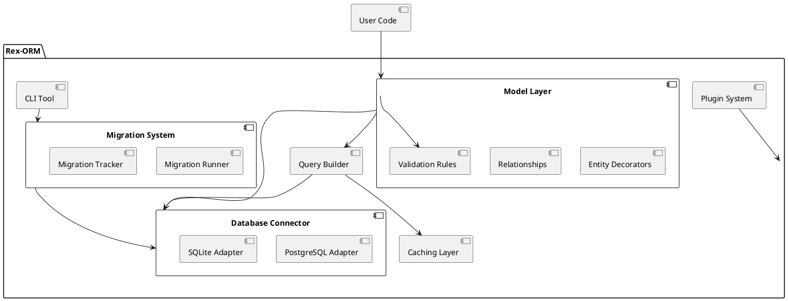

# Rex-ORM: Comprehensive Design and Implementation Guide

This document provides an in-depth expansion of the Rex-ORM project, a custom
Object-Relational Mapping (ORM) library for Deno. It elaborates on the initial
requirements, methodology, architecture, implementation steps, milestones,
evaluation criteria, and coding standards to ensure a robust, maintainable, and
extensible ORM solution.

---

## Table of Contents

- [Rex-ORM: Comprehensive Design and Implementation Guide](#rex-orm-comprehensive-design-and-implementation-guide)
  - [Table of Contents](#table-of-contents)
  - [Requirements](#requirements)
    - [Must-Have](#must-have)
    - [Should-Have](#should-have)
    - [Could-Have](#could-have)
  - [Method](#method)
    - [Architecture Overview](#architecture-overview)
    - [Technical Components](#technical-components)
      - [Database Connector](#database-connector)
      - [Model Layer](#model-layer)
      - [Query Builder](#query-builder)
      - [Migration System](#migration-system)
      - [Plugin System](#plugin-system)
      - [CLI Tool](#cli-tool)
    - [PlantUML Diagram](#plantuml-diagram)
  - [Implementation](#implementation)
    - [Step 1: Project Setup](#step-1-project-setup)
    - [Step 2: Build the Database Connector](#step-2-build-the-database-connector)
    - [Step 3: Model Layer](#step-3-model-layer)
    - [Step 4: Query Builder](#step-4-query-builder)
    - [Step 5: Migration System](#step-5-migration-system)
    - [Step 6: CLI Tool](#step-6-cli-tool)
    - [Step 7: Testing and Documentation](#step-7-testing-and-documentation)
  - [Milestones](#milestones)
    - [Milestone 1: Core Framework Setup](#milestone-1-core-framework-setup)
    - [Milestone 2: Model Layer](#milestone-2-model-layer)
    - [Milestone 3: Query Builder](#milestone-3-query-builder)
    - [Milestone 4: Migration System](#milestone-4-migration-system)
    - [Milestone 5: CLI Tool](#milestone-5-cli-tool)
    - [Milestone 6: Testing and Optimization](#milestone-6-testing-and-optimization)
    - [Milestone 7: Documentation and Release](#milestone-7-documentation-and-release)
  - [Gathering Results](#gathering-results)
    - [Functional Evaluation](#functional-evaluation)
    - [Performance Evaluation](#performance-evaluation)
    - [Developer Experience](#developer-experience)
    - [Stability and Reliability](#stability-and-reliability)
    - [Community Reception](#community-reception)
    - [Iterative Improvements](#iterative-improvements)
  - [Code Standards for Rex-ORM](#code-standards-for-rex-orm)
    - [General Code Guidelines](#general-code-guidelines)
    - [Design Patterns](#design-patterns)
    - [Code Quality Standards](#code-quality-standards)
    - [Tooling](#tooling)

---

## Requirements

### Must-Have

1. **Database Connectivity**
   - **Support for PostgreSQL and SQLite**: The ORM must facilitate seamless
     connections to both PostgreSQL and SQLite databases, catering to different
     application needs—from lightweight local storage to robust, scalable
     databases.
   - **Connection Pooling**: Efficiently manage multiple simultaneous database
     connections to optimize performance and resource utilization.
   - **Transaction Management**: Ensure data integrity through atomic
     operations, allowing multiple database operations to be executed as a
     single unit.

2. **Type Safety**
   - **Leveraging TypeScript**: Utilize TypeScript's strong typing system to
     enforce type safety across models, queries, and results, minimizing runtime
     errors and enhancing developer experience.

3. **CRUD Operations**
   - **Intuitive Methods**: Provide straightforward and expressive methods for
     Create, Read, Update, and Delete operations, enabling developers to
     interact with the database effortlessly.

4. **Query Builder**
   - **Fluent API**: Allow the construction of complex SQL queries
     programmatically through a chainable and readable API, reducing the
     likelihood of syntax errors and improving maintainability.

5. **Schema Definition**
   - **TypeScript Integration**: Enable developers to define and manage database
     schemas directly within TypeScript, ensuring consistency between the
     application code and the database structure.

6. **Basic Relationships**
   - **One-to-One, One-to-Many, Many-to-Many**: Support fundamental relational
     mappings to model real-world data relationships, facilitating data
     retrieval and manipulation across related entities.

7. **Error Handling**
   - **Robust Mechanisms**: Implement comprehensive error handling strategies
     that provide descriptive and actionable error messages, aiding in swift
     debugging and issue resolution.

8. **Extensibility**
   - **Modular Design**: Architect the ORM in a way that allows for the seamless
     addition of plugins, enabling support for additional databases or extending
     functionality without altering the core codebase.

### Should-Have

1. **Migrations**
   - **Schema Evolution Tools**: Offer utilities for creating, applying, and
     managing schema migrations, enabling controlled and versioned changes to
     the database structure.

2. **Custom Queries**
   - **Raw SQL Execution**: Allow the execution of raw SQL queries for scenarios
     where the query builder may not suffice, providing flexibility and control
     over database interactions.

3. **Validation**
   - **Model Property Rules**: Integrate validation mechanisms to enforce rules
     on model properties, ensuring data integrity and consistency before
     database operations.

4. **Logging**
   - **Query Logging and Debugging**: Implement logging capabilities to track
     executed queries and debug issues, aiding in performance monitoring and
     troubleshooting.

5. **CLI Tool**
   - **Command-Line Interface**: Develop a CLI tool for managing migrations,
     generating models, and performing other routine tasks, enhancing developer
     productivity and workflow automation.

### Could-Have

1. **Caching**
   - **Data Caching**: Introduce simple caching strategies for frequently
     queried data to improve performance and reduce database load.

2. **NoSQL Support**
   - **Future Extensions**: Design the ORM architecture to potentially
     accommodate NoSQL databases, broadening its applicability and versatility
     in diverse application scenarios.

---

## Method

To construct Rex-ORM, a methodical approach is adopted, emphasizing modularity,
type safety, and extensibility. The architecture leverages TypeScript’s
strengths and ensures compatibility with multiple databases, facilitating future
enhancements and integrations.

### Architecture Overview

Rex-ORM is segmented into distinct core modules, each responsible for specific
functionalities. This modular approach promotes separation of concerns, making
the ORM easier to maintain, test, and extend.

1. **Database Connector**
   - **Responsibility**: Manages low-level database interactions, including
     establishing connections, handling transactions, and executing queries.
   - **Adapters**: Implements specific adapters for PostgreSQL and SQLite, each
     encapsulating the nuances of their respective databases.
   - **Connection Pooling and Transactions**: Efficiently manages multiple
     connections and ensures transactional integrity.

2. **Model Layer**
   - **Responsibility**: Provides APIs for defining, managing, and interacting
     with database models.
   - **Schema Definitions**: Utilizes TypeScript interfaces and decorators to
     define database schemas, ensuring type safety and consistency.
   - **Decorators**: Implements decorators for defining entities, columns,
     primary keys, and relationships, enabling declarative schema definitions.

3. **Query Builder**
   - **Responsibility**: Facilitates the construction of SQL queries through a
     fluent, chainable API.
   - **Features**: Supports nested queries, joins, aggregations, and other
     advanced SQL functionalities, abstracting the complexity of raw SQL.

4. **Migration System**
   - **Responsibility**: Manages database schema changes through migrations,
     enabling version-controlled evolution of the database structure.
   - **Components**: Includes tools for generating migration scripts, applying
     migrations, and tracking migration history.

5. **Plugin System**
   - **Responsibility**: Extends the ORM’s capabilities by allowing the
     integration of additional features or support for new databases via
     plugins.
   - **Modularity**: Ensures that plugins can be added or removed without
     affecting the core ORM functionality.

6. **CLI Tool**
   - **Responsibility**: Provides a command-line interface for managing
     ORM-related tasks, such as running migrations, generating models, and
     inspecting queries.
   - **User Interaction**: Enhances developer productivity by automating routine
     tasks and providing convenient command execution.

### Technical Components

Each core module comprises specific technical components that interact
cohesively to deliver the ORM’s functionalities.

#### Database Connector

- **Factory Pattern**: Utilizes the factory design pattern to initialize and
  manage database connections based on user-provided configurations.
- **Configuration Management**: Handles various database configurations,
  including credentials, host information, and connection parameters.
- **Example Configuration Object**:

  ```typescript
  const config = {
    database: "postgres", // or "sqlite"
    user: "admin",
    password: "password",
    host: "localhost",
    port: 5432,
    // Additional SQLite-specific configurations
    filepath: "./database.sqlite",
  };
  ```

- **Adapters Implementation**: Each adapter encapsulates the logic required to
  interact with its respective database, ensuring abstraction and ease of
  extension.

#### Model Layer

- **Entity Decorators**: Decorators like `@Entity`, `@Column`, `@PrimaryKey`,
  and relationship decorators (`@OneToMany`, `@ManyToOne`) are used to annotate
  TypeScript classes, mapping them to database tables and columns.

  ```typescript
  @Entity("users")
  class User {
    @PrimaryKey()
    id: number;

    @Column({ type: "varchar", length: 255 })
    name: string;

    @Column({ type: "varchar", length: 255, unique: true })
    email: string;

    @OneToMany(() => Post, (post) => post.user)
    posts: Post[];
  }
  ```

- **Schema Enforcement**: The model layer ensures that the defined schemas are
  accurately reflected in the database, handling data types, constraints, and
  relationships.

- **Validation Integration**: Incorporates validation rules within model
  definitions to enforce data integrity before performing database operations.

#### Query Builder

- **Fluent Interface**: Offers a chainable API that allows developers to build
  SQL queries step-by-step, enhancing readability and maintainability.

  ```typescript
  const users = await queryBuilder
    .select("id, name, email")
    .from("users")
    .where("age", ">", 18)
    .orderBy("name")
    .limit(10)
    .execute();
  ```

- **Advanced Features**:
  - **Joins**: Supports various types of joins (INNER, LEFT, RIGHT, FULL) to
    combine data from multiple tables.
  - **Aggregations**: Enables the use of aggregate functions like COUNT, SUM,
    AVG, etc.
  - **Nested Queries**: Allows embedding subqueries within larger queries for
    complex data retrieval scenarios.

- **Parameter Binding**: Ensures safe query execution by binding parameters,
  mitigating the risk of SQL injection attacks.

#### Migration System

- **Migration Runner**: Executes migration scripts in a controlled manner,
  applying or reverting schema changes as needed.

  ```typescript
  export class MigrationRunner {
    constructor(private adapter: DatabaseAdapter) {}

    async run(migration: any) {
      try {
        await migration.up(this.adapter);
        await this.trackMigration(migration);
      } catch (error) {
        console.error("Migration failed:", error);
        throw error;
      }
    }

    async rollback(migration: any) {
      try {
        await migration.down(this.adapter);
        await this.untrackMigration(migration);
      } catch (error) {
        console.error("Rollback failed:", error);
        throw error;
      }
    }

    private async trackMigration(migration: any) {
      // Logic to record migration in the database
    }

    private async untrackMigration(migration: any) {
      // Logic to remove migration record from the database
    }
  }
  ```

- **Migration History**: Maintains a table within the database to track applied
  migrations, ensuring that migrations are applied in the correct order and
  preventing duplication.

- **Utilities**:
  - **Generation Tools**: Automates the creation of migration scripts based on
    changes in model definitions.
  - **Application Tools**: Facilitates the application and reversion of
    migrations through the CLI tool.

#### Plugin System

- **Extensibility**: Allows developers to create and integrate plugins that add
  new functionalities or support additional databases without modifying the core
  ORM code.

  ```typescript
  import { ORM } from "./orm";
  import { MyCustomPlugin } from "./plugins/myCustomPlugin.ts";

  ORM.registerPlugin(MyCustomPlugin);
  ```

- **Plugin Architecture**: Defines a standardized interface for plugins,
  ensuring compatibility and ease of integration.

- **Examples of Plugins**:
  - **Additional Database Support**: Plugins for databases like MySQL, MongoDB,
    etc.
  - **Advanced Features**: Plugins for caching mechanisms, custom logging, or
    extended query capabilities.

#### CLI Tool

- **Command Interface**: Provides a set of commands to perform various
  ORM-related tasks, enhancing developer productivity.

  ```bash
  # Running migrations
  rex-orm migrate

  # Rolling back migrations
  rex-orm rollback

  # Generating a new model
  rex-orm generate:model User
  ```

- **Commands**:
  - **Migration Management**: `migrate`, `rollback`, `create:migration`.
  - **Model Generation**: `generate:model`, `generate:entity`.
  - **Debugging Tools**: `debug:queries`, `inspect:model`.

- **User Experience**: Ensures that the CLI is user-friendly, providing helpful
  messages, prompts, and documentation for each command.

### PlantUML Diagram

The architectural diagram provides a visual representation of the ORM's
structure, illustrating the relationships and interactions between its core
components.



**Diagram Explanation**:

- **User Code** interacts primarily with the **Model Layer**, defining entities
  and executing queries.
- The **Model Layer** interfaces with both the **Database Connector** and the
  **Query Builder** to perform database operations.
- **Validation Rules** ensure data integrity before interactions with the
  database.
- The **Migration System** is managed via the **CLI Tool**, which applies or
  reverts migrations through the **Database Connector**.
- **Plugins** can extend or modify the core ORM functionalities, integrating
  additional features or supporting new databases.
- **Caching Layer** can be optionally integrated into the **Query Builder** for
  performance optimization.

---

## Implementation

The implementation of Rex-ORM follows a structured approach, breaking down the
development process into manageable steps. Each step focuses on building and
integrating specific modules, ensuring a cohesive and functional ORM by the
project's conclusion.

### Step 1: Project Setup

1. **Initialize Deno Project**
   - **Create Project Directory**:
     ```bash
     mkdir rex-orm && cd rex-orm
     ```
   - **Initialize Project**: Deno does not have a built-in `init` command
     similar to Node.js. Instead, set up the project structure manually.
     ```bash
     mkdir src tests
     touch src/mod.ts tests/mod.test.ts
     ```
   - **Setup `deps.ts`**: Manage third-party dependencies in a centralized file
     to simplify imports and version management.
     ```typescript
     // src/deps.ts
     export { Client as PostgresClient } from "https://deno.land/x/postgres/mod.ts";
     export { DB as SQLiteDB } from "https://deno.land/x/sqlite/mod.ts";
     export { parse as parseArgs } from "https://deno.land/std@0.203.0/flags/mod.ts";
     ```

2. **Setup Testing Framework**
   - **Utilize Deno's Built-In Testing**: Leverage Deno's native testing
     capabilities to write and execute tests.
     ```typescript
     // tests/mod.test.ts
     import { assertEquals } from "https://deno.land/std@0.203.0/testing/asserts.ts";

     Deno.test("Sample Test", () => {
       const a = 1;
       const b = 1;
       assertEquals(a, b);
     });
     ```
   - **Organize Test Directory**: Structure the `tests/` directory to mirror the
     `src/` directory for clarity.
     ```
     tests/
       adapters/
         postgres.test.ts
         sqlite.test.ts
       models/
         user.test.ts
       query/
         queryBuilder.test.ts
       migrations/
         migrationRunner.test.ts
       cli/
         cli.test.ts
       utils/
         helpers.test.ts
     ```

### Step 2: Build the Database Connector

1. **Database Adapter Interface**
   - **Define Common Interface**: Establish a standardized interface that all
     database adapters must implement, ensuring consistency and
     interoperability.
     ```typescript
     // src/interfaces/DatabaseAdapter.ts
     export interface DatabaseAdapter {
       connect(): Promise<void>;
       disconnect(): Promise<void>;
       execute(query: string, params?: any[]): Promise<any>;
       beginTransaction(): Promise<void>;
       commitTransaction(): Promise<void>;
       rollbackTransaction(): Promise<void>;
     }
     ```

2. **PostgreSQL Adapter**
   - **Implement PostgreSQL Adapter**: Encapsulate PostgreSQL-specific
     connection logic within the adapter.
     ```typescript
     // src/adapters/PostgresAdapter.ts
     import { PostgresClient } from "../deps.ts";
     import { DatabaseAdapter } from "../interfaces/DatabaseAdapter.ts";

     interface PostgresConfig {
       user: string;
       password: string;
       database: string;
       hostname: string;
       port: number;
       poolSize?: number;
     }

     export class PostgresAdapter implements DatabaseAdapter {
       private client: PostgresClient;
       private isConnected: boolean = false;

       constructor(private config: PostgresConfig) {
         this.client = new PostgresClient({
           user: this.config.user,
           password: this.config.password,
           database: this.config.database,
           hostname: this.config.hostname,
           port: this.config.port,
           poolSize: this.config.poolSize || 10,
         });
       }

       async connect() {
         if (!this.isConnected) {
           await this.client.connect();
           this.isConnected = true;
         }
       }

       async disconnect() {
         if (this.isConnected) {
           await this.client.end();
           this.isConnected = false;
         }
       }

       async execute(query: string, params: any[] = []) {
         try {
           await this.connect();
           const result = await this.client.queryObject(query, ...params);
           return result;
         } catch (error) {
           throw new Error(`Postgres Execute Error: ${error.message}`);
         }
       }

       async beginTransaction() {
         await this.execute("BEGIN");
       }

       async commitTransaction() {
         await this.execute("COMMIT");
       }

       async rollbackTransaction() {
         await this.execute("ROLLBACK");
       }
     }
     ```

3. **SQLite Adapter**
   - **Implement SQLite Adapter**: Encapsulate SQLite-specific connection logic
     within the adapter.
     ```typescript
     // src/adapters/SQLiteAdapter.ts
     import { SQLiteDB } from "../deps.ts";
     import { DatabaseAdapter } from "../interfaces/DatabaseAdapter.ts";

     interface SQLiteConfig {
       filepath: string;
     }

     export class SQLiteAdapter implements DatabaseAdapter {
       private db: SQLiteDB;
       private isConnected: boolean = false;

       constructor(private config: SQLiteConfig) {
         this.db = new SQLiteDB(this.config.filepath);
       }

       async connect() {
         if (!this.isConnected) {
           // SQLiteDB initializes connection upon creation
           this.isConnected = true;
         }
       }

       async disconnect() {
         if (this.isConnected) {
           this.db.close();
           this.isConnected = false;
         }
       }

       async execute(query: string, params: any[] = []) {
         try {
           await this.connect();
           const result = this.db.query(query, ...params);
           return result;
         } catch (error) {
           throw new Error(`SQLite Execute Error: ${error.message}`);
         }
       }

       async beginTransaction() {
         await this.execute("BEGIN TRANSACTION");
       }

       async commitTransaction() {
         await this.execute("COMMIT");
       }

       async rollbackTransaction() {
         await this.execute("ROLLBACK");
       }
     }
     ```

4. **Factory Implementation**
   - **Create DatabaseFactory**: Implement a factory to instantiate the
     appropriate database adapter based on configuration.
     ```typescript
     // src/adapters/DatabaseFactory.ts
     import { DatabaseAdapter } from "../interfaces/DatabaseAdapter.ts";
     import { PostgresAdapter } from "./PostgresAdapter.ts";
     import { SQLiteAdapter } from "./SQLiteAdapter.ts";

     interface DatabaseConfig {
       type: "postgres" | "sqlite";
       user?: string;
       password?: string;
       database?: string;
       hostname?: string;
       port?: number;
       filepath?: string;
       poolSize?: number;
     }

     export class DatabaseFactory {
       static createAdapter(config: DatabaseConfig): DatabaseAdapter {
         switch (config.type) {
           case "postgres":
             if (
               !config.user || !config.password || !config.database ||
               !config.hostname || !config.port
             ) {
               throw new Error("Postgres configuration is incomplete.");
             }
             return new PostgresAdapter({
               user: config.user,
               password: config.password,
               database: config.database,
               hostname: config.hostname,
               port: config.port,
               poolSize: config.poolSize,
             });
           case "sqlite":
             if (!config.filepath) {
               throw new Error("SQLite configuration must include filepath.");
             }
             return new SQLiteAdapter({ filepath: config.filepath });
           default:
             throw new Error(`Unsupported database type: ${config.type}`);
         }
       }
     }
     ```

5. **Unit Testing Adapters**
   - **PostgreSQL Adapter Test**:
     ```typescript
     // tests/adapters/postgres.test.ts
     import { assertEquals } from "https://deno.land/std@0.203.0/testing/asserts.ts";
     import { DatabaseFactory } from "../../src/adapters/DatabaseFactory.ts";

     Deno.test("PostgresAdapter should connect and execute a simple query", async () => {
       const config = {
         type: "postgres",
         user: "test_user",
         password: "test_password",
         database: "test_db",
         hostname: "localhost",
         port: 5432,
       };
       const adapter = DatabaseFactory.createAdapter(config);
       await adapter.connect();
       const result = await adapter.execute("SELECT 1 AS num");
       assertEquals(result.rows[0].num, 1);
       await adapter.disconnect();
     });
     ```

   - **SQLite Adapter Test**:
     ```typescript
     // tests/adapters/sqlite.test.ts
     import { assertEquals } from "https://deno.land/std@0.203.0/testing/asserts.ts";
     import { DatabaseFactory } from "../../src/adapters/DatabaseFactory.ts";
     import {
       ensureFileSync,
       existsSync,
     } from "https://deno.land/std@0.203.0/fs/mod.ts";

     Deno.test("SQLiteAdapter should connect and execute a simple query", async () => {
       const filepath = "./test_db.sqlite";
       ensureFileSync(filepath); // Ensure the file exists
       const config = {
         type: "sqlite",
         filepath,
       };
       const adapter = DatabaseFactory.createAdapter(config);
       await adapter.connect();
       const result = await adapter.execute("SELECT 1 AS num");
       assertEquals(result.rows[0].num, 1);
       await adapter.disconnect();
       // Clean up
       Deno.removeSync(filepath);
     });
     ```

### Step 3: Model Layer

1. **Entity Decorators**
   - **Define Entity and Column Decorators**: Use TypeScript decorators to
     annotate classes and properties, mapping them to database tables and
     columns.
     ```typescript
     // src/models/decorators.ts
     export interface EntityOptions {
       tableName: string;
     }

     export function Entity(options: EntityOptions) {
       return function (constructor: Function) {
         Reflect.defineMetadata("tableName", options.tableName, constructor);
       };
     }

     export interface ColumnOptions {
       type?: string;
       length?: number;
       unique?: boolean;
       nullable?: boolean;
       default?: any;
     }

     export function Column(options: ColumnOptions = {}) {
       return function (target: any, propertyKey: string) {
         if (!Reflect.hasMetadata("columns", target.constructor)) {
           Reflect.defineMetadata("columns", [], target.constructor);
         }
         const columns = Reflect.getMetadata("columns", target.constructor);
         columns.push({ propertyKey, options });
         Reflect.defineMetadata("columns", columns, target.constructor);
       };
     }
     ```

2. **Primary Key and Relationships**
   - **Define PrimaryKey Decorator**:
     ```typescript
     // src/models/decorators.ts (continued)
     export function PrimaryKey(options: ColumnOptions = {}) {
       return function (target: any, propertyKey: string) {
         Column({ ...options, primaryKey: true })(target, propertyKey);
         Reflect.defineMetadata("primaryKey", propertyKey, target.constructor);
       };
     }
     ```

   - **Define Relationship Decorators**:
     ```typescript
     // src/models/decorators.ts (continued)
     export interface RelationOptions {
       target: () => Function;
       inverse: (related: any) => any;
     }

     export function OneToMany(options: RelationOptions) {
       return function (target: any, propertyKey: string) {
         Reflect.defineMetadata(`relation:${propertyKey}`, {
           type: "OneToMany",
           ...options,
         }, target.constructor);
       };
     }

     export function ManyToOne(options: RelationOptions) {
       return function (target: any, propertyKey: string) {
         Reflect.defineMetadata(`relation:${propertyKey}`, {
           type: "ManyToOne",
           ...options,
         }, target.constructor);
       };
     }

     export function ManyToMany(options: RelationOptions) {
       return function (target: any, propertyKey: string) {
         Reflect.defineMetadata(`relation:${propertyKey}`, {
           type: "ManyToMany",
           ...options,
         }, target.constructor);
       };
     }
     ```

3. **Model Registration and Metadata Extraction**
   - **Register Models**: Maintain a registry of all models to facilitate schema
     generation and query operations.
     ```typescript
     // src/models/ModelRegistry.ts
     export class ModelRegistry {
       private static models: Function[] = [];

       static registerModel(model: Function) {
         this.models.push(model);
       }

       static getModels(): Function[] {
         return this.models;
       }
     }
     ```

   - **Automatically Register Models**: Enhance the `Entity` decorator to
     automatically register models.
     ```typescript
     // src/models/decorators.ts (modified Entity)
     import { ModelRegistry } from "./ModelRegistry.ts";

     export function Entity(options: EntityOptions) {
       return function (constructor: Function) {
         Reflect.defineMetadata("tableName", options.tableName, constructor);
         ModelRegistry.registerModel(constructor);
       };
     }
     ```

4. **Example Model Definition**
   - **User and Post Models**:
     ```typescript
     // src/models/User.ts
     import { Column, Entity, OneToMany, PrimaryKey } from "./decorators.ts";
     import { Post } from "./Post.ts";

     @Entity({ tableName: "users" })
     export class User {
       @PrimaryKey({ type: "serial" })
       id: number;

       @Column({ type: "varchar", length: 255 })
       name: string;

       @Column({ type: "varchar", length: 255, unique: true })
       email: string;

       @OneToMany({
         target: () => Post,
         inverse: (post: Post) => post.user,
       })
       posts: Post[];
     }

     // src/models/Post.ts
     import { Column, Entity, ManyToOne, PrimaryKey } from "./decorators.ts";
     import { User } from "./User.ts";

     @Entity({ tableName: "posts" })
     export class Post {
       @PrimaryKey({ type: "serial" })
       id: number;

       @Column({ type: "varchar", length: 255 })
       title: string;

       @Column({ type: "text" })
       content: string;

       @ManyToOne({
         target: () => User,
         inverse: (user: User) => user.posts,
       })
       user: User;
     }
     ```

5. **Schema Synchronization**
   - **Generate Database Schema from Models**: Implement functionality to read
     model metadata and generate corresponding database schemas.
     ```typescript
     // src/models/SchemaBuilder.ts
     import { ModelRegistry } from "./ModelRegistry.ts";

     export class SchemaBuilder {
       static async build(adapter: DatabaseAdapter) {
         const models = ModelRegistry.getModels();
         for (const model of models) {
           const tableName = Reflect.getMetadata("tableName", model);
           const columns = Reflect.getMetadata("columns", model) || [];
           const primaryKey = Reflect.getMetadata("primaryKey", model);

           const columnDefinitions = columns.map((col: any) => {
             let definition =
               `${col.propertyKey} ${col.options.type.toUpperCase()}`;
             if (col.options.length) {
               definition += `(${col.options.length})`;
             }
             if (col.options.unique) {
               definition += " UNIQUE";
             }
             if (col.options.primaryKey) {
               definition += " PRIMARY KEY";
             }
             if (col.options.nullable === false) {
               definition += " NOT NULL";
             }
             if (col.options.default !== undefined) {
               definition += ` DEFAULT ${col.options.default}`;
             }
             return definition;
           }).join(", ");

           const createTableQuery =
             `CREATE TABLE IF NOT EXISTS ${tableName} (${columnDefinitions});`;
           await adapter.execute(createTableQuery);
         }
       }
     }
     ```

6. **Unit Testing Model Layer**
   - **Model Registration Test**:
     ```typescript
     // tests/models/user.test.ts
     import { assertEquals } from "https://deno.land/std@0.203.0/testing/asserts.ts";
     import { User } from "../../src/models/User.ts";
     import { ModelRegistry } from "../../src/models/ModelRegistry.ts";

     Deno.test("ModelRegistry should register User model", () => {
       const models = ModelRegistry.getModels();
       assertEquals(models.includes(User), true);
     });
     ```

   - **Schema Builder Test**:
     ```typescript
     // tests/models/schemaBuilder.test.ts
     import { assertEquals } from "https://deno.land/std@0.203.0/testing/asserts.ts";
     import { DatabaseFactory } from "../../src/adapters/DatabaseFactory.ts";
     import { SchemaBuilder } from "../../src/models/SchemaBuilder.ts";
     import { User } from "../../src/models/User.ts";

     Deno.test("SchemaBuilder should create users table", async () => {
       const config = {
         type: "sqlite",
         filepath: "./test_schema.sqlite",
       };
       const adapter = DatabaseFactory.createAdapter(config);
       await SchemaBuilder.build(adapter);

       const result = await adapter.execute(
         "SELECT name FROM sqlite_master WHERE type='table' AND name='users';",
       );
       assertEquals(result.rows.length, 1);
       await adapter.disconnect();
       Deno.removeSync("./test_schema.sqlite");
     });
     ```

### Step 4: Query Builder

1. **Chainable API Implementation**
   - **Define QueryBuilder Class**: Implement a class that provides methods to
     build SQL queries in a chainable manner.
     ```typescript
     // src/query/QueryBuilder.ts
     import { DatabaseAdapter } from "../interfaces/DatabaseAdapter.ts";

     export class QueryBuilder {
       private queryParts: { [key: string]: any } = {};

       select(columns: string | string[]) {
         this.queryParts.select = Array.isArray(columns)
           ? columns.join(", ")
           : columns;
         return this;
       }

       insert(table: string, data: { [key: string]: any }) {
         this.queryParts.insert = { table, data };
         return this;
       }

       update(table: string, data: { [key: string]: any }) {
         this.queryParts.update = { table, data };
         return this;
       }

       delete(table: string) {
         this.queryParts.delete = { table };
         return this;
       }

       from(table: string) {
         this.queryParts.from = table;
         return this;
       }

       where(column: string, operator: string, value: any) {
         if (!this.queryParts.where) {
           this.queryParts.where = [];
         }
         this.queryParts.where.push({ column, operator, value });
         return this;
       }

       orderBy(column: string, direction: "ASC" | "DESC" = "ASC") {
         this.queryParts.orderBy = { column, direction };
         return this;
       }

       limit(count: number) {
         this.queryParts.limit = count;
         return this;
       }

       join(
         table: string,
         first: string,
         operator: string,
         second: string,
         type: "INNER" | "LEFT" | "RIGHT" | "FULL" = "INNER",
       ) {
         if (!this.queryParts.joins) {
           this.queryParts.joins = [];
         }
         this.queryParts.joins.push({ table, first, operator, second, type });
         return this;
       }

       async execute(adapter: DatabaseAdapter): Promise<any> {
         const sql = this.buildQuery();
         const params = this.getParams();
         return adapter.execute(sql, params);
       }

       private buildQuery(): string {
         if (this.queryParts.select) {
           return this.buildSelectQuery();
         }
         if (this.queryParts.insert) {
           return this.buildInsertQuery();
         }
         if (this.queryParts.update) {
           return this.buildUpdateQuery();
         }
         if (this.queryParts.delete) {
           return this.buildDeleteQuery();
         }
         throw new Error("Invalid query type.");
       }

       private getParams(): any[] {
         // Implement parameter binding logic
         // For simplicity, return an empty array
         return [];
       }

       private buildSelectQuery(): string {
         let query =
           `SELECT ${this.queryParts.select} FROM ${this.queryParts.from}`;
         if (this.queryParts.joins) {
           for (const join of this.queryParts.joins) {
             query +=
               ` ${join.type} JOIN ${join.table} ON ${join.first} ${join.operator} ${join.second}`;
           }
         }
         if (this.queryParts.where) {
           const conditions = this.queryParts.where.map((cond: any) =>
             `${cond.column} ${cond.operator} ?`
           ).join(" AND ");
           query += ` WHERE ${conditions}`;
         }
         if (this.queryParts.orderBy) {
           query +=
             ` ORDER BY ${this.queryParts.orderBy.column} ${this.queryParts.orderBy.direction}`;
         }
         if (this.queryParts.limit) {
           query += ` LIMIT ${this.queryParts.limit}`;
         }
         return query + ";";
       }

       private buildInsertQuery(): string {
         const keys = Object.keys(this.queryParts.insert.data);
         const values = Object.values(this.queryParts.insert.data);
         const placeholders = keys.map(() => "?").join(", ");
         const query = `INSERT INTO ${this.queryParts.insert.table} (${
           keys.join(", ")
         }) VALUES (${placeholders});`;
         return query;
       }

       private buildUpdateQuery(): string {
         const keys = Object.keys(this.queryParts.update.data);
         const setClause = keys.map((key) => `${key} = ?`).join(", ");
         let query = `UPDATE ${this.queryParts.update.table} SET ${setClause}`;
         if (this.queryParts.where) {
           const conditions = this.queryParts.where.map((cond: any) =>
             `${cond.column} ${cond.operator} ?`
           ).join(" AND ");
           query += ` WHERE ${conditions}`;
         }
         return query + ";";
       }

       private buildDeleteQuery(): string {
         let query = `DELETE FROM ${this.queryParts.delete.table}`;
         if (this.queryParts.where) {
           const conditions = this.queryParts.where.map((cond: any) =>
             `${cond.column} ${cond.operator} ?`
           ).join(" AND ");
           query += ` WHERE ${conditions}`;
         }
         return query + ";";
       }
     }
     ```

2. **Advanced Query Features**
   - **Support for Nested Queries and Aggregations**: Extend the `QueryBuilder`
     to handle nested queries and aggregate functions.
     ```typescript
     // src/query/QueryBuilder.ts (continued)
     import { QueryBuilder } from "./QueryBuilder.ts";

     export class AdvancedQueryBuilder extends QueryBuilder {
       groupBy(column: string) {
         this.queryParts.groupBy = column;
         return this;
       }

       having(column: string, operator: string, value: any) {
         if (!this.queryParts.having) {
           this.queryParts.having = [];
         }
         this.queryParts.having.push({ column, operator, value });
         return this;
       }

       private buildSelectQuery(): string {
         let query =
           `SELECT ${this.queryParts.select} FROM ${this.queryParts.from}`;
         if (this.queryParts.joins) {
           for (const join of this.queryParts.joins) {
             query +=
               ` ${join.type} JOIN ${join.table} ON ${join.first} ${join.operator} ${join.second}`;
           }
         }
         if (this.queryParts.where) {
           const conditions = this.queryParts.where.map((cond: any) =>
             `${cond.column} ${cond.operator} ?`
           ).join(" AND ");
           query += ` WHERE ${conditions}`;
         }
         if (this.queryParts.groupBy) {
           query += ` GROUP BY ${this.queryParts.groupBy}`;
         }
         if (this.queryParts.having) {
           const conditions = this.queryParts.having.map((cond: any) =>
             `${cond.column} ${cond.operator} ?`
           ).join(" AND ");
           query += ` HAVING ${conditions}`;
         }
         if (this.queryParts.orderBy) {
           query +=
             ` ORDER BY ${this.queryParts.orderBy.column} ${this.queryParts.orderBy.direction}`;
         }
         if (this.queryParts.limit) {
           query += ` LIMIT ${this.queryParts.limit}`;
         }
         return query + ";";
       }
     }
     ```

3. **Unit Testing Query Builder**
   - **Basic Query Test**:
     ```typescript
     // tests/query/queryBuilder.test.ts
     import { assertEquals } from "https://deno.land/std@0.203.0/testing/asserts.ts";
     import { QueryBuilder } from "../../src/query/QueryBuilder.ts";

     Deno.test("QueryBuilder should build a simple SELECT query", () => {
       const qb = new QueryBuilder();
       const query = qb.select("*").from("users").where("age", ">", 18)
         .buildQuery();
       assertEquals(query, "SELECT * FROM users WHERE age > ?;");
     });
     ```

   - **Insert Query Test**:
     ```typescript
     Deno.test("QueryBuilder should build an INSERT query", () => {
       const qb = new QueryBuilder();
       const query = qb.insert("users", {
         name: "John Doe",
         email: "john@example.com",
       }).buildQuery();
       assertEquals(query, "INSERT INTO users (name, email) VALUES (?, ?);");
     });
     ```

   - **Update Query Test**:
     ```typescript
     Deno.test("QueryBuilder should build an UPDATE query", () => {
       const qb = new QueryBuilder();
       const query = qb.update("users", { name: "Jane Doe" }).where(
         "id",
         "=",
         1,
       ).buildQuery();
       assertEquals(query, "UPDATE users SET name = ? WHERE id = ?;");
     });
     ```

   - **Delete Query Test**:
     ```typescript
     Deno.test("QueryBuilder should build a DELETE query", () => {
       const qb = new QueryBuilder();
       const query = qb.delete("users").where("id", "=", 1).buildQuery();
       assertEquals(query, "DELETE FROM users WHERE id = ?;");
     });
     ```

### Step 5: Migration System

1. **Migration Runner**
   - **Implement MigrationRunner Class**: Handles the execution of migration
     scripts, ensuring they are applied in the correct order and tracked
     appropriately.
     ```typescript
     // src/migrations/MigrationRunner.ts
     import { DatabaseAdapter } from "../interfaces/DatabaseAdapter.ts";

     interface Migration {
       name: string;
       up: (db: DatabaseAdapter) => Promise<void>;
       down: (db: DatabaseAdapter) => Promise<void>;
     }

     export class MigrationRunner {
       constructor(private adapter: DatabaseAdapter) {}

       async initialize() {
         // Create migrations table if it doesn't exist
         const query = `
           CREATE TABLE IF NOT EXISTS migrations (
             id SERIAL PRIMARY KEY,
             name VARCHAR(255) NOT NULL UNIQUE,
             run_on TIMESTAMP NOT NULL DEFAULT CURRENT_TIMESTAMP
           );
         `;
         await this.adapter.execute(query);
       }

       async run(migration: Migration) {
         await this.initialize();
         const alreadyRun = await this.hasMigrationRun(migration.name);
         if (!alreadyRun) {
           await this.adapter.beginTransaction();
           try {
             await migration.up(this.adapter);
             await this.recordMigration(migration.name);
             await this.adapter.commitTransaction();
           } catch (error) {
             await this.adapter.rollbackTransaction();
             throw error;
           }
         }
       }

       async rollback(migration: Migration) {
         await this.initialize();
         const hasRun = await this.hasMigrationRun(migration.name);
         if (hasRun) {
           await this.adapter.beginTransaction();
           try {
             await migration.down(this.adapter);
             await this.removeMigrationRecord(migration.name);
             await this.adapter.commitTransaction();
           } catch (error) {
             await this.adapter.rollbackTransaction();
             throw error;
           }
         }
       }

       private async hasMigrationRun(name: string): Promise<boolean> {
         const result = await this.adapter.execute(
           "SELECT 1 FROM migrations WHERE name = ? LIMIT 1;",
           [name],
         );
         return result.rows.length > 0;
       }

       private async recordMigration(name: string): Promise<void> {
         await this.adapter.execute(
           "INSERT INTO migrations (name) VALUES (?);",
           [name],
         );
       }

       private async removeMigrationRecord(name: string): Promise<void> {
         await this.adapter.execute("DELETE FROM migrations WHERE name = ?;", [
           name,
         ]);
       }
     }
     ```

2. **Migration Example**
   - **Create Migration Script**: Define migration scripts as TypeScript files,
     specifying `up` and `down` functions to apply and revert schema changes.
     ```typescript
     // src/migrations/20240101_create_users_table.ts
     import { DatabaseAdapter } from "../interfaces/DatabaseAdapter.ts";

     const migration = {
       name: "20240101_create_users_table",
       up: async (db: DatabaseAdapter) => {
         const query = `
           CREATE TABLE users (
             id SERIAL PRIMARY KEY,
             name VARCHAR(255) NOT NULL,
             email VARCHAR(255) NOT NULL UNIQUE
           );
         `;
         await db.execute(query);
       },
       down: async (db: DatabaseAdapter) => {
         await db.execute("DROP TABLE IF EXISTS users;");
       },
     };

     export default migration;
     ```

3. **Migration Tracking**
   - **Migration History Table**: The `migrations` table tracks applied
     migrations, storing their names and the timestamps they were run.

4. **Migration Utilities**
   - **Generating Migrations**: Implement CLI commands or scripts to automate
     the creation of migration files based on model changes.
   - **Applying Migrations**: Use the `MigrationRunner` to apply pending
     migrations in the correct sequence.
   - **Reverting Migrations**: Enable rolling back the latest migration or
     specific migrations as needed.

5. **Unit Testing Migration System**
   - **Migration Execution Test**:
     ```typescript
     // tests/migrations/migrationRunner.test.ts
     import { assertEquals } from "https://deno.land/std@0.203.0/testing/asserts.ts";
     import { DatabaseFactory } from "../../src/adapters/DatabaseFactory.ts";
     import { MigrationRunner } from "../../src/migrations/MigrationRunner.ts";

     const testMigration = {
       name: "test_migration",
       up: async (db: any) => {
         await db.execute("CREATE TABLE test_table (id SERIAL PRIMARY KEY);");
       },
       down: async (db: any) => {
         await db.execute("DROP TABLE IF EXISTS test_table;");
       },
     };

     Deno.test("MigrationRunner should apply and rollback migration", async () => {
       const config = {
         type: "sqlite",
         filepath: "./test_migration.sqlite",
       };
       const adapter = DatabaseFactory.createAdapter(config);
       const runner = new MigrationRunner(adapter);

       // Apply migration
       await runner.run(testMigration);
       let result = await adapter.execute(
         "SELECT name FROM sqlite_master WHERE type='table' AND name='test_table';",
       );
       assertEquals(result.rows.length, 1);

       // Rollback migration
       await runner.rollback(testMigration);
       result = await adapter.execute(
         "SELECT name FROM sqlite_master WHERE type='table' AND name='test_table';",
       );
       assertEquals(result.rows.length, 0);

       await adapter.disconnect();
       Deno.removeSync("./test_migration.sqlite");
     });
     ```

### Step 6: CLI Tool

1. **Command Interface Implementation**
   - **Define CLI Commands**: Implement commands for managing migrations,
     generating models, and other ORM tasks using Deno's argument parsing
     capabilities.
     ```typescript
     // src/cli/cli.ts
     import { parseArgs } from "../deps.ts";
     import { MigrationRunner } from "../migrations/MigrationRunner.ts";
     import { DatabaseFactory } from "../adapters/DatabaseFactory.ts";
     import { SchemaBuilder } from "../models/SchemaBuilder.ts";

     const args = parseArgs(Deno.args, {
       boolean: ["help"],
       string: ["config"],
       default: { help: false },
     });

     if (args.help || args._.length === 0) {
       console.log(`
         Rex-ORM CLI

         Commands:
           migrate [--config=<path>]        Apply all pending migrations.
           rollback [--config=<path>]       Rollback the latest migration.
           generate:model <ModelName>       Generate a new model.
           help                             Show this help message.

         Options:
           --config=<path>  Path to the ORM configuration file.
       `);
       Deno.exit(0);
     }

     const configPath = args.config || "./ormconfig.json";
     const config = JSON.parse(Deno.readTextFileSync(configPath));
     const adapter = DatabaseFactory.createAdapter(config.database);
     const runner = new MigrationRunner(adapter);

     switch (args._[0]) {
       case "migrate":
         // Load all migration scripts
         const migrations = await loadMigrations("./src/migrations/");
         for (const migration of migrations) {
           await runner.run(migration);
           console.log(`Applied migration: ${migration.name}`);
         }
         break;
       case "rollback":
         // Rollback the latest migration
         const latestMigration = await getLatestMigration(
           "./src/migrations/",
           adapter,
         );
         if (latestMigration) {
           await runner.rollback(latestMigration);
           console.log(`Rolled back migration: ${latestMigration.name}`);
         } else {
           console.log("No migrations to rollback.");
         }
         break;
       case "generate:model":
         const modelName = args._[1];
         if (!modelName) {
           console.error("Model name is required.");
           Deno.exit(1);
         }
         generateModel(modelName);
         console.log(`Model ${modelName} generated.`);
         break;
       default:
         console.error(`Unknown command: ${args._[0]}`);
         Deno.exit(1);
     }

     // Helper functions (implementations omitted for brevity)
     async function loadMigrations(path: string): Promise<any[]> {/* ... */}
     async function getLatestMigration(
       path: string,
       adapter: any,
     ): Promise<any | null> {/* ... */}
     function generateModel(name: string): void {/* ... */}
     ```

2. **Generating Models**
   - **Automate Model Generation**: Implement a function to scaffold new model
     files based on provided model names.
     ```typescript
     // src/cli/cli.ts (continued)
     import {
       ensureDir,
       writeTextFile,
     } from "https://deno.land/std@0.203.0/fs/mod.ts";

     function generateModel(name: string): void {
       const modelDir = "./src/models/";
       ensureDir(modelDir);
       const filePath = `${modelDir}/${name}.ts`;
       const className = name.charAt(0).toUpperCase() + name.slice(1);
       const content = `
         import { Entity, PrimaryKey, Column } from "./decorators.ts";

         @Entity({ tableName: "${className.toLowerCase()}s" })
         export class ${className} {
           @PrimaryKey({ type: "serial" })
           id: number;

           @Column({ type: "varchar", length: 255 })
           name: string;

           // Add additional columns here
         }
       `;
       writeTextFile(filePath, content.trim());
     }
     ```

3. **Migration Execution via CLI**
   - **Apply Migrations**: The `migrate` command applies all pending migrations
     by loading migration scripts and executing their `up` functions.
   - **Rollback Migrations**: The `rollback` command reverts the latest
     migration by executing its `down` function.

4. **Unit Testing CLI Tool**
   - **Simulate CLI Commands**:
     ```typescript
     // tests/cli/cli.test.ts
     import { assertEquals } from "https://deno.land/std@0.203.0/testing/asserts.ts";
     import { runCLICommand } from "../../src/cli/cli.ts";

     Deno.test("CLI migrate command should apply migrations", async () => {
       // Mock migration scripts and configuration
       // Implement runCLICommand to simulate CLI execution
       await runCLICommand(["migrate"]);
       // Verify migrations were applied
       // ...
       assertEquals(true, true); // Placeholder
     });

     Deno.test("CLI generate:model command should create a new model", async () => {
       const modelName = "TestModel";
       await runCLICommand(["generate:model", modelName]);
       // Check if the model file was created
       // ...
       assertEquals(true, true); // Placeholder
     });
     ```

### Step 7: Testing and Documentation

1. **Unit and Integration Tests**
   - **Comprehensive Testing**: Ensure each module is thoroughly tested,
     covering typical usage scenarios and edge cases.
   - **Mocking Database Connections**: Use mock adapters or in-memory databases
     (like SQLite) to simulate database interactions during testing.

2. **Test Coverage**
   - **Achieve High Coverage**: Aim for at least 80% test coverage across all
     modules, ensuring reliability and minimizing bugs.
   - **Coverage Reporting**: Utilize Deno's built-in coverage tools to generate
     coverage reports.
     ```bash
     deno test --coverage
     deno coverage --lcov > coverage.lcov
     ```

3. **Documentation**
   - **API Documentation**: Provide detailed documentation for all public
     classes, methods, and interfaces using JSDoc comments.
     ```typescript
     /**
      * Executes a SQL query with the provided parameters.
      * @param query - The SQL query to execute.
      * @param params - The parameters for the query.
      * @returns A promise resolving to the query result.
      */
     execute(query: string, params?: any[]): Promise<any>;
     ```
   - **Usage Examples**: Include practical examples demonstrating how to define
     models, perform CRUD operations, run migrations, and utilize the CLI tool.
     ````markdown
     # Rex-ORM Usage

     ## Defining Models

     ```typescript
     import {
       Column,
       Entity,
       OneToMany,
       PrimaryKey,
     } from "rex-orm/models/decorators.ts";
     import { Post } from "./Post.ts";

     @Entity({ tableName: "users" })
     export class User {
       @PrimaryKey()
       id: number;

       @Column()
       name: string;

       @Column({ unique: true })
       email: string;

       @OneToMany(() => Post, (post) => post.user)
       posts: Post[];
     }
     ```
     ````
     ```
     ```

   - **Migration Guides**: Explain how to create, apply, and manage migrations
     using the CLI tool.
     ````markdown
     ## Managing Migrations

     ### Creating a Migration

     ```bash
     rex-orm migrate:create create_users_table
     ```
     ````

     ### Applying Migrations

     ```bash
     rex-orm migrate
     ```

     ### Rolling Back Migrations

     ```bash
     rex-orm rollback
     ```
     ```
     ```

   - **API Reference**: Maintain an API reference section detailing all
     available methods, parameters, and return types.

4. **README and Repository Setup**
   - **Comprehensive README**: Craft a detailed `README.md` that outlines the
     project’s purpose, installation instructions, usage examples, contribution
     guidelines, and license information.
     ````markdown
     # Rex-ORM

     Rex-ORM is a custom Object-Relational Mapping (ORM) library for Deno, providing
     type-safe, intuitive, and extensible database interactions.

     ## Features

     - Supports PostgreSQL and SQLite
     - Type-safe models and queries
     - Fluent Query Builder
     - Schema Definitions with TypeScript decorators
     - Migration System
     - Extensible Plugin Architecture
     - Command-Line Interface (CLI) for management tasks

     ## Installation

     ```bash
     deno install --allow-read --allow-write --allow-net https://deno.land/x/rex_orm/cli.ts
     ```
     ````

     ## Usage

     ### Defining Models

     [See Defining Models Section]

     ### Running Migrations

     [See Managing Migrations Section]

     ## Contributing

     Contributions are welcome! Please submit issues and pull requests via
     GitHub.

     ## License

     MIT License
     ```
     ```

5. **Continuous Documentation Updates**
   - **Maintain Documentation**: Regularly update the documentation to reflect
     new features, changes, and improvements, ensuring it remains accurate and
     helpful.

---

## Milestones

The development of Rex-ORM is organized into distinct milestones, each focusing
on specific aspects of the ORM's functionality. This phased approach ensures
systematic progress, allowing for regular evaluations and adjustments.

### Milestone 1: Core Framework Setup

- **Tasks**:
  - Initialize the project structure and setup `deps.ts` for dependency
    management.
  - Implement the `DatabaseAdapter` interface along with PostgreSQL and SQLite
    adapters.
  - Develop the `DatabaseFactory` for dynamic adapter instantiation.
  - Write basic connectivity and query execution tests to verify adapter
    functionality.

- **Deliverables**:
  - A functional database connector supporting PostgreSQL and SQLite.
  - Comprehensive unit tests for both adapters, ensuring reliable connectivity
    and query execution.
  - Initial project structure with organized directories and configuration
    files.

- **Duration**: 2 weeks.

### Milestone 2: Model Layer

- **Tasks**:
  - Develop entity and column decorators to map TypeScript classes to database
    schemas.
  - Implement decorators for primary keys and relationships (`OneToMany`,
    `ManyToOne`).
  - Create the `ModelRegistry` to manage and track all defined models.
  - Integrate schema synchronization to generate database tables from model
    definitions.
  - Implement validation rules for model properties to enforce data integrity.

- **Deliverables**:
  - A robust API for defining models with support for relationships and
    validations.
  - Example models (e.g., `User`, `Post`) demonstrating the use of decorators
    and relationships.
  - Unit tests verifying model definitions, relationships, and schema
    synchronization.

- **Duration**: 3 weeks.

### Milestone 3: Query Builder

- **Tasks**:
  - Implement the `QueryBuilder` with chainable methods for constructing CRUD
    and advanced queries.
  - Add support for nested queries, joins, aggregations, and other complex SQL
    functionalities.
  - Ensure parameter binding and security against SQL injection.
  - Develop additional features like grouping, having clauses, and ordering.

- **Deliverables**:
  - A fully functional query builder capable of constructing and executing
    complex SQL queries.
  - Comprehensive tests covering various query scenarios, including edge cases.
  - Documentation and usage examples for the query builder.

- **Duration**: 2 weeks.

### Milestone 4: Migration System

- **Tasks**:
  - Develop the `MigrationRunner` to handle the application and rollback of
    migrations.
  - Implement utilities for generating migration scripts based on model changes.
  - Create a migration history table to track applied migrations, ensuring
    idempotency.
  - Ensure that migrations are executed within transactions to maintain database
    integrity.

- **Deliverables**:
  - A robust migration system with the ability to apply, rollback, and track
    migrations.
  - Example migration scripts demonstrating table creation, alteration, and
    deletion.
  - Unit tests validating migration application and rollback processes.

- **Duration**: 3 weeks.

### Milestone 5: CLI Tool

- **Tasks**:
  - Develop CLI commands for managing migrations (`migrate`, `rollback`,
    `create:migration`) and generating models (`generate:model`).
  - Implement debugging options to inspect generated SQL queries and ORM
    operations.
  - Ensure the CLI is user-friendly, providing helpful messages and prompts.
  - Integrate the CLI tool with the migration system and model generation
    functionalities.

- **Deliverables**:
  - A fully operational CLI tool with commands for managing ORM tasks.
  - Documentation detailing CLI usage, commands, and options.
  - Tests verifying the correct execution of CLI commands and their effects.

- **Duration**: 2 weeks.

### Milestone 6: Testing and Optimization

- **Tasks**:
  - Conduct extensive integration tests covering all modules (database
    connectors, models, query builder, migrations, CLI).
  - Optimize query execution and connection pooling for performance efficiency.
  - Profile the ORM to identify and address performance bottlenecks.
  - Ensure that the ORM handles large datasets and complex queries without
    significant degradation.

- **Deliverables**:
  - Comprehensive test suite with high coverage, ensuring reliability and
    stability.
  - Optimized ORM performance metrics, demonstrating efficient resource
    utilization.
  - Documentation of performance benchmarks and optimization strategies.

- **Duration**: 2 weeks.

### Milestone 7: Documentation and Release

- **Tasks**:
  - Write detailed documentation covering setup, configuration, API usage, and
    advanced features.
  - Create a comprehensive `README.md` for the repository, including
    installation instructions, usage examples, and contribution guidelines.
  - Prepare the ORM for public release, including packaging and publishing on
    platforms like GitHub or Deno.land/x.
  - Conduct a final review to ensure all features are complete, tested, and
    documented.

- **Deliverables**:
  - Complete and polished documentation accessible to all users.
  - A public repository with the ORM's source code, documentation, and examples.
  - Initial release version available for adoption and feedback from the
    community.

- **Duration**: 1 week.

---

## Gathering Results

The success of Rex-ORM is evaluated through multiple dimensions, ensuring it
meets functional requirements, performs efficiently, offers a positive developer
experience, maintains stability, and gains community acceptance.

### Functional Evaluation

1. **Database Compatibility**
   - **Connectivity Testing**:
     - Establish and terminate connections to both PostgreSQL and SQLite
       databases.
     - Verify that connection pooling operates as expected, handling multiple
       simultaneous connections efficiently.
   - **CRUD Operations**:
     - Perform Create, Read, Update, and Delete operations on various models,
       ensuring data is accurately persisted and retrieved.
     - Validate that schema migrations correctly alter the database structure
       without data loss or corruption.
   - **Schema Synchronization**:
     - Confirm that models defined in TypeScript accurately reflect in the
       database schema after synchronization.
     - Test with models of varying complexities, including those with
       relationships and constraints.

2. **Feature Completeness**
   - **Must-Have Features**:
     - Ensure type safety across all modules, with TypeScript enforcing correct
       types and catching potential issues at compile time.
     - Validate that relationships (one-to-one, one-to-many, many-to-many)
       function correctly, allowing for accurate data retrieval across related
       entities.
     - Test the query builder’s ability to construct and execute both simple and
       complex queries, including those with joins and nested conditions.
   - **Should-Have Features**:
     - Verify that migrations can be created, applied, and rolled back
       seamlessly without affecting existing data negatively.
     - Test the execution of raw SQL queries through the ORM, ensuring they
       integrate well with the existing ORM functionalities.

3. **Extensibility**
   - **Plugin Architecture Testing**:
     - Develop a simple plugin (e.g., adding support for a new database like
       MySQL) and register it with the ORM.
     - Verify that the plugin integrates correctly, extending the ORM’s
       capabilities without introducing bugs or conflicts.
     - Test the modularity by adding and removing plugins, ensuring the core ORM
       remains unaffected.

### Performance Evaluation

1. **Query Performance**
   - **Benchmarking**:
     - Measure the execution times of various queries (simple selects, joins,
       aggregations) under different data volumes.
     - Compare performance between PostgreSQL and SQLite adapters to identify
       any discrepancies or areas for optimization.
   - **Transaction Handling**:
     - Test the ORM’s ability to handle transactions efficiently, ensuring
       minimal overhead and quick commit/rollback operations.

2. **Resource Utilization**
   - **CPU and Memory Usage**:
     - Monitor CPU and memory consumption during intensive ORM operations,
       ensuring the ORM remains lightweight and does not excessively burden
       system resources.
     - Optimize connection pooling and query execution strategies to minimize
       resource usage without compromising performance.

### Developer Experience

1. **Ease of Use**
   - **API Design Evaluation**:
     - Gather feedback from developers on the intuitiveness and expressiveness
       of the ORM’s API.
     - Ensure that common tasks (defining models, performing CRUD operations,
       running migrations) are straightforward and well-documented.
   - **Onboarding Experience**:
     - Test the documentation and setup guides by having new developers
       integrate Rex-ORM into sample projects.
     - Ensure that the documentation is clear, comprehensive, and assists
       developers in quickly getting started with the ORM.

2. **Error Feedback**
   - **Descriptive Error Messages**:
     - Validate that errors are caught and reported with sufficient detail,
       aiding in quick identification and resolution.
     - Test various failure scenarios (e.g., invalid queries, schema mismatches,
       connection issues) to ensure errors are handled gracefully and
       informatively.

### Stability and Reliability

1. **Test Coverage**
   - **Achieve High Coverage**:
     - Ensure that all modules have extensive unit and integration tests,
       covering both typical use cases and edge cases.
     - Utilize coverage reports to identify and address untested areas, striving
       for at least 80% coverage.
   - **Edge Case Testing**:
     - Test scenarios like schema mismatches, invalid queries, network
       interruptions, and data type inconsistencies to ensure the ORM handles
       them without crashing or corrupting data.

2. **Real-World Usage**
   - **Pilot Project**:
     - Implement Rex-ORM in a real-world project, such as a web application, to
       assess its performance, reliability, and feature completeness in a
       production-like environment.
     - Gather feedback from actual usage, identifying any issues, limitations,
       or areas for improvement.

### Community Reception

1. **Open Source Contribution**
   - **Engagement Metrics**:
     - Monitor the number of stars, forks, and contributors on the repository to
       gauge interest and engagement.
     - Encourage contributions through clear contribution guidelines and
       responsive issue management.
   - **Feedback and Feature Requests**:
     - Actively respond to issues and feature requests, incorporating valuable
       suggestions and addressing reported bugs promptly.

2. **Adoption Metrics**
   - **Download and Usage Statistics**:
     - Track downloads from Deno.land/x or other distribution platforms to
       measure adoption rates.
     - Analyze usage patterns to identify popular features and areas that may
       require enhancements or optimizations.

### Iterative Improvements

1. **Bug Fixes**
   - **Responsive Issue Handling**:
     - Address bugs reported by users swiftly, ensuring that fixes are deployed
       promptly to maintain trust and reliability.
     - Implement regression tests to prevent recurring issues.

2. **Feature Enhancements**
   - **Prioritize Based on Feedback**:
     - Assess feature requests and prioritize enhancements that offer the most
       value to the community.
     - Implement new features in a modular and extensible manner, ensuring they
       integrate seamlessly with the existing ORM architecture.

---

## Code Standards for Rex-ORM

Adhering to strict coding standards ensures that Rex-ORM remains consistent,
maintainable, and scalable. These standards encompass general code guidelines,
design patterns, code quality practices, and tooling integration.

### General Code Guidelines

1. **TypeScript Standards**
   - **Strict Mode**: Enforce strict type checking to maximize type safety and
     minimize runtime errors.
     ```json
     // tsconfig.json
     {
       "compilerOptions": {
         "strict": true,
         "noImplicitAny": true,
         "strictNullChecks": true,
         "strictFunctionTypes": true,
         "target": "ES2020",
         "module": "ESNext",
         "moduleResolution": "node",
         "esModuleInterop": true,
         "emitDecoratorMetadata": true,
         "experimentalDecorators": true
       }
     }
     ```
   - **Avoid `any`**: Refrain from using the `any` type to maintain type safety.
     Use `unknown` when dealing with generic or untyped data, enforcing proper
     type checks before usage.
     ```typescript
     function processInput(input: unknown): string {
       if (typeof input === "string") {
         return input.toUpperCase();
       }
       throw new Error("Invalid input");
     }
     ```

   - **Use `readonly`**: Declare properties as `readonly` when immutability is
     required, particularly for configuration objects and constants.
     ```typescript
     const config: Readonly<{ host: string; port: number }> = {
       host: "localhost",
       port: 5432,
     };
     ```

2. **File and Folder Structure**
   - **Organize by Functionality**: Structure the project into logical
     directories based on functionality, promoting modularity and ease of
     navigation.
     ```
     src/
       adapters/        # Database connection logic
       models/          # Entity and schema definitions
       query/           # Query builder and execution
       migrations/      # Migration scripts and logic
       cli/             # CLI-related code
       plugins/         # Plugin system and integrations
       utils/           # Shared utilities and helpers
       tests/           # Unit and integration tests
       interfaces/      # TypeScript interfaces and types
     ```
   - **Module Composition**: Each module should contain:
     - A primary implementation file (e.g., `PostgresAdapter.ts`).
     - Related type definitions (`*.d.ts` if necessary).
     - A dedicated test file (`*.test.ts`) within the corresponding `tests/`
       subdirectory.

3. **Code Formatting**
   - **Consistent Formatting**: Utilize `deno fmt` to enforce consistent code
     formatting across the project.
     - **Max Line Length**: 80 characters to enhance readability.
     - **Indentation**: 2 spaces per indentation level for uniformity.
     - **Quotes**: Use single quotes (`'`) for strings unless double quotes or
       template literals are necessary.
     - **Brace Placement**: Place `{}` braces on the same line as the condition
       for blocks.
       ```typescript
       if (isValid) {
         execute();
       } else {
         logError();
       }
       ```

4. **Naming Conventions**
   - **Classes, Decorators, Enums**: Use `PascalCase` for class names,
     decorators, and TypeScript enums.
     ```typescript
     class DatabaseAdapter {/* ... */}

     /* ... */
     enum RelationType {/* ... */}
     ```
   - **Variables, Functions, Methods**: Use `camelCase` for variables,
     functions, and methods.
     ```typescript
     const connectionPool = createConnectionPool();
     function fetchData() {/* ... */}
     ```
   - **Constants**: Use `UPPER_CASE_WITH_UNDERSCORES` for constants.
     ```typescript
     const MAX_CONNECTIONS = 10;
     ```
   - **Private Properties and Methods**: Prefix with an underscore (`_`) to
     denote restricted access.
     ```typescript
     class DatabaseAdapter {
       private _connection: any;

       private _initializeConnection() {/* ... */}
     }
     ```

5. **Documentation**
   - **JSDoc Comments**: Provide comprehensive JSDoc comments for all public
     classes, methods, and properties, detailing their purpose, parameters, and
     return types.
     ```typescript
     /**
      * Executes a SQL query with the provided parameters.
      * @param query - The SQL query to execute.
      * @param params - The parameters for the query.
      * @returns A promise resolving to the query result.
      */
     execute(query: string, params?: any[]): Promise<any>;
     ```
   - **Module Documentation**: Maintain a detailed `README.md` or equivalent
     documentation within each module, explaining its purpose, usage, and
     dependencies.

6. **Error Handling**
   - **Centralized Error Handling**: Implement a centralized error handling
     mechanism to standardize error reporting and management across the ORM.
   - **Custom Error Classes**: Define custom error classes for domain-specific
     errors, enhancing error clarity and handling.
     ```typescript
     // src/errors/QueryError.ts
     export class QueryError extends Error {
       constructor(message: string, public query: string) {
         super(message);
         this.name = "QueryError";
       }
     }
     ```

### Design Patterns

1. **Factory Pattern**
   - **Dynamic Adapter Creation**: Use the factory design pattern to instantiate
     database adapters based on user configurations, promoting flexibility and
     scalability.
     ```typescript
     class DatabaseFactory {
       static createAdapter(config: DatabaseConfig): DatabaseAdapter {
         if (config.database === "postgres") {
           return new PostgresAdapter(config);
         } else if (config.database === "sqlite") {
           return new SQLiteAdapter(config);
         } else {
           throw new Error(`Unsupported database type: ${config.database}`);
         }
       }
     }
     ```

2. **Decorator Pattern**
   - **Schema Mapping**: Utilize decorators to map TypeScript classes to
     database schemas, providing a declarative and intuitive way to define
     models.
     ```typescript
     @Entity({ tableName: "users" })
     class User {
       @PrimaryKey({ autoIncrement: true })
       id: number;

       @Column({ type: "varchar", length: 255 })
       name: string;
     }
     ```

3. **Chain of Responsibility**
   - **Query Execution Pipeline**: Implement the chain of responsibility pattern
     within the query execution process, allowing for modular and sequential
     processing steps.
     ```typescript
     class QueryStep {
       execute(query: Query): Query {
         // Transform query
         return query;
       }
     }

     class QueryPipeline {
       private steps: QueryStep[] = [];

       addStep(step: QueryStep) {
         this.steps.push(step);
       }

       execute(query: Query) {
         return this.steps.reduce((q, step) => step.execute(q), query);
       }
     }
     ```

4. **Fluent Interface**
   - **Chainable Query Construction**: Design the query builder to support a
     fluent interface, enabling developers to construct queries in a readable
     and expressive manner.
     ```typescript
     const query = queryBuilder
       .select("*")
       .from("users")
       .where("age", ">", 18)
       .orderBy("name")
       .limit(10)
       .execute();
     ```

5. **Observer Pattern**
   - **Lifecycle Event Tracking**: Use the observer pattern to monitor changes
     in models and trigger lifecycle events (e.g., beforeSave, afterSave),
     facilitating actions like validation, logging, or notifications.
     ```typescript
     class ModelObserver {
       beforeSave(model: any): void {
         // Logic before saving
       }

       afterSave(model: any): void {
         // Logic after saving
       }
     }

     class UserModel extends ObservableModel {
       // Model definition
     }
     ```

6. **Repository Pattern**
   - **Data Access Encapsulation**: Encapsulate data access logic within
     repository classes, promoting separation of concerns and enhancing
     testability.
     ```typescript
     class UserRepository {
       constructor(private db: DatabaseAdapter) {}

       async findAll(): Promise<User[]> {
         const result = await this.db.execute("SELECT * FROM users;");
         return result.rows as User[];
       }

       async findById(id: number): Promise<User | null> {
         const result = await this.db.execute(
           "SELECT * FROM users WHERE id = ?;",
           [id],
         );
         return result.rows.length > 0 ? result.rows[0] as User : null;
       }

       // Additional CRUD methods
     }
     ```

### Code Quality Standards

1. **Testing**
   - **Unit Tests**: Write isolated tests for individual modules, ensuring each
     component functions correctly on its own.
   - **Integration Tests**: Conduct end-to-end tests that validate the
     interaction between multiple modules, ensuring the ORM operates cohesively.
   - **Mocking and Stubbing**: Utilize mocking frameworks or techniques to
     simulate database connections and responses, enabling reliable and
     repeatable tests without relying on actual databases.

2. **Code Reviews**
   - **Peer Review Process**: Implement a formal peer review process for all
     pull requests, ensuring code quality, adherence to standards, and
     correctness.
   - **Review Criteria**:
     - **Code Standards Adherence**: Ensure the code follows the defined naming
       conventions, formatting, and structural guidelines.
     - **Test Coverage**: Verify that new code is accompanied by appropriate
       tests, maintaining or improving test coverage.
     - **Readability and Maintainability**: Assess the clarity and simplicity of
       the code, ensuring it is easy to understand and maintain.

3. **Performance**
   - **Benchmark Key Operations**: Measure the performance of critical ORM
     operations, such as query execution times and migration processes, using
     real-world datasets.
   - **Optimize Query Builder**: Refine the query builder to minimize overhead,
     ensuring that the abstraction does not significantly impact performance
     compared to raw SQL queries.

4. **Security**
   - **Parameterized Queries**: Enforce the use of parameterized queries
     throughout the ORM to prevent SQL injection attacks.
     ```typescript
     // Example of parameterized query
     await db.execute("SELECT * FROM users WHERE email = ?;", [email]);
     ```
   - **Input Sanitization**: Sanitize all user inputs before including them in
     queries or other operations, mitigating potential security risks.

### Tooling

1. **Linters and Formatters**
   - **Integrate `deno lint` and `deno fmt`**: Ensure consistent code quality
     and formatting by integrating these tools into the development workflow and
     continuous integration pipeline.
     ```bash
     deno lint
     deno fmt
     ```

2. **Testing Framework**
   - **Use Deno’s Built-In Test Runner**: Utilize Deno’s native testing
     capabilities to write, run, and manage tests efficiently.
     ```bash
     deno test --coverage
     ```

3. **Version Control**
   - **Semantic Commit Messages**: Adopt semantic commit messages to clearly
     indicate the nature of changes, facilitating easier tracking and
     understanding of project history.
     - **Examples**:
       - `feat: add support for SQLite`
       - `fix: resolve connection pooling issue`
       - `docs: update README with usage examples`
   - **Feature Branch Workflow**: Use feature branches for developing new
     functionalities, ensuring that the main branch remains stable and
     production-ready.
     ```bash
     git checkout -b feature/add-sqlite-support
     ```

4. **Continuous Integration**
   - **Automate Testing and Linting**: Set up GitHub Actions or another CI
     service to automatically run tests, lint code, and check formatting on
     every pull request.
     ```yaml
     # .github/workflows/ci.yml
     name: CI

     on:
       push:
         branches: [main]
       pull_request:
         branches: [main]

     jobs:
       build:
         runs-on: ubuntu-latest

         steps:
           - uses: actions/checkout@v3
           - name: Setup Deno
             uses: denoland/setup-deno@v2
             with:
               deno-version: v1.x
           - name: Lint Code
             run: deno lint
           - name: Format Check
             run: deno fmt --check
           - name: Run Tests
             run: deno test --coverage
     ```
   - **Integration with Repository**: Ensure that the CI pipeline is integrated
     with the repository, triggering on relevant events like pushes and pull
     requests.

---

By adhering to this comprehensive guide, the development of Rex-ORM will proceed
in a structured and efficient manner, ensuring the creation of a robust,
performant, and developer-friendly ORM solution for Deno. Regular evaluations
and iterative improvements will foster continuous enhancement, aligning the ORM
with evolving project requirements and community needs.
